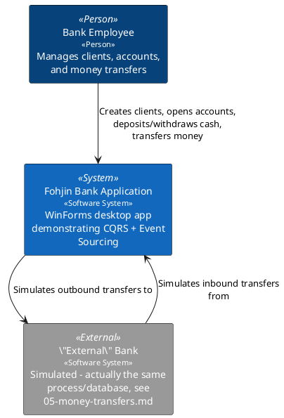
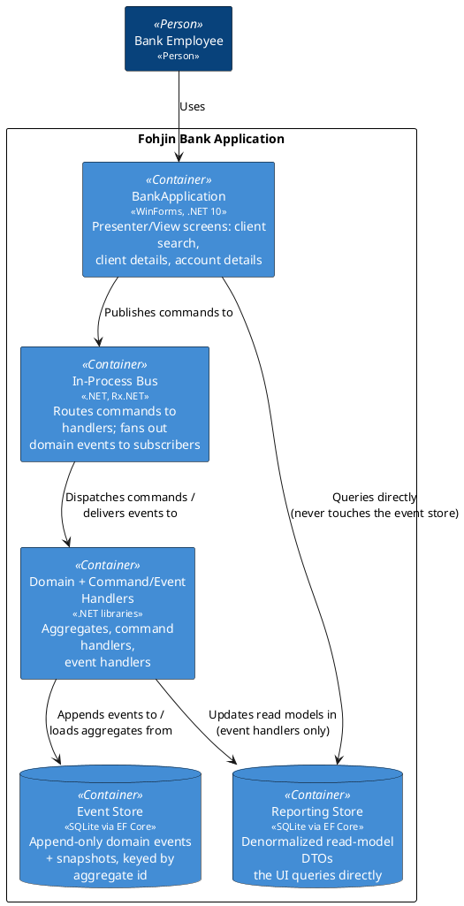

# Architecture Overview

Fohjin.DDD is a reference implementation of CQRS + Event Sourcing: a WinForms bank
application where every state change is a domain command, every fact is a domain event,
and the UI reads from a separate, denormalized read model rather than the write-side
aggregates.

This document gives the system-level (C4 Context/Container) view. Each bounded piece of
functionality has its own doc alongside this one — see the index at the bottom.

> **Diagram style note**: all C4-flavored diagrams in this doc set are hand-drawn with
> plain PlantUML (colored `rectangle`/`database` blocks with `<<stereotype>>` labels)
> rather than the `C4-PlantUML` include library, so they render without needing network
> access to GitHub.

## System Context

## Containers

**The core CQRS rule enforced here**: `winforms` never reads from `eventStoreDb`, and
command handlers never read from `reportingDb`. The only bridge between write and read
sides is a domain event traveling through the bus.

## Data flow, one sentence per stage

1. A WinForms Presenter builds a command and calls `IBus.Publish` + `CommitAsync`.
2. The bus routes the command (by its runtime type) to the one `ICommandHandler<T>` that
   handles it, wrapped in a transaction against the event store.
3. The handler loads (or creates) an aggregate, calls a domain method, which raises one or
   more domain events.
4. The event store persists the new events (and updates a version counter used for
   optimistic concurrency and, in principle, snapshotting).
5. Each persisted event is re-published on the bus, this time as an `IDomainEvent` — the
   bus fans it out via Rx to every independently-subscribed event handler.
6. Event handlers update the reporting store's DTOs; the UI's next query (or refresh
   timer) picks up the change.

## Doc index

| Doc | Covers |
|---|---|
| `01-client-management.md` | Client aggregate, create/rename/move-client commands |
| `02-bank-cards.md` | BankCard child entity, assign/cancel/report-stolen |
| `03-account-management.md` | ActiveAccount/ClosedAccount, open/close/rename |
| `04-cash-operations.md` | Deposit/withdrawal |
| `05-money-transfers.md` | The simulated internal/external transfer routing |
| `06-event-sourcing-infrastructure.md` | Aggregate roots, event store, snapshots |
| `07-messaging-bus.md` | Command dispatch + Rx event fan-out |
| `08-reporting-read-models.md` | Read-model DTOs and their event-driven updates |
| `09-winforms-ui.md` | Presenter/View pattern, screen flows |
