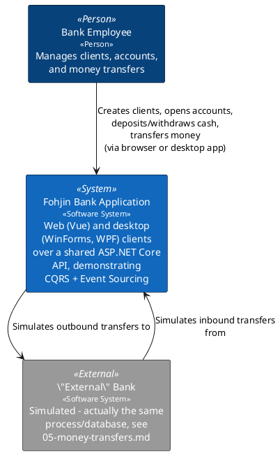
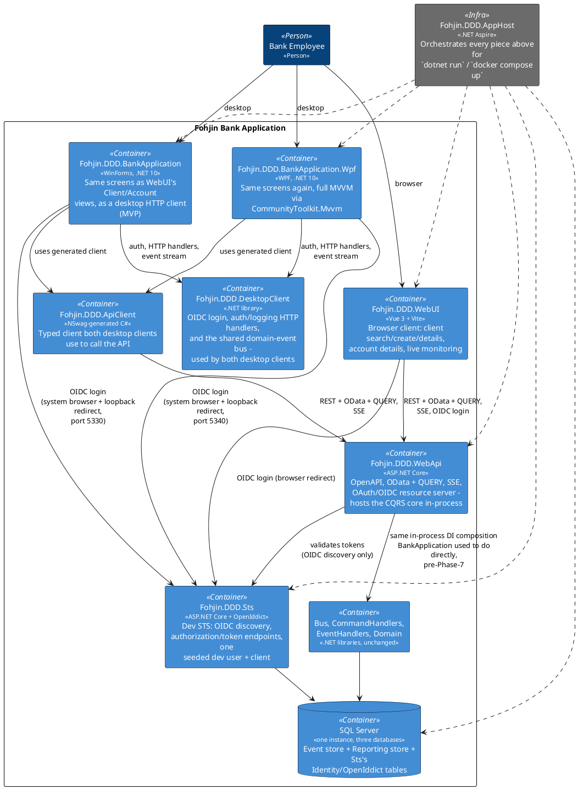
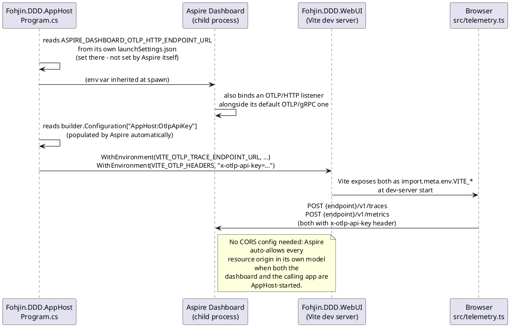

# Architecture Overview

Fohjin.DDD is a reference implementation of CQRS + Event Sourcing: a bank application —
reachable from a retargeted WinForms desktop client, a WPF desktop client, and a Vue web
client, all three talking to the same ASP.NET Core API — where every state change is a
domain command, every fact is a domain event, and the UI reads from a separate, denormalized
read model rather than the write-side aggregates.

This document gives the system-level (C4 Context/Container) view. Each bounded piece of
functionality has its own doc alongside this one — see the index at the bottom. This
system reached its current shape (an ASP.NET Core API + Vue web client + a retargeted
WinForms desktop client + a WPF desktop client + SQL Server + Aspire hosting, from an
original single-process WinForms app) through an incremental migration, phase by phase, each
one shippable on its own; `docs/supporting/` holds the research behind each technology
choice made along the way (OpenIddict vs. Duende, OData vs. hand-rolled filtering,
Aspire/Docker Compose, NSwag).

> **Diagram style note**: all C4-flavored diagrams in this doc set are hand-drawn with
> plain PlantUML (colored `rectangle`/`database` blocks with `<<stereotype>>` labels)
> rather than the `C4-PlantUML` include library, so they render without needing network
> access to GitHub.

## System Context

## Containers

**The core CQRS rule enforced here**: neither client (`vue` nor `winforms`) ever reaches
the event store or the reporting store directly — everything goes through `api`'s HTTP
surface. Inside `api`, command handlers never read from the reporting store and event
handlers never read from the event store; the only bridge between write and read sides is
still a domain event traveling through the in-process bus (see
`07-messaging-bus.md`) — that part of the picture is exactly what it was before this
system had an HTTP front door at all.

**What actually changed vs. what didn't**: the domain/command/event layer (`01`–`08`
below) is untouched by the API/Vue/hosting work — every aggregate, command handler, and
event handler still does exactly what it always did. What changed is *where that layer
runs* (inside `Fohjin.DDD.WebApi` now, not inside `Fohjin.DDD.BankApplication`) and *how a
client reaches it* (HTTP instead of an in-process `IBus` reference). `Fohjin.DDD.BankApplication`
kept its Presenter/View screens (`09-client-uis.md`) but now drives them through
`Fohjin.DDD.ApiClient` instead of injecting `IBus`/`IReportingRepository` directly.

**Why each new piece looks the way it does** — the research behind these choices lives in
`docs/supporting/`, written at the point each decision was made, not after the fact:
- `Fohjin.DDD.Sts` being a small OpenIddict-based dev STS rather than a full identity
  platform: `supporting/oidc-sts-openiddict-vs-duende.md`.
- `Fohjin.DDD.WebApi`'s `GET`-with-a-body `QUERY` HTTP method for OData-style filtering
  (rather than only supporting simple `GET` query strings): `supporting/rfc10008-http-query-method.md`.
- The AsyncAPI document `Fohjin.DDD.WebApi` publishes describing its SSE event stream
  (`GET /api/events`), and the Saunter library generating it: `supporting/asyncapi-saunter.md`.
- `Fohjin.DDD.ApiClient` (WinForms and WPF) and `Fohjin.DDD.WebUI/src/api/generated-client.ts`
  (Vue) all being generated from the same `openapi.json` via NSwag, rather than
  hand-written per client - including `openapi.json` itself, generated at build time
  (`Microsoft.Extensions.ApiDescription.Server`) rather than curled by hand from a running
  server: `supporting/nswag-client-codegen.md`.
- `Fohjin.DDD.AppHost` orchestrating local `dotnet run` and generating (not
  hand-maintaining) a `docker-compose.yaml` for deployment: `supporting/hosting-aspire-docker-compose.md`.

`Fohjin.DDD.WebApi` exposes both of its generated API documents as browsable pages, not just
raw JSON, in development: `Scalar.AspNetCore`'s `MapScalarApiReference()` (`/scalar/v1`) reads
the OpenAPI document (`/openapi/v1.json`) — the modern replacement for what Swashbuckle's
bundled Swagger UI used to provide, since `Microsoft.AspNetCore.OpenApi` only generates the
document itself and ships no UI of its own — and Saunter's own `MapAsyncApiUi()`
(`/asyncapi/ui/index.html`) does the same for the AsyncAPI document
(`supporting/asyncapi-saunter.md`). `Fohjin.DDD.AppHost/AppHost.cs` surfaces all four URLs
(`OpenAPI`, `OpenAPI UI (Scalar)`, `AsyncAPI`, `AsyncAPI UI`) as clickable links on the
`webapi` resource in the Aspire dashboard via `WithUrlForEndpoint`, rather than requiring
anyone to already know the paths.

Scalar can drive a real login against `Fohjin.DDD.Sts` rather than requiring a token to be
pasted in by hand: `WebApi/Program.cs`'s `AddOpenApi` document transformer declares an
`OAuth2`/authorization-code security scheme (pointing at Sts's real `connect/authorize` and
`connect/token` endpoints) on the OpenAPI document itself, and `MapScalarApiReference` layers
Scalar-UI-only knobs on top that have no equivalent field in the OpenAPI spec (PKCE mode,
client id) — `dev-client`'s own values, since it's the same public/PKCE client every other
caller uses. The AsyncAPI UI has no equivalent: it's a static documentation viewer with no
"try it"/connect feature at all, so there's nothing to log into. Getting Scalar's login
working live surfaced two more gaps, both fixed the same way as the CORS bug above — by
actually driving the button in a browser, not by reading the code:
- Scalar's OAuth2 popup redirects back to itself (`http://127.0.0.1:5320/scalar/v1`) rather
  than a dedicated callback route — confirmed live (OpenIddict otherwise rejects the request
  with `invalid_request`/"redirect_uri is not valid"). Added as another registered redirect URI
  on `dev-client` (`Fohjin.DDD.Sts/Program.cs`), alongside the Vue/WinForms ones already there.
- The token exchange itself is a cross-origin browser `fetch()` from Scalar's origin
  (`http://127.0.0.1:5320`) straight to Sts's `/connect/token` — confirmed live (an opaque
  "Failed to fetch" with no server-side trace, until this was added). Added to
  `Fohjin.DDD.Sts/Program.cs`'s CORS policy alongside the Vue dev server's origin.

## Data flow, one sentence per stage

1. A Presenter (WinForms), a ViewModel (WPF), or a Vue component builds a request and calls
   the API — via the generated `FohjinApiClient` for the two desktop clients, or a
   `fetch`-based generated client for Vue — carrying a bearer token from the OIDC login each
   client performed against `Fohjin.DDD.Sts`.
2. `Fohjin.DDD.WebApi`'s minimal API endpoint validates the token, builds the corresponding
   command, and calls `IBus.Publish` + `CommitAsync` — from here on, everything is exactly
   what it always was pre-migration.
3. The bus routes the command (by its runtime type) to the one `ICommandHandler<T>` that
   handles it, wrapped in a transaction against the event store.
4. The handler loads (or creates) an aggregate, calls a domain method, which raises one or
   more domain events.
5. The event store persists the new events (and updates a version counter used for
   optimistic concurrency and, in principle, snapshotting).
6. Each persisted event is re-published on the bus's `IObservable<IDomainEvent>` stream —
   every independently-subscribed event handler gets its own filtered Rx subscription (see
   `07-messaging-bus.md`), fired detached from the original HTTP request, which has
   already returned `202 Accepted` by this point.
7. Event handlers update the reporting store's DTOs. A client's next query picks up the
   change — WinForms via a fixed-delay poll (`ISystemTimer`), Vue by reacting to the
   matching domain event on its shared client-side event bus (`GET /api/events`, SSE —
   `07-messaging-bus.md` and `09-client-uis.md`'s Vue section), which is the same
   `GET /api/events` stream the Monitoring screen in both clients watches directly.

## Dev environment

Fixed, not guessed per session — every port, credential, and hostname below is the same
across every machine this runs on, since so much of the system (seeded OAuth redirect URIs,
CORS policies, connection strings, launch profiles) hard-codes them rather than discovering
them dynamically.

- **Ports**: `Fohjin.DDD.Sts` = 5310, `Fohjin.DDD.WebApi` = 5320, Vue dev server = 5173,
  WinForms desktop OIDC loopback = 5330, WPF desktop OIDC loopback = 5340, WinForms FlaUI
  test browser remote-debugging = 9333, WPF FlaUI test browser remote-debugging = 9334, SQL
  Server = 14330.
- **SQL Server**: one instance for everything (event store, reporting, STS's
  Identity/OpenIddict tables) — `sa` / `Dev!Passw0rd`,
  `TrustServerCertificate=True;Encrypt=False`. Databases: `FohjinDomainEventStore`,
  `FohjinReporting`, `FohjinSts`. A persistent dev container named `fohjin-sqlserver-dev` is
  the usual way to have one running outside Aspire/`Fohjin.DDD.AppHost`.
- **STS seeded dev user**: `dev@fohjin.local` / `Dev!Passw0rd`. Seeded client: `dev-client`
  (public, PKCE).
- `Fohjin.DDD.AppHost` (`dotnet run`) boots the whole system — SQL Server container, STS,
  WebApi, Vue dev server — with one command; this is the primary way to run everything
  together, not five separate terminals. Its `AddSqlServer(...)` resource creates its own
  container each run (`ContainerLifetime.Session`, the Aspire default — it stops with the
  AppHost on a graceful shutdown, though a forceful kill of the AppHost process bypasses that
  and leaves it orphaned); `Fohjin.DDD.WebApi.csproj`'s build-time OpenAPI generation actually
  boots the real app in-process (`docs/supporting/nswag-client-codegen.md`), so building
  `Fohjin.DDD.WebApi` — and therefore starting the AppHost, which references it — needs a
  live SQL Server reachable *before* the build even starts, not just before the app runs.
- **Node.js on this machine**: `C:\repo\oobdev\RunScripts\node.bat`/`npm.bat` sit earlier on
  `PATH` than the real `C:\Program Files\nodejs` install and are broken (fail outside an
  interactive terminal). Prefix any `npm`/`node` invocation from a non-interactive shell with
  `PATH="/c/Program Files/nodejs:$PATH"` — including before `dotnet run` on
  `Fohjin.DDD.AppHost` itself, since it spawns the Vue dev server as a child process that
  inherits this same broken `PATH` otherwise (the Vite resource then silently never starts;
  the giveaway is `dcp.exe` listening on 5173 but every request to it timing out).

## Observability

Every request that crosses this system — browser → `Fohjin.DDD.WebApi`/`Fohjin.DDD.Sts` →
event store/reporting store — reports to the same place: the Aspire dashboard
`Fohjin.DDD.AppHost` starts. Two independent pieces feed it both traces (joined into single
distributed traces by the standard `traceparent` header) and metrics:

- **Backend** (`Fohjin.DDD.WebApi`, `Fohjin.DDD.Sts`): `Fohjin.DDD.ServiceDefaults`'
  `AddServiceDefaults()`/`ConfigureOpenTelemetry()` (ASP.NET Core, HttpClient, and runtime
  instrumentation, for both traces and metrics) was already wired into both projects'
  `Program.cs` from early on in the Aspire-hosting work — `Fohjin.DDD.AppHost` auto-injects
  the OTLP endpoint/headers into every `AddProject<>` resource, so this needed no new code,
  only live verification. Its metrics include the standard `http.server.request.duration`
  (incoming requests) and `http.client.request.duration` (outgoing - e.g. WebApi calling
  Sts's discovery document).
- **Browser** (`Fohjin.DDD.WebUI`): `src/telemetry.ts` (`startTelemetry()`, called from
  `main.ts` before anything else) sends both signals straight from the browser:
  - Traces via `@opentelemetry/sdk-trace-web` + `@opentelemetry/exporter-trace-otlp-proto`,
    with `DocumentLoadInstrumentation` (page load) and `FetchInstrumentation` (API calls,
    scoped via `propagateTraceHeaderCorsUrls` to just the WebApi/Sts origins so
    `traceparent` isn't sent to arbitrary third parties).
  - Metrics via `@opentelemetry/sdk-metrics` + `@opentelemetry/exporter-metrics-otlp-proto`,
    recording two histograms from real browser Performance-API data (nothing invented):
    `webui.document_load.duration` (Navigation Timing, the same data the document-load trace
    span already carries) and `http.client.request.duration` (Resource Timing entries for
    `fetch` calls, filtered to the same WebApi/Sts origins as the trace propagation
    allow-list) — the latter deliberately reuses the backend's own metric name so the
    dashboard shows a matching browser-side/server-side pair.
  - Both no-op entirely unless `VITE_OTLP_TRACE_ENDPOINT_URL` is set — true for a plain
    `npm run dev` outside Aspire, so nothing needs disabling by hand outside the
    AppHost-orchestrated dev flow.

The wiring that makes the browser piece possible:

> **Why `ASPIRE_DASHBOARD_OTLP_HTTP_ENDPOINT_URL` has to be set in
> `Fohjin.DDD.AppHost/Properties/launchSettings.json`**: browsers can't speak gRPC, so the
> dashboard's default OTLP/gRPC-only endpoint (`ASPIRE_DASHBOARD_OTLP_ENDPOINT_URL`) is
> useless to `src/telemetry.ts`. The dashboard only opens a second, browser-usable OTLP/HTTP
> listener when this env var is present on the AppHost process *before* it starts (confirmed
> empirically — the dashboard's own startup banner only prints an `OTLP/HTTP:` line when
> it's set); Aspire does not turn this on by default the way it does the gRPC one.

> **Bug found live-verifying this**: `Fohjin.DDD.WebApi`'s `Program.cs` had an unremoved
> `dotnet new webapi` template default, `app.UseHttpsRedirection()`, running *before*
> `app.UseCors(...)`. It redirected every request — including the browser's own CORS
> preflight `OPTIONS` — to its `launchSettings.json` "https" profile's port (7094), which
> nothing actually listens on under `Fohjin.DDD.AppHost` (this API is pinned http-only there,
> matching `Fohjin.DDD.Sts`, which never had this call at all). Browsers reject any redirect
> response to a preflight outright, and even after reordering the two calls, the *actual*
> authenticated request still got redirected cross-origin and lost its `Authorization` header
> in the process (stripped on cross-origin redirect per the fetch spec) — so every
> authenticated call from `Fohjin.DDD.WebUI` failed with an opaque browser-console CORS error
> and no server-side trace of why. Invisible to `dotnet test` (nothing in the suite drives a
> real cross-origin preflight) and invisible to previous live-browser checks too, since those
> predate running the whole stack through `Fohjin.DDD.AppHost`. Fixed by removing
> `UseHttpsRedirection()` entirely, matching `Fohjin.DDD.Sts`.

## Doc index

| Doc | Covers |
|---|---|
| `01-client-management.md` | Client aggregate, create/rename/move-client commands |
| `02-bank-cards.md` | BankCard child entity, assign/cancel/report-stolen |
| `03-account-management.md` | ActiveAccount/ClosedAccount, open/close/rename |
| `04-cash-operations.md` | Deposit/withdrawal |
| `05-money-transfers.md` | The simulated internal/external transfer routing |
| `06-event-sourcing-infrastructure.md` | Aggregate roots, event store, snapshots |
| `07-messaging-bus.md` | Command dispatch + Rx event fan-out |
| `08-reporting-read-models.md` | Read-model DTOs and their event-driven updates |
| `09-client-uis.md` | All three UIs: WinForms' Presenter/View pattern, Vue as a sibling client, and WPF's MVVM equivalent, plus screen flows for each |
| `10-patterns-and-practices.md` | Named architectural/design patterns used, with references |
| `patterns/` | Same patterns, explained from first principles with diagrams - for learning the pattern, not just locating it |
| `supporting/` | Research backing the technology choices made getting here |
