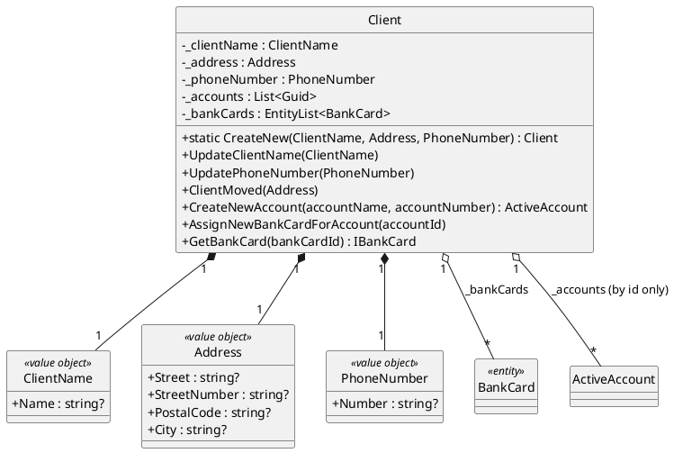
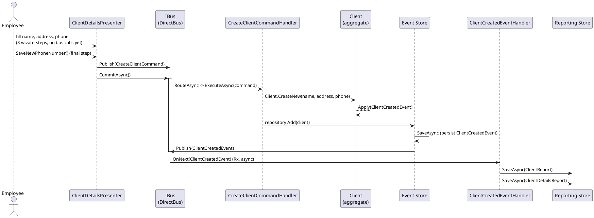
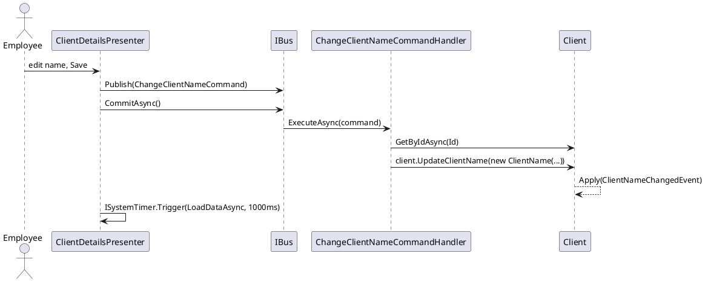

# Client Management

Covers creating a client and changing their name, address, or phone number. See
`00-architecture-overview.md` for the diagram style note and the overall system view.

## Domain model

`Client` is the aggregate root. `ClientName`, `Address`, and `PhoneNumber` are immutable
value objects (C# `record`s). `BankCard` is a child entity of `Client` — covered in
`02-bank-cards.md`, shown here only as a relationship.

`_accounts` stores only account **ids** (`List<Guid>`) — the client doesn't hold account
aggregates, just enough to answer "does this account belong to this client" for the
`AssignNewBankCardForAccount` guard.

### Guard clauses

| Method | Guard | Exception |
|---|---|---|
| `UpdateClientName`, `UpdatePhoneNumber`, `ClientMoved`, `CreateNewAccount`, `AssignNewBankCardForAccount` | `Id == Guid.Empty` (client never created) | `NonExistingClientException("The Client is not created and no opperations can be executed on it")` |
| `AssignNewBankCardForAccount` | `accountId` not in `_accounts` | `NonExistingAccountException("Client does not have the requested account")` |
| `GetBankCard` | `bankCardId` not found in `_bankCards` | `NonExistingBankCardException("The requested bank card does not exist!")` |

## Commands, handlers, events

| Command | Handler | Aggregate method | Event raised |
|---|---|---|---|
| `CreateClientCommand` | `CreateClientCommandHandler` | `Client.CreateNew(...)` | `ClientCreatedEvent` |
| `ChangeClientNameCommand` | `ChangeClientNameCommandHandler` | `client.UpdateClientName(...)` | `ClientNameChangedEvent` |
| `ChangeClientPhoneNumberCommand` | `ChangeClientPhoneNumberCommandHandler` | `client.UpdatePhoneNumber(...)` | `ClientPhoneNumberChangedEvent` |
| `ClientIsMovingCommand` | `ClientIsMovingCommandHandler` | `client.ClientMoved(...)` | `ClientMovedEvent` |

Each event has a matching event handler that updates the read model (`ClientReport` /
`ClientDetailsReport`, see `08-reporting-read-models.md`):

| Event | Read-model effect |
|---|---|
| `ClientCreatedEvent` | Save `ClientReport` + `ClientDetailsReport` |
| `ClientNameChangedEvent` | Update `ClientReport.Name` + `ClientDetailsReport.ClientName` |
| `ClientPhoneNumberChangedEvent` | Update `ClientDetailsReport.PhoneNumber` |
| `ClientMovedEvent` | Update `ClientDetailsReport`'s address fields |

## Sequence: creating a new client

The WinForms wizard (`ClientDetailsPresenter`, see `09-winforms-ui.md`) collects name,
address, and phone number across three panels before publishing anything — only the last
step actually talks to the bus.

The dashed/async arrow into `ClientCreatedEventHandler` matters: it runs on its own Rx
subscription, decoupled in time from the command that triggered it (see
`07-messaging-bus.md`). The UI's refresh timer (`09-winforms-ui.md`) is what eventually
picks up the new row — there's no direct callback from event handler to UI.

## Editing an existing client

`ChangeClientNameCommand`/`ClientIsMovingCommand`/`ChangeClientPhoneNumberCommand` follow
the same shape as each other: publish immediately (no batching across wizard steps, unlike
create), `CommitAsync`, then a fixed-delay UI refresh. One representative sequence stands
in for all three:

