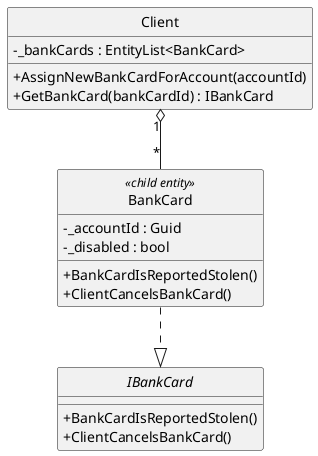
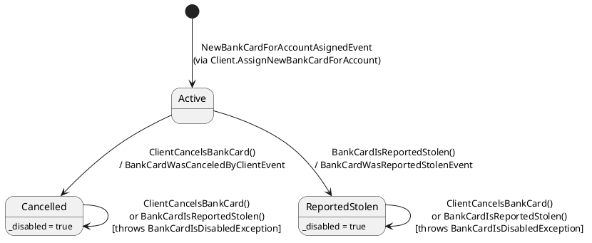
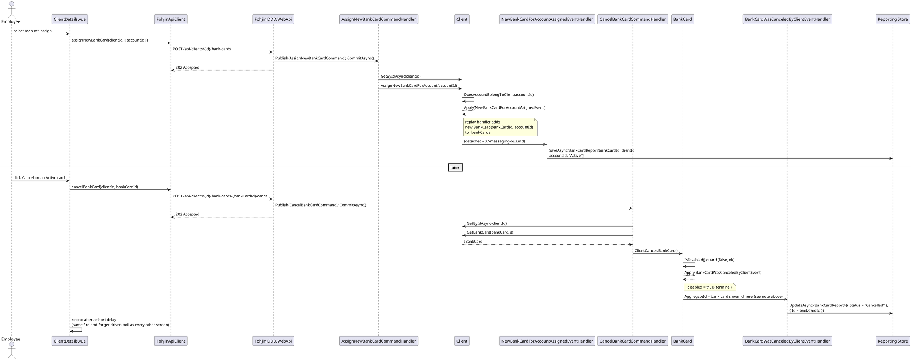

# Bank Cards

Covers assigning a new bank card to an account, cancelling it, and reporting it stolen.

> **History**: for most of this migration this domain/command layer had no UI at all in
> either client — a pre-existing gap from the original CQRS demo, predating this migration
> entirely. A bank-cards section was added to Vue's `ClientDetails.vue` first, once a real
> read model (`BankCardReport`, below) existed to back a list screen; WinForms' equivalent
> (`ClientDetails.Views`/`ClientDetailsPresenter`, a "Client bank cards" tab plus a "Bank
> Cards" menu) was added afterward to reach feature parity across every client, and the WPF
> client (`09-client-uis.md`) implements it from the start. The domain itself never changed
> throughout any of this: only a read model and three UIs got added on top of
> commands/handlers/events that already existed.

## Entity relationship

`BankCard` is a child entity of `Client` (not its own aggregate root — it has no
independent lifecycle outside a `Client`). It's created only as a side effect of
`Client.AssignNewBankCardForAccount`.

> Why "entity, not aggregate root" is a meaningful distinction here, not just terminology:
> `patterns/ddd-building-blocks.md`.

`BankCard` itself exposes nothing beyond `Id`, a private `_accountId` link, and a private
`_disabled` flag — no card number, no card type, no expiry, nothing else. The read model
below (`BankCardReport`) reflects exactly that; nothing is invented beyond what the domain
actually has. It's populated by the three domain events' handlers
(`Fohjin.DDD.EventHandlers`), which used to be no-ops (kept around only to satisfy the
"every event must have a handler" completeness check) before the read model existed:

| Event | Handler effect |
|---|---|
| `NewBankCardForAccountAsignedEvent` | Save `BankCardReport(bankCardId, clientId, accountId, "Active")` |
| `BankCardWasCanceledByClientEvent` | Update `BankCardReport.Status = "Cancelled"` (matched by `Id` — see note below) |
| `BankCardWasReportedStolenEvent` | Update `BankCardReport.Status = "ReportedStolen"` (same) |

One `AggregateId` quirk worth knowing if you touch these handlers: `NewBankCardForAccountAsignedEvent`
is applied from within `Client` (so its `AggregateId` is the **client's** id — the event
carries an explicit `BankCardId` property instead), but `BankCardWasCanceledByClientEvent`/
`BankCardWasReportedStolenEvent` are applied from within `BankCard` itself, so *their*
`AggregateId` is the **bank card's own** id — matching `BankCardReport.Id`, which was set
from `BankCardId` at Assign time. Same aggregate hierarchy, two different meanings of
`AggregateId` depending on which object called `Apply()`.

`BankCardReport` is a child collection of `ClientDetailsReport`
(`ClientDetailsReport.BankCards`) using the same reflection-based
`"{ParentTypeName}Id"`-convention loading as `Accounts`/`ClosedAccounts`
(`08-reporting-read-models.md`) — so `GET /api/clients/{id}/details` already returns it,
no separate list endpoint was needed.

## State

Both terminal transitions share the same `_disabled` flag, so — from state alone — a
cancelled card and a stolen card look identical. The only way to tell them apart is which
event is in the aggregate's history.

Both `Cancelled` and `ReportedStolen` are terminal — there's no "reactivate" path. Calling
either method again (from either terminal state) throws
`BankCardIsDisabledException("The bank card is disabled and no operations can be executed on it")`.

## Commands, handlers, events

| Command | Handler | Aggregate call | Event raised |
|---|---|---|---|
| `AssignNewBankCardCommand(clientId, accountId)` | `AssignNewBankCardCommandHandler` | `client.AssignNewBankCardForAccount(accountId)` | `NewBankCardForAccountAsignedEvent(newBankCardId, accountId)` |
| `CancelBankCardCommand(clientId, bankCardId)` | `CancelBankCardCommandHandler` | `client.GetBankCard(bankCardId)` then `bankCard.ClientCancelsBankCard()` | `BankCardWasCanceledByClientEvent` |
| `ReportStolenBankCardCommand(clientId, bankCardId)` | `ReportStolenBankCardCommandHandler` | `client.GetBankCard(bankCardId)` then `bankCard.BankCardIsReportedStolen()` | `BankCardWasReportedStolenEvent` |

`AssignNewBankCardForAccount` guards `DoesAccountBelongToClient(accountId)` before raising
its event — see `01-client-management.md` for the guard/exception table.

## Web API endpoints

| Endpoint | Command | Request body |
|---|---|---|
| `POST /api/clients/{id}/bank-cards` | `AssignNewBankCardCommand(id, request.AccountId)` | `{ accountId }` |
| `POST /api/clients/{id}/bank-cards/{bankCardId}/cancel` | `CancelBankCardCommand(id, bankCardId)` | *(none)* |
| `POST /api/clients/{id}/bank-cards/{bankCardId}/report-stolen` | `ReportStolenBankCardCommand(id, bankCardId)` | *(none)* |

Same `bus.Publish(...); bus.CommitAsync(); return Results.Accepted(...)` fire-and-forget
shape as every other command endpoint (`00-architecture-overview.md`'s data-flow section).
All three clients present the same shape: a "Bank cards" list (account it's linked to +
status) with Cancel/Report-stolen actions on `Active` cards, and a form to assign a new
card against one of the client's own open accounts — Vue's `ClientDetails.vue` (a section
under Client Details), WinForms' `ClientDetails` view (a "Client bank cards" tab, reached
via the "Bank Cards" menu — `09-client-uis.md`), and WPF's equivalent (`09-client-uis.md`).

## Sequence: assign, then cancel

WinForms and WPF follow the exact same request shape through their own client (`ApiClient`
call → `202 Accepted` → refresh) — only what initiates the call differs: WinForms'
`ClientDetailsPresenter.AssignNewBankCard()`/`CancelSelectedBankCard()`/
`ReportSelectedBankCardStolen()` (wired to View events by the reflection-based MVP pattern,
`patterns/winforms-architecture.md`) and WPF's `ClientDetailsViewModel`'s equivalent
`RelayCommand`s (`patterns/wpf-architecture.md`) — see `09-client-uis.md`.
