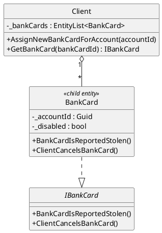
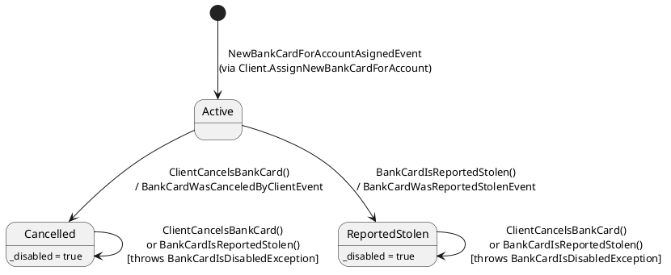
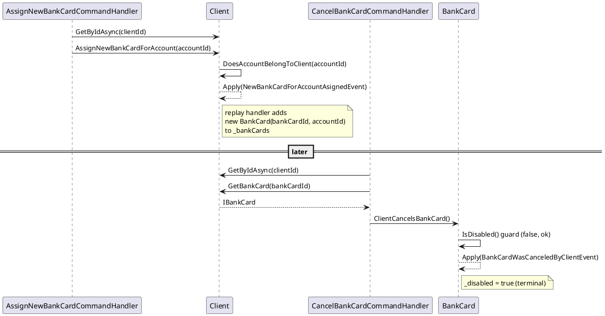

# Bank Cards

Covers assigning a new bank card to an account, cancelling it, and reporting it stolen.

> **Not exposed in the UI.** The WinForms app has no screen for any of this — no menu
> item, no panel, no button anywhere calls `AssignNewBankCardCommand`,
> `CancelBankCardCommand`, or `ReportStolenBankCardCommand`. This is domain + command
> handler + test coverage only (see `Test.Fohjin.DDD/Scenarios/Assign_new_bank_card`).
> Treat this doc as documenting a capability, not a walkthrough of a screen.

## Entity relationship

`BankCard` is a child entity of `Client` (not its own aggregate root — it has no
independent lifecycle outside a `Client`). It's created only as a side effect of
`Client.AssignNewBankCardForAccount`.

There is currently no read-model (`Fohjin.DDD.Reporting.Dtos`) for bank cards — the three
domain events below all have registered event handlers that are no-ops (they exist to
satisfy the "every event must have a handler" completeness check, but do nothing).

## State

Both terminal transitions share the same `_disabled` flag, so — from state alone — a
cancelled card and a stolen card look identical. The only way to tell them apart is which
event is in the aggregate's history.

Both `Cancelled` and `ReportedStolen` are terminal — there's no "reactivate" path. Calling
either method again (from either terminal state) throws
`BankCardIsDisabledException("The bank card is disabled and no operations can be executed on it")`.

## Commands, handlers, events

| Command | Handler | Aggregate call | Event raised |
|---|---|---|---|
| `AssignNewBankCardCommand(clientId, accountId)` | `AssignNewBankCardCommandHandler` | `client.AssignNewBankCardForAccount(accountId)` | `NewBankCardForAccountAsignedEvent(newBankCardId, accountId)` |
| `CancelBankCardCommand(clientId, bankCardId)` | `CancelBankCardCommandHandler` | `client.GetBankCard(bankCardId)` then `bankCard.ClientCancelsBankCard()` | `BankCardWasCanceledByClientEvent` |
| `ReportStolenBankCardCommand(clientId, bankCardId)` | `ReportStolenBankCardCommandHandler` | `client.GetBankCard(bankCardId)` then `bankCard.BankCardIsReportedStolen()` | `BankCardWasReportedStolenEvent` |

`AssignNewBankCardForAccount` guards `DoesAccountBelongToClient(accountId)` before raising
its event — see `01-client-management.md` for the guard/exception table.

## Sequence: assign, then cancel

