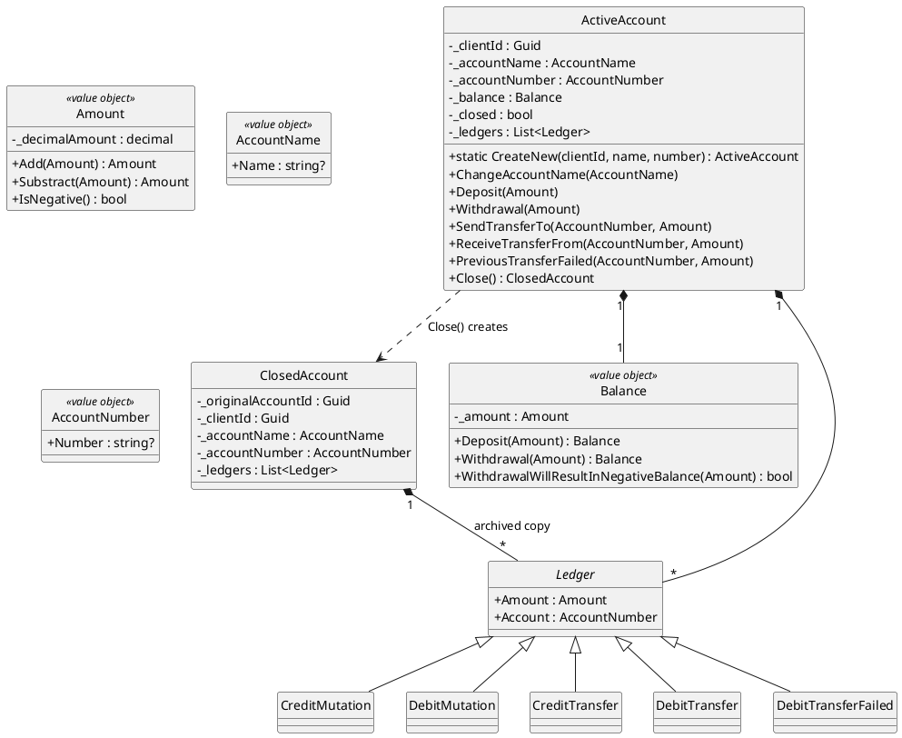
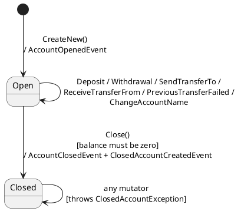
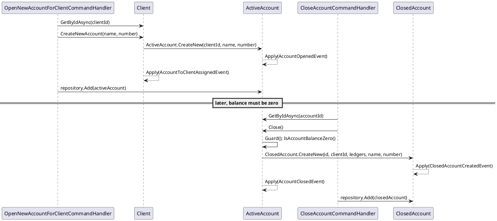

# Account Management

Covers opening an account, closing it, and renaming it. Deposits, withdrawals, and
transfers each get their own doc (`04-cash-operations.md`, `05-money-transfers.md`)
because of how much routing/guard logic they carry, but they're all methods on the same
`ActiveAccount` aggregate described here.

## Domain model

> Aggregate root / value object explained from first principles: `patterns/ddd-building-blocks.md`.

`ActiveAccount` is the aggregate root while an account is open. Closing it produces a
separate, independent aggregate — `ClosedAccount` — that archives the ledger history.
Every balance-changing operation appends a `Ledger` entry; the `Ledger` subclasses are
pure markers (no extra fields) used only for their type name.

| Operation | Ledger entry created |
|---|---|
| Deposit | `CreditMutation` |
| Withdrawal | `DebitMutation` |
| SendTransferTo | `CreditTransfer` |
| ReceiveTransferFrom | `DebitTransfer` |
| PreviousTransferFailed (compensating refund) | `DebitTransferFailed` |

`ClosedAccountCreatedEventHandler.GetDescription` recognizes `"DebitTransferFailed"` —
matching what a failed transfer actually produces — so replaying a closed account's archived
ledger describes a failed-transfer entry correctly instead of throwing
`UnsupportedTransferTypeException`.

## Guard clauses

Every mutator except the factory calls `Guard()` first, which is `IsAccountNotCreated()` +
`IsAccountClosed()`.

| Guard | Condition | Exception |
|---|---|---|
| `IsAccountNotCreated` | `Id == Guid.Empty` | `NonExitsingAccountException("The ActiveAccount is not created and no operations can be executed on it")` |
| `IsAccountClosed` | `_closed == true` | `ClosedAccountException("The ActiveAccount is closed and no operations can be executed on it")` |
| `IsBalanceHighEnough` (Withdrawal, SendTransferTo) | `_balance.WithdrawalWillResultInNegativeBalance(amount)` | `AccountBalanceToLowException("The amount {0:C} is larger than your current balance {1:C}")` |
| `IsAccountBalanceZero` (Close only) | `_balance != 0.0M` | `AccountBalanceNotZeroException("The current balance is {0:C} this must first be transferred to an other account")` |

## State

`Close()` is the only transition, and it's one-way: it both marks the `ActiveAccount` as
`_closed = true` (so it rejects all further operations) and constructs an independent
`ClosedAccount` aggregate carrying a serialized copy of the ledger history.

## Commands, handlers, events

| Command | Handler | Aggregate call | Event(s) raised |
|---|---|---|---|
| `OpenNewAccountForClientCommand` | `OpenNewAccountForClientCommandHandler` | `client.CreateNewAccount(name, number)` | `AccountOpenedEvent` |
| `ChangeAccountNameCommand` | `ChangeAccountNameCommandHandler` | `activeAccount.ChangeAccountName(...)` | `AccountNameChangedEvent` |
| `CloseAccountCommand` | `CloseAccountCommandHandler` | `activeAccount.Close()` | `AccountClosedEvent` + `ClosedAccountCreatedEvent` |

| Event | Read-model effect |
|---|---|
| `AccountOpenedEvent` | Save `AccountReport` + `AccountDetailsReport` (Balance = 0) |
| `AccountNameChangedEvent` | Update `AccountReport`/`AccountDetailsReport`.AccountName |
| `AccountClosedEvent` | Update `AccountReport`/`AccountDetailsReport`.Status = "Closed" (same row, same id - `08-reporting-read-models.md`) |
| `ClosedAccountCreatedEvent` | none (no-op - the row was already marked closed in place above) |

## Sequence: open then close an account

