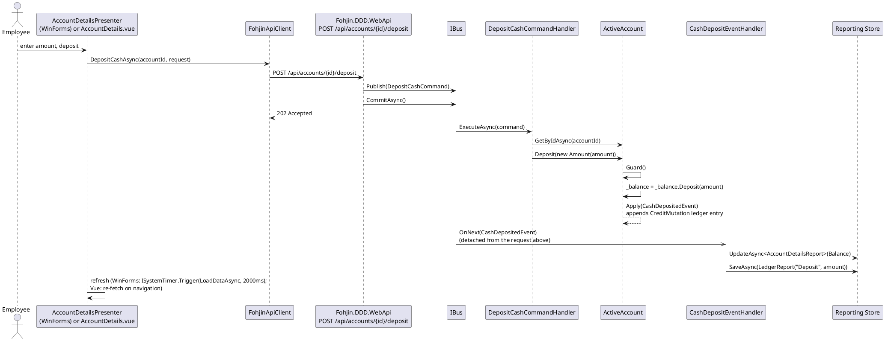
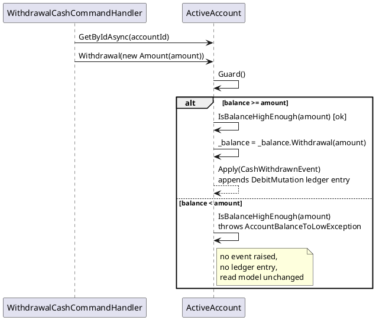

# Cash Operations

Deposit and withdrawal — the two simplest mutators on `ActiveAccount` (see
`03-account-management.md` for the aggregate, guards, and the `Ledger` hierarchy these
operations append to).

## Commands, handlers, events

| Command | Handler | Aggregate call | Event | Ledger entry |
|---|---|---|---|---|
| `DepositCashCommand(accountId, amount)` | `DepositCashCommandHandler` | `activeAccount.Deposit(new Amount(amount))` | `CashDepositedEvent(newBalance, amount)` | `CreditMutation` |
| `WithdrawalCashCommand(accountId, amount)` | `WithdrawalCashCommandHandler` | `activeAccount.Withdrawal(new Amount(amount))` | `CashWithdrawnEvent(newBalance, amount)` | `DebitMutation` |

| Event | Read-model effect |
|---|---|
| `CashDepositedEvent` | Update `AccountDetailsReport.Balance`; save `LedgerReport("Deposit", amount)` |
| `CashWithdrawnEvent` | Update `AccountDetailsReport.Balance`; save `LedgerReport("Withdrawal", amount)` |

## Sequence: deposit (always succeeds if the account is open)

Both clients drive this through the same `POST /api/accounts/{id}/deposit` endpoint —
WinForms' `AccountDetailsPresenter.DepositMoney()` and Vue's `AccountDetails.vue` deposit
form both call it via their own generated `FohjinApiClient`, and everything from the
endpoint down is identical to how it worked before this system had an HTTP front door.

## Sequence: withdrawal, both outcomes

Withdrawal is the same shape but has a real guard to show — insufficient balance throws
before any event is raised, so the account's state (and the read model) is left untouched.

