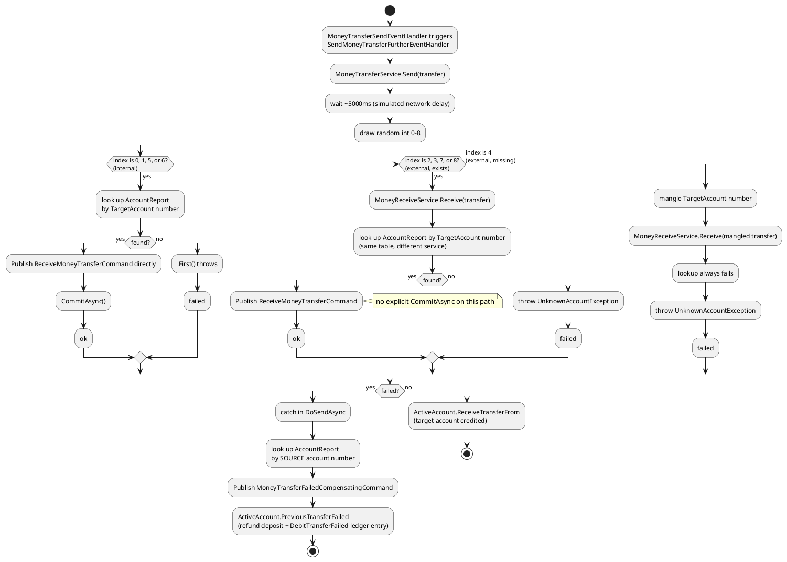
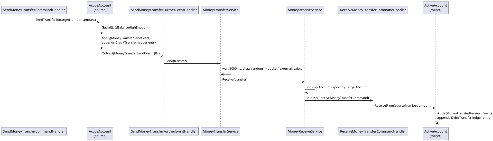
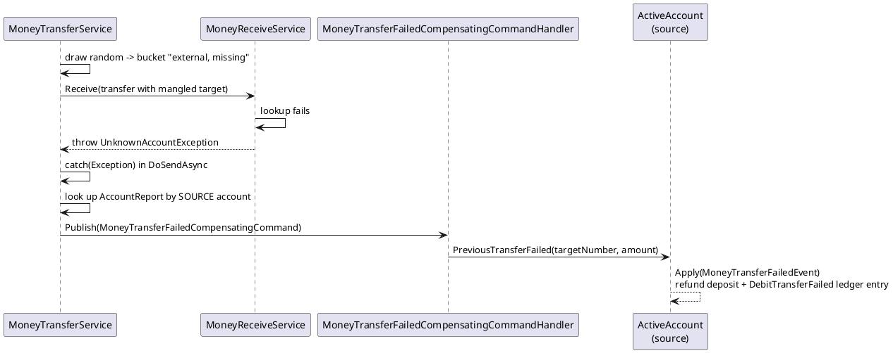

# Money Transfers

This is the most involved flow in the app: the bank simulates talking to other banks by
routing a transfer through one of three fake outcomes, entirely at random, against its own
single database. There is no real external bank anywhere in this codebase.

## The routing gag

`MoneyTransferService.Send` schedules `DoSendAsync` after a fake 5-second network delay
(`ISystemTimer.Trigger(..., 5000)`), then draws `ISystemRandom.Next(0, 9)` and looks the
result up in a 9-entry dictionary:

| Index | Route | Meaning |
|---|---|---|
| 0, 1, 5, 6 | Internal | Target account exists in *this* bank's own tables |
| 2, 3, 7, 8 | External (exists) | Routed through `IReceiveMoneyTransfers.Receive` as if it were a different bank — but `MoneyReceiveService` queries the same `AccountReport` table |
| 4 | External (missing) | Same as above, but the target account number is deliberately mangled first, guaranteeing the lookup fails |

The code's own comment: *"I didn't want to introduce an actual external bank, so that's
why you see this nice construct :)"*.

> **Bug found while documenting this**: the "mangle the account number" step is
> `moneyTransfer.TargetAccount?.Reverse().ToString()`. `Reverse()` on a `string` returns
> `IEnumerable<char>`, and calling `.ToString()` on *that* does not reverse the string — it
> just prints the enumerator's type name. It still produces something that isn't a valid
> account number (so the bug this line is trying to cause still happens), just not for the
> reason the code implies.

## Activity diagram: transfer routing

## Commands, handlers, events

| Command | Handler | Aggregate call | Event |
|---|---|---|---|
| `SendMoneyTransferCommand` | `SendMoneyTransferCommandHandler` | `activeAccount.SendTransferTo(targetNumber, amount)` | `MoneyTransferSendEvent` |
| `ReceiveMoneyTransferCommand` | `ReceiveMoneyTransferCommandHandler` | `activeAccount.ReceiveTransferFrom(sourceNumber, amount)` | `MoneyTransferReceivedEvent` |
| `MoneyTransferFailedCompensatingCommand` | `MoneyTransferFailedCompensatingCommandHandler` | `activeAccount.PreviousTransferFailed(targetNumber, amount)` | `MoneyTransferFailedEvent` |

All three handlers null-conditional (`?.`) the aggregate call — if `GetByIdAsync` can't
find the account, the handler silently no-ops rather than throwing.

| Event | Read-model effect | Other handler |
|---|---|---|
| `MoneyTransferSendEvent` | Update balance; save `LedgerReport("Transfer to {target}")` | **`SendMoneyTransferFurtherEventHandler`** also subscribes — it's what actually calls `MoneyTransferService.Send`, restarting the routing pipeline above |
| `MoneyTransferReceivedEvent` | Update balance; save `LedgerReport("Transfer from {source}")` | — |
| `MoneyTransferFailedEvent` | Update balance (refund); save `LedgerReport("Transfer to {target} failed")` | — |

Two independent event handlers subscribe to the same `MoneyTransferSendEvent` — one
updates the read model, the other drives the simulated routing. Neither knows about the
other (see `07-messaging-bus.md` for how Rx fans a single event out to N handlers).

## Sequence: full send-to-external-account, success case

## Sequence: compensating failure

`DebitTransferFailed` is the ledger entry type from the refund above — see
`03-account-management.md` for the known bug where `ClosedAccountCreatedEventHandler`
doesn't recognize this type name if the account is later closed with one of these entries
in its history.
