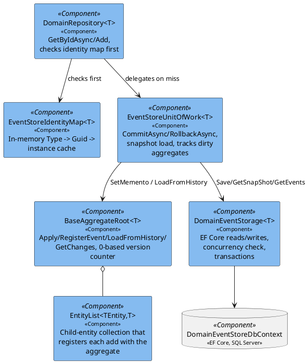
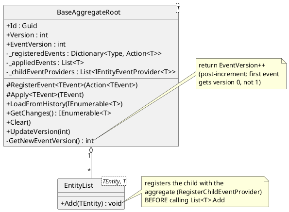
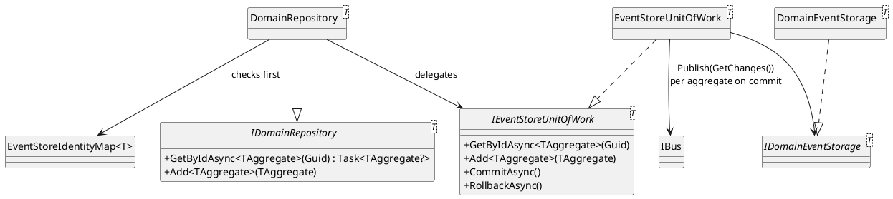
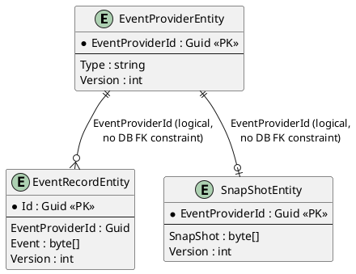
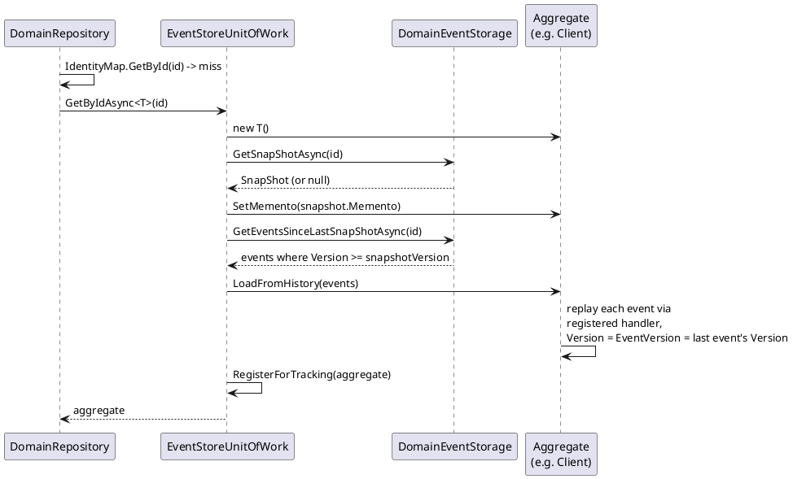
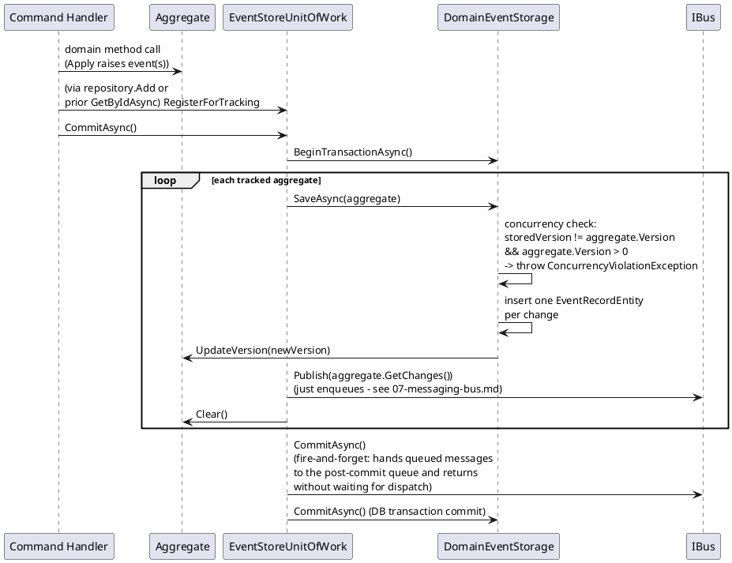

# Event Sourcing Infrastructure

The plumbing every aggregate in `01`–`05` sits on top of: how an aggregate raises and
replays events, how it's loaded and saved, and how that's persisted to SQL Server. None of
this changed when this system grew an HTTP front door — it's reached today from
`Fohjin.DDD.WebApi`'s minimal API endpoints (`00-architecture-overview.md`'s data-flow
section) instead of directly from WinForms presenters, but the code in this document is
untouched.

## Components

## `BaseAggregateRoot<TDomainEvent>`

`Apply<TEvent>` does three things in order: stamp `AggregateId`/`Version` on the event,
dispatch it to the registered handler (mutating state), and append it to `_appliedEvents`
(the "changes since last commit" buffer that `GetChanges()` returns).

Child entities (e.g. `BankCard` under `Client`) don't keep their own version counter —
they call back into the parent aggregate's `EventVersion` via a `Func<int>` hooked up when
`EntityList.Add` registers them, so parent and child events share one monotonic sequence.

## Repository / unit-of-work chain

`DomainRepository.GetByIdAsync` checks the identity map first (so a second `GetByIdAsync`
for the same aggregate within one unit of work returns the same in-memory instance)
before falling through to `EventStoreUnitOfWork`, which actually loads from storage.

## Entity relations — event store tables

One `EventProviderEntity` row per aggregate/entity stream. Relationships are enforced only
by matching `EventProviderId` values — there's no `HasOne`/`WithMany` in the EF Core model
and no foreign-key constraint in the migrations.

> **Gap found while documenting this**: the snapshot machinery
> (`SaveShapShotAsync`/`GetEventCountSinceLastSnapShotAsync`) exists and works, but nothing
> in the production commit path (`EventStoreUnitOfWork.CommitAsync`) ever calls it
> automatically. It's only invoked from repository tests, whose names imply an intended
> "snapshot every 10 events" policy that was never wired up outside tests.

## Sequence: load with snapshot

If no snapshot exists, `GetEventsSinceLastSnapShotAsync` returns nothing and the flow falls
back to `GetAllEventsAsync(id)` — full replay from event 0.

## Sequence: commit (save)

`Bus.CommitAsync()` returning does **not** mean event handlers have run yet — see
`07-messaging-bus.md` for the fire-and-forget dispatch this hands off to, which is also
why `Fohjin.DDD.WebApi`'s command endpoints return `202 Accepted` rather than `200 OK`
with a result.
