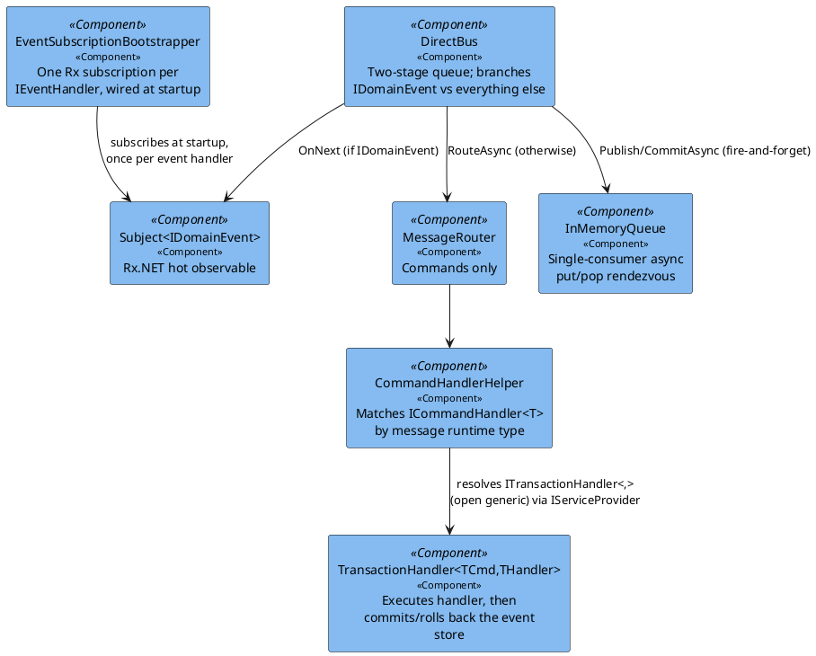
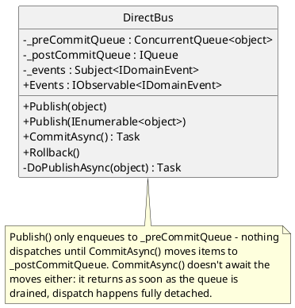
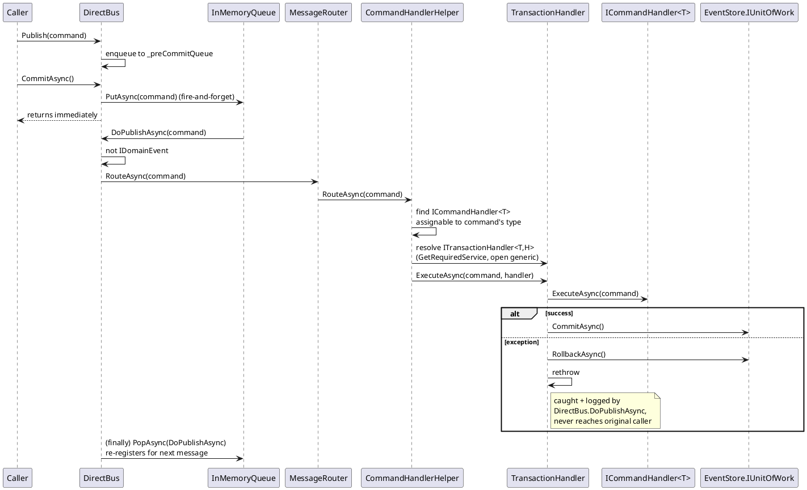
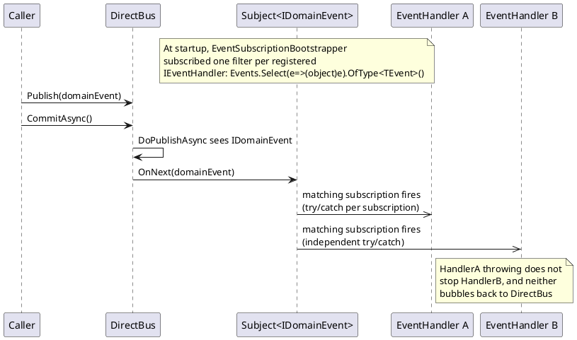

# Messaging / Bus

How a published command reaches exactly one handler, and how a published domain event
reaches every independently-subscribed handler. Both travel through the same `IBus`, but
split onto two different paths inside `DirectBus`.

> **Naming collision worth knowing about**: there are two unrelated interfaces both named
> `IUnitOfWork`. `Fohjin.DDD.Bus.IUnitOfWork` (`CommitAsync` + sync `Rollback`) is what
> `IBus` extends. `Fohjin.DDD.EventStore.IUnitOfWork` (`CommitAsync` + async
> `RollbackAsync`) is a completely different type, injected into `TransactionHandler` as
> the event-store session (resolved via `IEventStoreUnitOfWork<IDomainEvent>`, see
> `06-event-sourcing-infrastructure.md`). Don't assume "unit of work" means "the bus" when
> reading handler constructors.

## Components

## `DirectBus` — the two-stage queue

`DoPublishAsync` is registered once at construction (`_postCommitQueue.PopAsync(DoPublishAsync)`)
and re-registers itself in a `finally` block after every message — a self-sustaining
single-consumer loop, one message processed at a time, in submission order. Its try/catch
logs and swallows exceptions, because nothing awaits this method anymore now that
`CommitAsync` is fire-and-forget — an unhandled exception here would otherwise become an
unobserved task exception.

## Sequence: command dispatch

## Sequence: domain event fan-out (Rx)

Each event handler gets its **own** independent Rx subscription over the same shared
`bus.Events` stream, filtered by `OfType<TEvent>()`. N handlers subscribed to the same
event type means N independent invocations per publish, each with its own try/catch — one
handler's failure never blocks or is seen by another (see `EventSubscriptionBootstrapper`
in `Fohjin.DDD.Configuration`).

The Vue frontend has its own client-side mirror of exactly this shape:
`Fohjin.DDD.WebUI/src/events/eventBus.ts` is one shared `GET /api/events` (SSE) connection
for the whole browser session, with N independent filtered subscribers (one per screen that
wants live refresh) instead of each screen opening its own connection or polling — see
`09-winforms-ui.md`'s Vue section for the client-side details.

## Startup wiring

This bus, and every command/event handler it dispatches to, now lives inside
`Fohjin.DDD.WebApi`'s process rather than the WinForms exe's (see
`00-architecture-overview.md`) — `Fohjin.DDD.WebApi/Program.cs`:
`app.Services.BootStrapApplicationAsync()` (event-store/reporting database migrations)
runs first, then `app.Services.SubscribeEventHandlers()` — every `IEventHandler`
registered in DI gets its reflection-derived `IEventHandler<TEvent>` inspected once, and
one Rx subscription created, *before* the API starts accepting requests.
