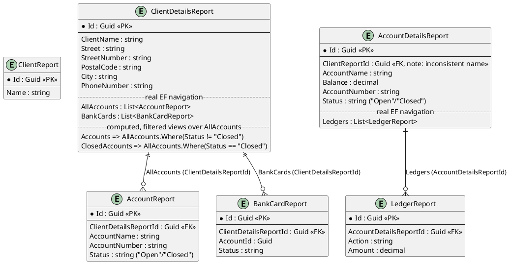
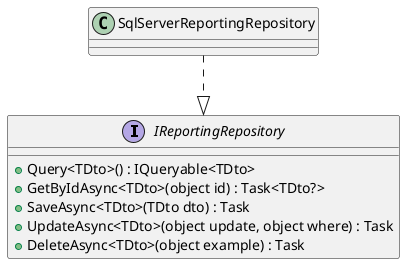

# Reporting / Read Models

The query side. Every DTO here lives in `Fohjin.DDD.Reporting.Dtos`, is written to only by
event handlers, and is read exclusively through `Fohjin.DDD.WebApi`'s HTTP endpoints (plain
REST `GET`s, six top-level OData entity sets, and two OData nested/contained routes — see
below) — never by a command handler, and never derived from the event store at query time (see
`00-architecture-overview.md` for why that boundary matters). Before the API existed,
WinForms presenters queried `IReportingRepository` in-process directly; that direct
reference is gone (`09-client-uis.md`) but the repository itself, and everything else in
this document, is unchanged.

> The Repository and Specification/dynamic-query-object patterns this implements, explained
> from first principles: `patterns/repository-and-unit-of-work.md` and
> `patterns/ddd-building-blocks.md`.

## Entity relations

`ClosedAccountReport`/`ClosedAccountDetailsReport` used to be separate tables (each an
independent, `HasBaseType(null)`-broken-out "closed" copy of `AccountReport`/`AccountDetailsReport`)
that `AccountClosedEventHandler` created by *deleting* the live row and
`ClosedAccountCreatedEventHandler` *recreating* it under a new id in the other table. They're
gone: `AccountReport`/`AccountDetailsReport` now carry their own `Status` ("Open"/"Closed"),
mutated in place by `AccountClosedEventHandler`, so `LedgerReport.AccountDetailsReportId` always
has exactly one unambiguous target regardless of whether the account is open or closed — a
single FK can't point at "whichever of two tables currently has this id", which is exactly the
bind the old two-table design was in. The event store still keeps the real, immutable history;
only the *read model*'s own delete/recreate ceremony was redundant with that.

EF Core quirks worth knowing if you touch this model:

- `ClientDetailsReport.AllAccounts`/`.BankCards` and `AccountDetailsReport.Ledgers` are real EF
  Core navigations (`HasMany().WithOne().HasForeignKey(...)` in `ReportingDbContext`), not a
  reflection-based loader — `IReportingRepository.Query<TDto>()`/`GetByIdAsync<TDto>()` compose
  against them with ordinary `.Include()`/`.SelectMany()`, and OData's nested/contained routes
  (below) resolve them the same way. `ClientDetailsReport.Accounts`/`.ClosedAccounts` are
  computed, `.Ignore()`'d filtered views over `AllAccounts` by `Status` — not separate
  navigations — kept so every existing UI consumer (WinForms, WPF, Vue, `Fohjin.DDD.ApiClient`)
  sees the same two-property wire shape it always did.
- `AccountDetailsReport`'s foreign key to its client is named `ClientReportId`, while
  `AccountReport`'s is `ClientDetailsReportId` — same logical relationship, inconsistent
  naming between the two DTOs.
- `AccountReport`, `LedgerReport`, and `BankCardReport` each carry an `InsertionSequence` EF
  Core *shadow property* (`ValueGeneratedOnAdd()`, an `IDENTITY` column with no corresponding
  CLR property, so it never appears in the DTO, the OpenAPI contract, or the NSwag-generated
  TypeScript client) purely so `GetByIdAsync<TDto>`'s ordered `.Include()` calls can
  `ORDER BY` it — needed because SQL Server, unlike SQLite, doesn't return an unordered
  `SELECT`'s rows in insertion order, and a client's Ledger/account/bank-card list needs to
  display chronologically.

## `IReportingRepository`: one composable query surface, one fast path, three write methods

There used to be one query method, `GetByExampleAsync<TDto>(object? example)`, which reflected
an anonymous object's properties into an equality-only `Expression<Func<TDto,bool>>` predicate —
every call site invented its own "example" shape, and it couldn't compose (no `.OrderBy()`, no
paging, nothing beyond AND-of-equals). It's gone. `Query<TDto>()` returns a plain
`IQueryable<TDto>` instead: callers `.Where()`/`.OrderBy()`/etc it themselves, and both the plain
REST `GET` endpoints and every OData endpoint below apply their query options to the exact same
`IQueryable` — one query mechanism for every DTO, not "getByFilterA", "getByFilterB", ... times
six DTOs. `GetByIdAsync<TDto>(object id)` is the common single-row-by-primary-key fast path
(every DTO's PK is literally `Id`, so it's one hardcoded equality check, no reflection) — for
`ClientDetailsReport`/`AccountDetailsReport` specifically it also does the ordered
`.Include(...OrderBy...)` calls that load their real navigations chronologically.

`UpdateAsync`/`DeleteAsync` still take an anonymous "where" object and build an
`Expression<Func<TDto,bool>>` predicate from it via reflection (`BuildPredicate`/
`GetPropertyInformation` in `SqlServerReportingRepository`) — that part of the original design
was fine for writes (an update/delete is naturally a fixed shape: "set these fields where these
match"), so it wasn't touched.

`Query<TDto>()`/`GetByIdAsync<TDto>()` open a *fresh* `DbContext` per call (via
`IDbContextFactory<ReportingDbContext>`) rather than reusing one across calls or disposing it
before returning, tracked in the repository instance's own `_readContexts` list and disposed
together when the repository itself is (`IAsyncDisposable`). This matters specifically in this
codebase: `IReportingRepository` is registered `Transient`, but
`Fohjin.DDD.MessageRouting.EventSubscriptionBootstrapper` resolves every `IEventHandler` exactly
once at startup and keeps it (and everything its constructor captured, transitively) alive for
the app's entire lifetime — so a repository injected into an event handler is not actually
short-lived just because it's registered `Transient`. A single DbContext reused across every call
on such an instance would violate "DbContext isn't safe for concurrent operations" the moment two
dispatches overlap; a fresh context per call avoids that at the cost of not composing a query
built from one `Query`/`GetByIdAsync` call against one built from another — never needed here.

## Three ways in: plain REST, top-level OData, and nested/contained OData

Every DTO here is reachable up to three ways from `Fohjin.DDD.WebApi`, all three ultimately
reading through `IReportingRepository.Query<TDto>()`:

- **Plain REST** — `GET /api/clients`-style endpoints, described the same way they always
  worked (`Program.cs`).
- **Top-level OData entity sets** — `GET /odata/{EntitySet}` for all six DTOs (`Clients`,
  `ClientDetails`, `Accounts`, `AccountDetails`, `Ledgers`, `BankCards`), plus the RFC 10008
  `QUERY /odata/{EntitySet}` variant (same `$filter` syntax, as a JSON body, for filters too
  large/complex for a query string — `docs/supporting/rfc10008-http-query-method.md`). Both
  verbs share one generic handler,
  `EndpointRouteBuilderExtensions.MapODataEntitySet<TDto>(entitySetName)`, called once per DTO in
  `Program.cs` — there's exactly one code path applying `$filter`/`$orderby` for any of them.
  This handler applies `ODataQueryOptions.ApplyTo` by hand and serializes the result as a plain
  `System.Text.Json` array (matching what a plain REST endpoint returns), rather than going
  through `[EnableQuery]`'s own OData-JSON formatter — so it can't honor `$select`/`$count`/
  `$expand` (`ODataValidationSettings.AllowedQueryOptions` restricts it to `Filter | OrderBy`,
  turning any other query option into a `400` instead of a silently-wrong or throwing response).
- **Nested/contained OData routes** — `GET /odata/ClientDetails({id})/Accounts?$filter=...` (and
  `/ClosedAccounts`, `/BankCards`), `GET /odata/AccountDetails({id})/Ledgers?$filter=...` — real
  `ODataController`s (`OData/Controllers/ClientDetailsController.cs`,
  `AccountDetailsController.cs`) matched purely by OData's own routing conventions (controller
  name = entity set name, action `Get{NavigationProperty}` = the navigation property to
  resolve — no attribute routing). These go through real `[EnableQuery(AllowedQueryOptions =
  AllowedQueryOptions.All)]`, so unlike the top-level entity sets, `$select`/`$expand`/`$top`/
  `$skip`/`$count` all work — nothing pins these routes' response shape the way
  `ODataClientsEndpointTest.cs` pins the top-level ones, so there was no reason to restrict them.
  One consequence worth knowing: `[EnableQuery]`'s formatter wraps every collection response in
  an OData envelope (`{"@odata.context": "...", "value": [...]}`), unlike the bare JSON array the
  top-level entity sets and plain REST endpoints return — a client reading a nested route needs
  to unwrap `"value"` (see `NestedODataRoutesTest.cs`).

`app.MapControllers()` in `Program.cs` is what makes the nested routes' `ODataController`s
reachable at all — every other endpoint in that file is minimal-API (`MapGet`/`MapPost`/
`MapMethods`), so nothing before that call ever wired an actual `[Controller]` class into the
endpoint pipeline, even though `AddOData(...)` had already registered the EDM model and route
component. `ODataModel.Build()` also explicitly `.Ignore()`s `ClientDetailsReport.AllAccounts`
from the EDM model — it's the real navigation backing the `Accounts`/`ClosedAccounts` filtered
views that are the two nested routes actually meant for API consumers, so it's excluded to avoid
a third, unfiltered nested route appearing alongside them.

## Event → read-model effect

| Event | Handler | Effect |
|---|---|---|
| `ClientCreatedEvent` | `ClientCreatedEventHandler` | Save `ClientReport`; Save `ClientDetailsReport` |
| `ClientNameChangedEvent` | `ClientNameChangedEventHandler` | Update `ClientReport.Name`; Update `ClientDetailsReport.ClientName` |
| `ClientMovedEvent` | `ClientMovedEventHandler` | Update `ClientDetailsReport`'s address fields |
| `ClientPhoneNumberChangedEvent` | `ClientPhoneNumberChangedEventHandler` | Update `ClientDetailsReport.PhoneNumber` |
| `AccountToClientAssignedEvent` | `AccountToClientAssignedEventHandler` | none (no-op) |
| `AccountOpenedEvent` | `AccountOpenedEventHandler` | Save `AccountReport`; Save `AccountDetailsReport` (Balance = 0) |
| `AccountNameChangedEvent` | `AccountNameChangedEventHandler` | Update `AccountReport`/`AccountDetailsReport`.AccountName |
| `AccountClosedEvent` | `AccountClosedEventHandler` | Update `AccountReport.Status` = "Closed"; Update `AccountDetailsReport.Status` = "Closed" |
| `ClosedAccountCreatedEvent` | `ClosedAccountCreatedEventHandler` | none (no-op — the account row was already marked closed in place above, under its original id, so there's nothing left to recreate) |
| `CashDepositedEvent` | `CashDepositEventHandler` | Update Balance; Save `LedgerReport("Deposit")` |
| `CashWithdrawnEvent` | `CashWithdrawnEventHandler` | Update Balance; Save `LedgerReport("Withdrawal")` |
| `MoneyTransferSendEvent` | `MoneyTransferSendEventHandler` | Update Balance; Save `LedgerReport("Transfer to {target}")` |
| `MoneyTransferSendEvent` | `SendMoneyTransferFurtherEventHandler` | none — drives `ISendMoneyTransfer.Send` (outbound side-effect, not a report write) |
| `MoneyTransferReceivedEvent` | `MoneyTransferReceivedEventHandler` | Update Balance; Save `LedgerReport("Transfer from {source}")` |
| `MoneyTransferFailedEvent` | `MoneyTransferFailedEventHandler` | Update Balance (refund); Save `LedgerReport("Transfer to {target} failed")` |
| `NewBankCardForAccountAsignedEvent` | `NewBankCardForAccountAssignedEventHandler` | Save `BankCardReport` (Status = "Active") |
| `BankCardWasCanceledByClientEvent` | `BankCardWasCanceledByClientEventHandler` | Update `BankCardReport.Status` = "Cancelled" |
| `BankCardWasReportedStolenEvent` | `BankCardWasReportedStolenEventHandler` | Update `BankCardReport.Status` = "ReportedStolen" |

Three of the eighteen registered event handlers are pure no-ops on the read side —
`AccountToClientAssignedEventHandler`, `SendMoneyTransferFurtherEventHandler` (which exists
purely to drive the transfer routing in `05-money-transfers.md`, not to write a report), and
`ClosedAccountCreatedEventHandler` (a no-op since the `AccountReport`/`AccountDetailsReport`
merge above — the preceding `AccountClosedEvent` already did the only read-model effect this
event used to cause). The three bank-card lifecycle events used to be no-ops too, before
`BankCardReport` and its Vue-only UI existed (`02-bank-cards.md`).
