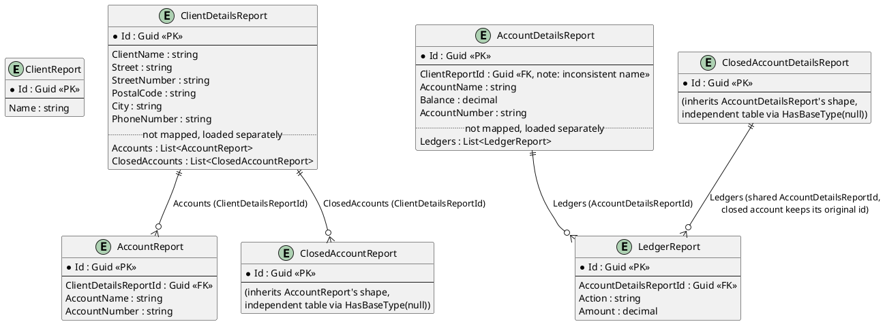
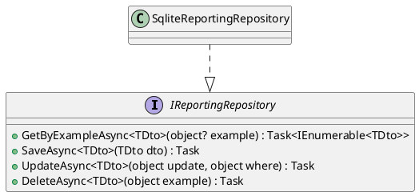

# Reporting / Read Models

The query side. Every DTO here lives in `Fohjin.DDD.Reporting.Dtos`, is written to only by
event handlers, and is read directly by the WinForms presenters — never by a command
handler, and never derived from the event store at query time (see
`00-architecture-overview.md` for why that boundary matters).

## Entity relations

Two EF Core quirks worth knowing if you touch this model:

- `ClosedAccountReport`/`ClosedAccountDetailsReport` use `entity.HasBaseType((Type?)null)`
  in `ReportingDbContext` to break out of EF's default table-per-hierarchy inheritance —
  each gets its own independent table instead of collapsing into
  `AccountReport`/`AccountDetailsReport`.
- The four child-collection navigations (`ClientDetailsReport.Accounts`/`.ClosedAccounts`,
  `AccountDetailsReport.Ledgers`, `ClosedAccountDetailsReport.Ledgers`) are `Ignore()`'d —
  not mapped by EF at all. `SqliteReportingRepository.LoadChildrenAsync` populates them
  manually after the main query, using a `{ParentTypeName}Id` naming convention
  (reflection-based, not a real EF navigation).
- `AccountDetailsReport`'s foreign key to its client is named `ClientReportId`, while
  `AccountReport`'s is `ClientDetailsReportId` — same logical relationship, inconsistent
  naming between the two DTOs.

## `IReportingRepository`

`GetByExampleAsync`/`UpdateAsync`/`DeleteAsync` all take an anonymous object
(`new { AccountNumber = "..." }`), reflect its properties into a dictionary, and build an
`Expression<Func<TDto,bool>>` predicate at runtime (AND of per-property equality checks) —
there's no LINQ query written by hand anywhere in this repository, just data-driven
expression trees. After every `GetByExampleAsync`, `LoadChildrenAsync` reflects over the
result's generic-typed properties to find and populate the `Ignore()`'d child collections
described above.

## Event → read-model effect

| Event | Handler | Effect |
|---|---|---|
| `ClientCreatedEvent` | `ClientCreatedEventHandler` | Save `ClientReport`; Save `ClientDetailsReport` |
| `ClientNameChangedEvent` | `ClientNameChangedEventHandler` | Update `ClientReport.Name`; Update `ClientDetailsReport.ClientName` |
| `ClientMovedEvent` | `ClientMovedEventHandler` | Update `ClientDetailsReport`'s address fields |
| `ClientPhoneNumberChangedEvent` | `ClientPhoneNumberChangedEventHandler` | Update `ClientDetailsReport.PhoneNumber` |
| `AccountToClientAssignedEvent` | `AccountToClientAssignedEventHandler` | none (no-op) |
| `AccountOpenedEvent` | `AccountOpenedEventHandler` | Save `AccountReport`; Save `AccountDetailsReport` (Balance = 0) |
| `AccountNameChangedEvent` | `AccountNameChangedEventHandler` | Update `AccountReport`/`AccountDetailsReport`.AccountName |
| `AccountClosedEvent` | `AccountClosedEventHandler` | **Delete** `AccountReport`; **Delete** `AccountDetailsReport` |
| `ClosedAccountCreatedEvent` | `ClosedAccountCreatedEventHandler` | Save `ClosedAccountReport`; Save `ClosedAccountDetailsReport`; Save one `LedgerReport` per archived ledger entry |
| `CashDepositedEvent` | `CashDepositEventHandler` | Update Balance; Save `LedgerReport("Deposit")` |
| `CashWithdrawnEvent` | `CashWithdrawnEventHandler` | Update Balance; Save `LedgerReport("Withdrawal")` |
| `MoneyTransferSendEvent` | `MoneyTransferSendEventHandler` | Update Balance; Save `LedgerReport("Transfer to {target}")` |
| `MoneyTransferSendEvent` | `SendMoneyTransferFurtherEventHandler` | none — drives `ISendMoneyTransfer.Send` (outbound side-effect, not a report write) |
| `MoneyTransferReceivedEvent` | `MoneyTransferReceivedEventHandler` | Update Balance; Save `LedgerReport("Transfer from {source}")` |
| `MoneyTransferFailedEvent` | `MoneyTransferFailedEventHandler` | Update Balance (refund); Save `LedgerReport("Transfer to {target} failed")` |
| `NewBankCardForAccountAsignedEvent` | `NewBankCardForAccountAssignedEventHandler` | none (no-op) |
| `BankCardWasCanceledByClientEvent` | `BankCardWasCanceledByClientEventHandler` | none (no-op) |
| `BankCardWasReportedStolenEvent` | `BankCardWasReportedStolenEventHandler` | none (no-op) |

Five of the eighteen registered event handlers are pure no-ops on the read side — three
bank-card lifecycle events (there's no bank-card read model at all, see
`02-bank-cards.md`), `AccountToClientAssignedEvent`, and `SendMoneyTransferFurtherEventHandler`
(which exists purely to drive the transfer routing in `05-money-transfers.md`, not to
write a report).
