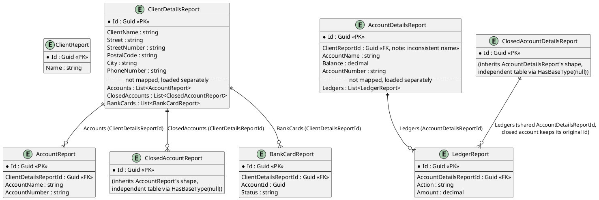
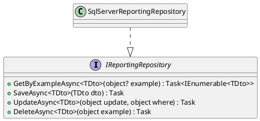

# Reporting / Read Models

The query side. Every DTO here lives in `Fohjin.DDD.Reporting.Dtos`, is written to only by
event handlers, and is read exclusively through `Fohjin.DDD.WebApi`'s HTTP endpoints (both
plain REST `GET`s and the `GET /odata/Clients` OData endpoint, see below) — never by a
command handler, and never derived from the event store at query time (see
`00-architecture-overview.md` for why that boundary matters). Before the API existed,
WinForms presenters queried `IReportingRepository` in-process directly; that direct
reference is gone (`09-client-uis.md`) but the repository itself, and everything else in
this document, is unchanged.

> The Repository and Specification/dynamic-query-object patterns this implements, explained
> from first principles: `patterns/repository-and-unit-of-work.md` and
> `patterns/ddd-building-blocks.md`.

## Entity relations

Four EF Core quirks worth knowing if you touch this model:

- `ClosedAccountReport`/`ClosedAccountDetailsReport` use `entity.HasBaseType((Type?)null)`
  in `ReportingDbContext` to break out of EF's default table-per-hierarchy inheritance —
  each gets its own independent table instead of collapsing into
  `AccountReport`/`AccountDetailsReport`.
- The five child-collection navigations (`ClientDetailsReport.Accounts`/`.ClosedAccounts`/`.BankCards`,
  `AccountDetailsReport.Ledgers`, `ClosedAccountDetailsReport.Ledgers`) are `Ignore()`'d —
  not mapped by EF at all. `SqlServerReportingRepository.LoadChildrenAsync` populates them
  manually after the main query, using a `{ParentTypeName}Id` naming convention
  (reflection-based, not a real EF navigation).
- `AccountDetailsReport`'s foreign key to its client is named `ClientReportId`, while
  `AccountReport`'s is `ClientDetailsReportId` — same logical relationship, inconsistent
  naming between the two DTOs.
- `AccountReport`, `ClosedAccountReport`, `LedgerReport`, and `BankCardReport` each carry an `InsertionSequence`
  EF Core *shadow property* (`ValueGeneratedOnAdd()`, an `IDENTITY` column with no
  corresponding CLR property, so it never appears in the DTO, the OpenAPI contract, or the
  NSwag-generated TypeScript client) purely so `LoadChildrenAsync` can `ORDER BY` it —
  needed because SQL Server, unlike SQLite, doesn't return an unordered `SELECT`'s rows in
  insertion order, and a client's Ledger/account list needs to display chronologically.

## Two ways in: `IReportingRepository` and OData

Every DTO here is reachable two ways from `Fohjin.DDD.WebApi`: through `IReportingRepository`
(below — plain `GET /api/clients`-style REST endpoints, described the same way it always
worked), and through `GET /odata/Clients`, which queries `IDbContextFactory<ReportingDbContext>`
directly with a live `IQueryable<ClientReport>` and `ODataQueryOptions.ApplyTo` — giving a
Vue/OData client real `$filter`/`$orderby`/`$select` pushdown that the reflection-based
repository's equality-only predicates can't offer. Both paths read the same tables; OData
just bypasses the repository for the one DTO (`ClientReport`) that needs richer querying.

## `IReportingRepository`

`GetByExampleAsync`/`UpdateAsync`/`DeleteAsync` all take an anonymous object
(`new { AccountNumber = "..." }`), reflect its properties into a dictionary, and build an
`Expression<Func<TDto,bool>>` predicate at runtime (AND of per-property equality checks) —
there's no LINQ query written by hand anywhere in this repository, just data-driven
expression trees. After every `GetByExampleAsync`, `LoadChildrenAsync` reflects over the
result's generic-typed properties to find and populate the `Ignore()`'d child collections
described above.

## Event → read-model effect

| Event | Handler | Effect |
|---|---|---|
| `ClientCreatedEvent` | `ClientCreatedEventHandler` | Save `ClientReport`; Save `ClientDetailsReport` |
| `ClientNameChangedEvent` | `ClientNameChangedEventHandler` | Update `ClientReport.Name`; Update `ClientDetailsReport.ClientName` |
| `ClientMovedEvent` | `ClientMovedEventHandler` | Update `ClientDetailsReport`'s address fields |
| `ClientPhoneNumberChangedEvent` | `ClientPhoneNumberChangedEventHandler` | Update `ClientDetailsReport.PhoneNumber` |
| `AccountToClientAssignedEvent` | `AccountToClientAssignedEventHandler` | none (no-op) |
| `AccountOpenedEvent` | `AccountOpenedEventHandler` | Save `AccountReport`; Save `AccountDetailsReport` (Balance = 0) |
| `AccountNameChangedEvent` | `AccountNameChangedEventHandler` | Update `AccountReport`/`AccountDetailsReport`.AccountName |
| `AccountClosedEvent` | `AccountClosedEventHandler` | **Delete** `AccountReport`; **Delete** `AccountDetailsReport` |
| `ClosedAccountCreatedEvent` | `ClosedAccountCreatedEventHandler` | Save `ClosedAccountReport`; Save `ClosedAccountDetailsReport`; Save one `LedgerReport` per archived ledger entry |
| `CashDepositedEvent` | `CashDepositEventHandler` | Update Balance; Save `LedgerReport("Deposit")` |
| `CashWithdrawnEvent` | `CashWithdrawnEventHandler` | Update Balance; Save `LedgerReport("Withdrawal")` |
| `MoneyTransferSendEvent` | `MoneyTransferSendEventHandler` | Update Balance; Save `LedgerReport("Transfer to {target}")` |
| `MoneyTransferSendEvent` | `SendMoneyTransferFurtherEventHandler` | none — drives `ISendMoneyTransfer.Send` (outbound side-effect, not a report write) |
| `MoneyTransferReceivedEvent` | `MoneyTransferReceivedEventHandler` | Update Balance; Save `LedgerReport("Transfer from {source}")` |
| `MoneyTransferFailedEvent` | `MoneyTransferFailedEventHandler` | Update Balance (refund); Save `LedgerReport("Transfer to {target} failed")` |
| `NewBankCardForAccountAsignedEvent` | `NewBankCardForAccountAssignedEventHandler` | Save `BankCardReport` (Status = "Active") |
| `BankCardWasCanceledByClientEvent` | `BankCardWasCanceledByClientEventHandler` | Update `BankCardReport.Status` = "Cancelled" |
| `BankCardWasReportedStolenEvent` | `BankCardWasReportedStolenEventHandler` | Update `BankCardReport.Status` = "ReportedStolen" |

Two of the eighteen registered event handlers are pure no-ops on the read side —
`AccountToClientAssignedEvent` and `SendMoneyTransferFurtherEventHandler` (which exists
purely to drive the transfer routing in `05-money-transfers.md`, not to write a report).
The three bank-card lifecycle events used to be no-ops too, before `BankCardReport` and
its Vue-only UI existed (`02-bank-cards.md`).
