# Client UIs: WinForms, Vue, and WPF

Three client applications drive the same `Fohjin.DDD.WebApi`: `Fohjin.DDD.BankApplication`
(WinForms desktop, retargeted from an in-process app to an HTTP client),
`Fohjin.DDD.WebUI` (Vue 3 + Vite), and `Fohjin.DDD.BankApplication.Wpf` (WPF desktop, the
newest of the three — full MVVM via CommunityToolkit.Mvvm). None of them ever touch the
domain, the bus, or either database directly — all three go through a generated API client
and sign in against `Fohjin.DDD.Sts` before making any call (see `00-architecture-overview.md`).
This doc covers WinForms first (the original UI, and the one with more architectural
machinery worth explaining — the Presenter/View reflection wiring), then Vue, then WPF, as
three siblings covering the same screens.

## WinForms

> The Model-View-Presenter pattern this implements, and why Vue isn't "MVP again," explained
> from first principles: `patterns/mvp.md`.

### Presenter/View wiring

`Presenter<TView>`'s constructor wires up every view event to a matching presenter method
purely by reflection and naming convention — no manual `+=` anywhere in a concrete
presenter. This is unchanged by the HTTP retargeting below; it's purely a UI-layer
mechanism.

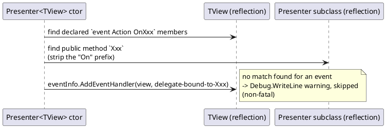

So `IClientDetailsView.OnSaveNewClientName` auto-binds to
`ClientDetailsPresenter.SaveNewClientName()` purely because the names match — this is what
`PresenterTest.cs` verifies.

### Sign-in, before any window opens

There's no WinForms login screen. `Fohjin.DDD.BankApplication/Program.cs` calls
`DesktopAuthService.LoginAsync()` once, synchronously, before building any presenter or
showing any window — every presenter's `FohjinApiClient` calls assume a token is already
sitting in `AuthorizationHandler.AccessToken` by the time they run. `LoginAsync()` opens
the STS's real login page in the user's actual default browser
(`Process.Start(..., UseShellExecute: true)`) and catches the authorization-code redirect
on a local `HttpListener` bound to a loopback address — the same authorization-code + PKCE
flow Vue drives via `oidc-client-ts` (below), against the same seeded `dev-client`, just
without a browser tab of its own. No refresh token is requested; the access token
(OpenIddict's default 1-hour lifetime) is held in memory for the process's lifetime, so a
session outlasting that needs signing in again — an accepted limitation for this dev
sample, not something this codebase builds silent-renewal machinery for.

### Components

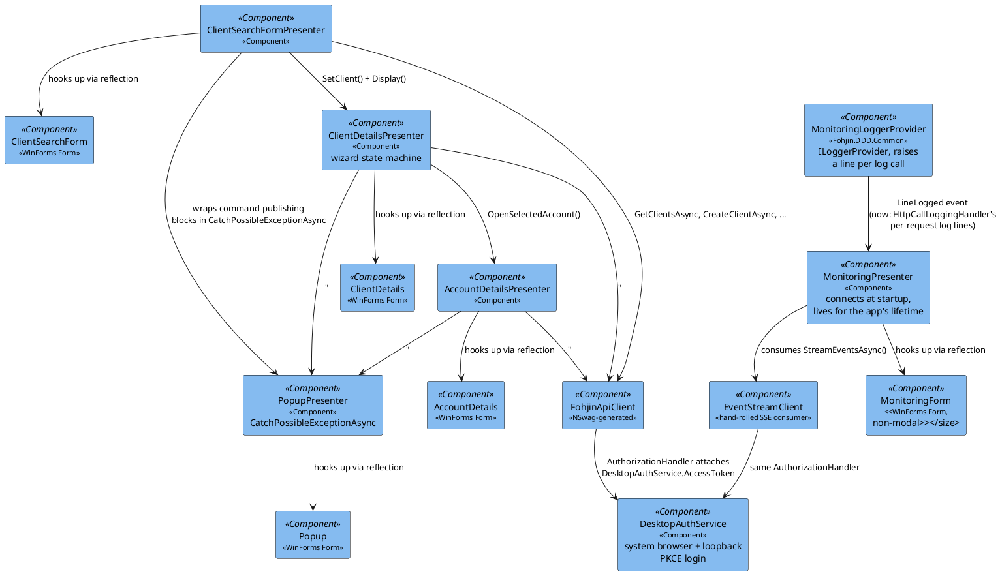

`IAccountDetailsPresenter` has no bank-card methods — `AssignNewBankCardCommand` /
`CancelBankCardCommand` / `ReportStolenBankCardCommand` (see `02-bank-cards.md`) are not
wired to any button or menu anywhere in this UI (or in Vue's).

### Screens

**Client Search** — the main window. A hidden single-tab `TabControl` hosts a `ListBox`
bound to `ClientReport`s (fetched via `FohjinApiClient.GetClientsAsync()`); a menu item
starts the "add new client" flow.

```plantuml
@startsalt
{
  { "Client" | "Help" }
  ==
  Existing clients
  {
    "Doe, John"
    "Smith, Jane"
    "Nijhof, Mark"
  }
}
@endsalt
```

**Client Details — create-new wizard.** Three steps, shown one panel at a time. Steps 1
and 2 only mutate an in-memory DTO (`_clientDetailsReport = ... with { ... }`) — nothing is
sent to the API until step 3.

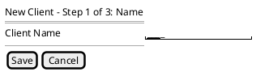

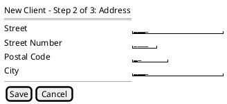

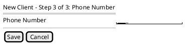

**Client Details — editing an existing client.** Every field is visible at once; each
"initiate change" action opens the relevant panel and calls the API immediately on save
(no batching, unlike create).

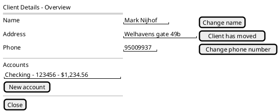

**Client Details — bank cards**, reached via the "Bank Cards" menu (a separate tab from the
overview, unlike Accounts/Closed accounts, which sit inline — see
`docs/patterns/winforms-architecture.md` for the Presenter/View pair this added). Existing
cards show which account they're linked to and their status, with Cancel/Report-stolen
buttons on `Active` ones (`docs/02-bank-cards.md`: no card number/type/expiry exists in the
read model to show, same as Vue's equivalent section).

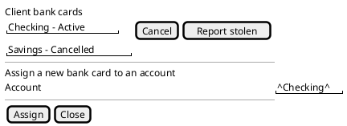

**Account Details.**

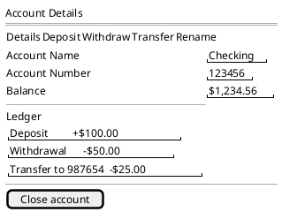

**Popup** — the shared error dialog every presenter routes exceptions through, now via
`PopupPresenter.CatchPossibleExceptionAsync(Func<Task>)` (an async overload was added
alongside the original sync `CatchPossibleException(Action)` in Phase 7, since every
presenter method wrapping an API call needed to `await` it).

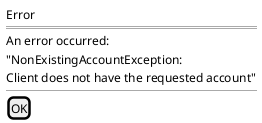

**Monitoring** — a non-modal companion window, opened alongside the main window at
startup (`MonitoringPresenter.Display()` calls `Show()`, not `ShowDialog()`, so it never
blocks the rest of the UI). Two bounded, auto-scrolling lists: every HTTP call the app
makes on the left, every domain event on the right. Capped at a fixed entry count (oldest
trimmed) so a long-running session doesn't grow memory or the control unboundedly.

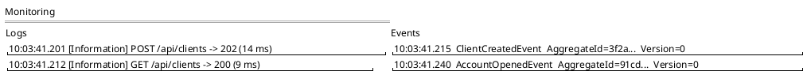

Design notes (see the components diagram above for how the pieces connect):

- `MonitoringLoggerProvider` (`Fohjin.DDD.Common`) is a custom `ILoggerProvider` registered
  alongside the existing console/debug providers in `Program.cs` — it doesn't replace them,
  it's a third listener. It raises a plain `event Action<string>? LineLogged` per log call.
  Since Phase 7, what it captures changed: there's no more in-process bus/command-handler
  logging to listen to (that all runs inside `Fohjin.DDD.WebApi`'s process now), so the log
  half is fed by a new `HttpCallLoggingHandler` — a `DelegatingHandler` in
  `FohjinApiClient`'s pipeline that logs `"{Method} {Path} -> {StatusCode} ({ElapsedMs} ms)"`
  per outgoing request.
- The event half used to be a direct `IBus.Events` subscription (`Subject<IDomainEvent>`,
  in-process). Since WinForms doesn't host the CQRS core anymore, `MonitoringPresenter`
  instead consumes `GET /api/events` through `EventStreamClient` — a hand-rolled
  `System.Net.ServerSentEvents.SseParser<T>`-based consumer, because the NSwag-generated
  `FohjinApiClient.StreamEventsAsync()` does a one-shot `SendAsync` and discards the
  response body without ever reading it (NSwag has no real streaming-response support).
  `ConsumeEventStreamAsync` runs an infinite retry loop with a 5-second backoff on
  disconnect, since the SSE connection can drop independently of the rest of the app.
- Both subscriptions can fire from any thread. `MonitoringForm`'s
  `AppendLogLine`/`AppendEventLine` marshal to the UI thread themselves
  (`InvokeRequired`/`BeginInvoke`) before touching a control — the same fix already applied
  to `SystemTimer` for the same reason.

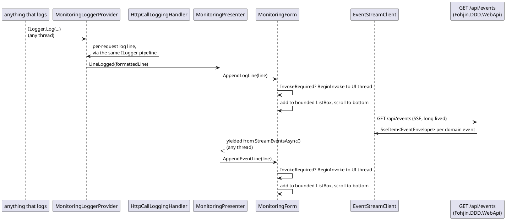

### Sequence: create new client, full UI-to-refresh flow

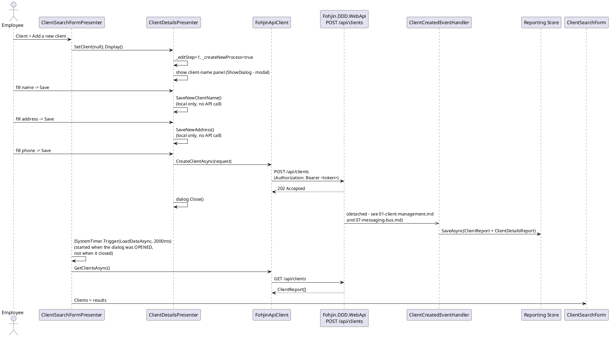

The 2-second timer is a blind fixed-delay poll, not correlated with when the command/event
pipeline actually finishes — on a slow event handler the new client may not appear yet, and
there's no retry. `ISystemTimer.Trigger` captures the UI `SynchronizationContext` when
scheduled and marshals the callback back onto it, so setting a WinForms control's
`DataSource` from the timer's background thread doesn't throw invisibly.

### Bugs found live-verifying the WinForms HTTP retargeting

Retargeting WinForms from in-process CQRS calls to real HTTP calls against `Fohjin.DDD.WebApi`
introduced four production bugs, none caught by `dotnet build` or the existing unit/integration
suite - every one only surfaced by driving the compiled `.exe` with FlaUI + Playwright:

- **Missing a real `Application.Run()` message loop**: `Program.cs`'s `Main` used to show a
  form and return once its constructor finished, because every CQRS call used to complete
  synchronously in-process. Real HTTP calls are genuine async I/O - `ClientSearchFormPresenter.
  Display()`'s `await LoadDataAsync()` now always actually suspends, so without a message loop
  pumping, `Main()` would return and the whole process would exit before that continuation
  ever ran, silently dropping the initial data load.
- **A premature `HttpListener.Stop()`**: `DesktopAuthService`'s OIDC loopback listener used to
  call `listener.Stop()` immediately after `GetContextAsync()` returned, before writing the
  browser's "you can close this tab" response. `Stop()` tears down resources
  (e.g. the response stream's `ThreadPoolBoundHandle`) shared with any still-in-flight
  `HttpListenerContext`, so the write threw `ObjectDisposedException` - sign-in appeared to
  hang with the browser tab never confirming success. Fixed by leaving cleanup to the
  `using var listener` declaration, which stops/disposes it only once the method actually
  returns or throws, after the response is written.
- **A DI registration gap**: `AddHttpMessageHandler<AuthorizationHandler>()`/
  `<HttpCallLoggingHandler>()` on the typed `FohjinApiClient`/`EventStreamClient` registrations
  require the handler types themselves to already be resolvable from the container - without
  their own `services.AddTransient<AuthorizationHandler>()`/`AddTransient<HttpCallLoggingHandler>()`
  calls, every HTTP call threw `InvalidOperationException: No service for type
  'AuthorizationHandler' has been registered.` at the first API call, not at startup.
- **A transient-client bug**: `DesktopAuthService` was briefly registered via
  `services.AddHttpClient<DesktopAuthService>(...)`, which resolves a *new*
  `DesktopAuthService` instance on every injection (only the underlying `HttpMessageHandler`
  is pooled). `AuthorizationHandler` needs to read back the *same* instance's `AccessToken`
  that `Main` sets via `LoginAsync()` before any window opens - a fresh instance's
  `AccessToken` is always `null`, so every request silently went out with no `Authorization`
  header, producing 401s that looked like an auth/config problem rather than a DI lifetime
  one. Fixed by registering `DesktopAuthService` as a plain `services.AddSingleton(sp => new
  DesktopAuthService(...))` instead.

## Vue (`Fohjin.DDD.WebUI`)

A single-page app (Vue 3 + Vite + Vue Router) covering the same screens as WinForms, built
against the same `Fohjin.DDD.WebApi` and the same generated client story — NSwag generates
a `fetch`-based TypeScript client (`src/api/generated-client.ts`) instead of the C#
`FohjinApiClient` WinForms uses, from the same `openapi.json`.

> The layered (Pinia store / composable / config / component) architecture every screen
> below follows, explained from first principles: `patterns/vue-architecture.md`.

| Route | Component | Covers |
|---|---|---|
| `/login` | `Login.vue` | Redirects into the STS's real login page |
| `/callback` | `LoginCallback.vue` | OIDC authorization-code redirect target |
| `/` | `ClientSearch.vue` | Client list (equivalent of WinForms' Client Search) |
| `/clients/new` | `ClientCreate.vue` | Single form for all three fields — no wizard, one `POST /api/clients` on submit |
| `/clients/:id` | `ClientDetails.vue` | Equivalent of WinForms' Client Details (edit + accounts list + bank cards — all three clients have feature parity, `02-bank-cards.md`) |
| `/accounts/:id` | `AccountDetails.vue` | Equivalent of WinForms' Account Details |
| `/monitoring` | `Monitoring.vue` | Live event stream, connect/disconnect, multi-select event-type filter (none selected = show all) |

`router/index.ts`'s `beforeEach` guard redirects any non-public route to `/login` unless
`getUser()` (from `oidc-client-ts`'s `UserManager`) returns a non-expired user — this is
Vue's equivalent of WinForms blocking on `DesktopAuthService.LoginAsync()` before showing
any window, just enforced per-navigation instead of once at startup.

### Screens

`LoginCallback.vue` renders nothing of its own — it's a bare redirect target
(`completeLogin()` then an immediate router push), so it has no wireframe below.

**Login.**

```plantuml
@startsalt
{
  Fohjin Bank
  ==
  [Sign in]
}
@endsalt
```

**Client Search** — same role as WinForms' main window, as a route instead.

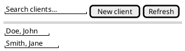

**Client Create** — a single form for all three fields, unlike WinForms' three-step wizard
(`docs/patterns/vue-architecture.md`'s Structure layer has no notion of a multi-step flow to
reuse here, and nothing about client creation needs one).

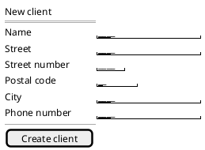

**Client Details** — edit fields, accounts, and bank cards all on one scrollable page
(`02-bank-cards.md`: no card number/type/expiry exists in the read model to show, same as
WinForms' equivalent screen).

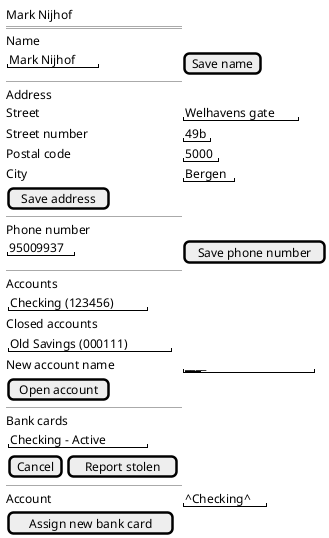

**Account Details.**

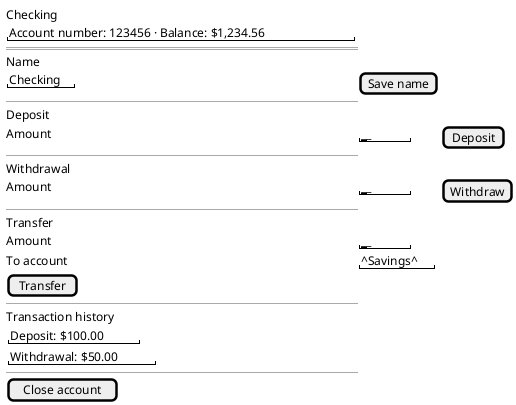

**Monitoring** — a route rather than a companion window, since a browser tab can't open a
second top-level window the way WinForms/WPF do; connect state and a type filter replace
what's otherwise the same shared-event-bus idea as the desktop clients'.

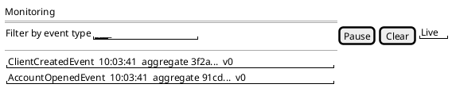

### Sign-in: browser redirect, not a loopback listener

`src/auth/authService.ts` wraps `oidc-client-ts`'s `UserManager` — `login()` calls
`signinRedirect()` (full-page redirect to the STS, PKCE handled automatically for
`response_type: "code"`), and `LoginCallback.vue` calls `completeLogin()` (`signinRedirectCallback()`)
to exchange the code for tokens once the STS redirects back to `/callback`. This is the
same authorization-code + PKCE flow WinForms drives through `DesktopAuthService` and the
same seeded `dev-client`, against the same `Fohjin.DDD.Sts` — the difference is purely
mechanical: a real browser tab doing a page redirect vs. a desktop process opening a
system browser and listening on a loopback port for the same redirect.

### Sign-out: the client's `post_logout_redirect_uri` has to be registered too

`logout()` calls `signoutRedirect()`, which sends the browser to `Fohjin.DDD.Sts`'s
`/connect/logout` with `post_logout_redirect_uri: window.location.origin`. OpenIddict
validates that URI against the calling client's own registration before it will honor it -
`Fohjin.DDD.Sts/Program.cs`'s dev-client seeding registered `RedirectUris` (for sign-in) from
the start, but never `PostLogoutRedirectUris` or the `EndSession` endpoint permission a
client needs to use `/connect/logout` at all. With neither registered, OpenIddict rejected
every sign-out attempt outright (`error:invalid_request` /
`error_description: The specified 'post_logout_redirect_uri' is invalid.` /
`error_uri: https://documentation.openiddict.com/errors/ID2052`), and
`AuthorizationController.LogoutPost()`'s `SignOut(...)` call fell back to its own
`RedirectUri = "/"` - landing the browser on `Fohjin.DDD.Sts`'s generic MVC home page
(`Views/Home/Index.cshtml`, unrelated template scaffolding) instead of back in the Vue app,
which is easy to mistake for a second, unrelated web app rather than the STS's own fallback
page. Fixed by adding `DevClientOptions.PostLogoutRedirectUris` (bound from
`DevClient:PostLogoutRedirectUris` in `appsettings.Development.json`) and granting
`Permissions.Endpoints.EndSession` alongside the existing `Authorization`/`Token`
permissions. `Fohjin.DDD.BankApplication.UITests/VueSignInSignOutTest.cs` drives this whole
round trip through a real headless browser and asserts the final URL is back on the Vue
app, not `Fohjin.DDD.Sts`'s own page - the assertion that actually catches this bug, since
"no error" alone doesn't prove the redirect went anywhere useful.

### Live refresh: a shared client-side event bus, not a poll

`src/events/eventBus.ts` is one shared `GET /api/events` (SSE) connection for the whole
Vue session — opened once at app boot (`main.ts`) and kept open, rather than each screen
polling on its own fixed-delay timer. It's the client-side mirror of `DirectBus`'s own
shape server-side (`07-messaging-bus.md`): one shared event stream, N independent
subscribers, each filtering for what it cares about. It can't use the NSwag-generated
client's `streamEvents()` (NSwag has no real SSE support) or the browser's native
`EventSource` (can't attach an `Authorization` header) — so, same as `EventStreamClient` on
the WinForms side, it reads `GET /api/events` by hand: `fetch()` with a bearer token, then
a hand-parsed reader over `Results.ServerSentEvents`'s wire format (`event:`/`data:` lines,
blank line between records), filtering out the synthetic `"StreamConnected"` marker event.

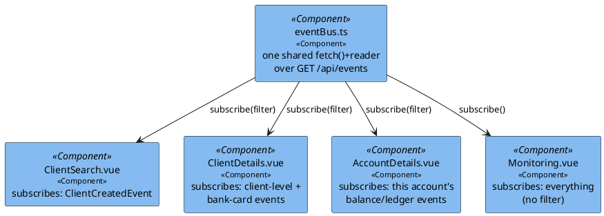

Filtering happens client-side, per subscriber, over the one unfiltered stream — not via a
separate server-side `$filter` connection per screen, since there's only one shared
connection. Filters key off `eventType` and `aggregateId` exactly as documented in each
domain doc: `ClientDetails.vue` needs the note in `02-bank-cards.md`/`06-event-sourcing-infrastructure.md`
about `BankCardWasCanceledByClientEvent`/`BankCardWasReportedStolenEvent` carrying the bank
card's own id as `aggregateId`, not the client's, so it also checks the event's aggregate id
against every bank card id already loaded for that client.

**No queue or replay on this stream** — an event that fires while nobody's connected (the
brief window right after login while the OIDC token exchange finishes, a dropped network
connection, a laptop waking from sleep) is gone for good, not delivered late. Two things
mitigate this without reintroducing a poll: the retry loop reconnects almost immediately
(not on a flat backoff) specifically when the reason was "not authenticated yet" rather than
a real connection failure, since every extra second there is a bigger miss window; and
`onReconnect()` lets a screen do one reconciliation reload every time the connection
(re)establishes, catching anything that happened in the gap. `Monitoring.vue` is the
simplest subscriber — no filter, no reconciliation reload (it has nothing to "reload," just
a live list) — and its "Pause"/"Resume" buttons only stop appending to its own list; they
don't touch the shared connection other screens are also using.

## WPF (`Fohjin.DDD.BankApplication.Wpf`)

The third client, and the only one that's MVVM from the start (WinForms stays MVP, Vue's
reactivity is already MVVM-flavored but organized differently — see
`patterns/winforms-architecture.md` and `patterns/vue-architecture.md` for why). Same
screens as the other two, same `FohjinApiClient`, same `dev-client` OIDC login — a desktop
loopback listener like WinForms (port 5340, not 5330, so both can run side by side), not a
browser redirect like Vue.

> The Model/ViewModel/View/Structure/Styling layering every screen below follows, explained
> from first principles: `patterns/wpf-architecture.md`.

**ViewModel-first navigation**: `MainWindow.xaml` is just `<ContentControl Content="{Binding
CurrentViewModel}" />`, bound to `INavigationService.CurrentViewModel` (an `ObservableObject`).
`Resources/ViewModelTemplates.xaml` maps each ViewModel type to a `DataTemplate` wrapping its
View — `ClientSearchViewModel` → `ClientSearchView`, and so on. Views never construct a
ViewModel or another View; `NavigationService.Show*()` resolves the next ViewModel from DI,
calls `Initialize(id)` where one's needed, and swaps `CurrentViewModel`.

**Live refresh**: a shared `DomainEventBus` (`Fohjin.DDD.DesktopClient`) wraps the same
`EventStreamClient` WinForms' `MonitoringPresenter` uses, but here every navigable ViewModel
consumes it (not just Monitoring) — `NavigationService`'s constructor subscribes to
`EventReceived` once and dispatches by pattern-matching on whichever ViewModel is currently
`CurrentViewModel`, so there's never a per-navigation subscribe/unsubscribe to leak. Each
ViewModel's `OnDomainEvent(...)` mirrors the exact same event-name/aggregate-id filter rules
`refreshRules.ts` encodes for Vue, and reloads twice (immediately, then again after 750ms) —
the same reconciliation-retry fix already applied to Vue for the SSE-vs-read-model race
(`07-messaging-bus.md`).

### Screens

**Client Search** (`ClientSearchView`) — a live-filtered `ICollectionView` over the client
list, shown in `MainWindow`'s content area rather than as a top-level form.

```plantuml
@startsalt
{
  Clients
  ==
  { "________________" | [New client] | [Refresh] }
  {
    "Doe, John"
    "Smith, Jane"
  }
}
@endsalt
```

**Client Create** (`ClientCreateView`) — one form, like Vue, not WinForms' three-step wizard.

```plantuml
@startsalt
{
  New client
  ==
  Name          | "________________"
  Street        | "________________"
  Street number | "____"
  Postal code   | "______"
  City          | "________________"
  Phone number  | "________________"
  --
  { [Create client] | [Cancel] }
}
@endsalt
```

**Client Details** (`ClientDetailsView`) — edit fields, accounts, and bank cards, the same
three-`GroupBox` layout WinForms uses on its Overview tab, all on one scrollable page instead
of separate tabs.

```plantuml
@startsalt
{
  Mark Nijhof
  ==
  Name
  { "Mark Nijhof" | [Save name] }
  --
  Address
  Street        | "Welhavens gate"
  Street number | "49b"
  Postal code   | "5000"
  City          | "Bergen"
  [Save address]
  --
  Phone number
  { "95009937" | [Save phone number] }
  --
  Accounts
  {
    "Checking (123456)"
  }
  Closed accounts
  {
    "Old Savings (000111)"
  }
  New account name | "________________"
  [Open account]
  --
  Bank cards
  {
    "Checking - Active"
  }
  { [Cancel] | [Report stolen] }
  --
  Assign a new bank card to an account
  Account | "^Checking^"
  [Assign]
}
@endsalt
```

**Account Details** (`AccountDetailsView`).

```plantuml
@startsalt
{
  Checking
  "Account number: 123456   Balance: $1,234.56"
  ==
  Name
  { "Checking" | [Save name] }
  --
  Deposit
  { "______" | [Deposit] }
  --
  Withdrawal
  { "______" | [Withdraw] }
  --
  Transfer
  Amount     | "______"
  To account | "^Savings^"
  [Transfer]
  --
  Transaction history
  {
    "Deposit: $100.00"
    "Withdrawal: $50.00"
  }
  --
  [Close account]
}
@endsalt
```

**Monitoring** (`MonitoringWindow`) — a separate non-modal window, WPF's equivalent of
WinForms' `MonitoringForm`, shown alongside the main window at startup.

```plantuml
@startsalt
{
  Monitoring
  ==
  {
    Logs | [Clear]
    {
      "10:03:41.201 [Information] POST /api/clients -> 202 (14 ms)"
    }
  } | {
    Events | [Clear]
    {
      "10:03:41.215  ClientCreatedEvent  AggregateId=3f2a...  Version=0"
    }
  }
}
@endsalt
```

### Bugs found live-verifying the WPF client

None of these were caught by `dotnet build`/`dotnet test` — all three surfaced only once a
FlaUI+Playwright harness actually drove the compiled `.exe` end to end (the same discipline
CLAUDE.md's bug list documents for the other two clients):

- **SSE event envelopes deserialized to all-default values, breaking every event-driven
  reload.** `Fohjin.DDD.WebApi`'s `Results.ServerSentEvents` serializes each item with
  ASP.NET Core's default `JsonSerializerDefaults.Web` (camelCase), but
  `EventStreamClient.StreamEventsAsync()` (shared by WinForms and WPF) called
  `JsonSerializer.Deserialize<EventEnvelope>(data)` with no matching options — case-sensitive
  PascalCase-only by default. This doesn't throw; it silently binds nothing, so every event
  arrived with `EventType=""`, `AggregateId=Guid.Empty`. The wire-level `"StreamConnected"`
  sentinel filter (keyed off the SSE `event:` field, not the deserialized body) still worked,
  masking the bug until a WPF ViewModel's `OnDomainEvent(eventType, ...)` check against that
  always-empty `eventType` never matched anything real. Fixed by deserializing with
  `JsonSerializerOptions.Web`.
- **A ListBox's double-click command never fired.** `ClientSearchView`/`ClientDetailsView`
  originally wired "open on double-click" via `<ListBox.InputBindings><MouseBinding
  MouseAction="LeftDoubleClick" .../></ListBox.InputBindings>` on the `ListBox` itself — a
  commonly-suggested WPF pattern that turns out not to fire here: `ListBoxItem`'s own
  `MouseLeftButtonDown` handling (selection) never lets the bubbled double-click reach the
  ListBox's `InputBindings` gesture recognition. Selection worked, the command never
  executed, with no exception anywhere. Fixed with an `ItemContainerStyle`
  `EventSetter Event="MouseDoubleClick"` targeting `ListBoxItem` directly, handled in
  code-behind (the item *is* the event source, so it always fires).
- **The bank-card Assign button could get stuck permanently disabled** (WinForms, not
  WPF — see below) once discovered while cross-checking the two implementations.

### Bug found live-verifying the WinForms bank-cards feature

- **The "Assign" bank-card button could stay disabled forever if a client had exactly one
  open account.** `ClientDetailsPresenter`'s `EnableSaveButton()`/`DisableSaveButton()` toggle
  one shared "current step's save button" set (all five step buttons together), driven by
  `FormElementGotChanged()` reacting to real user input events. `_newBankCardAccount` auto-
  selects its first item the instant its `DataSource` is (re)assigned — including during the
  *account-creation* background refresh that lands while the Bank Cards tab isn't even open
  yet, which fires `SelectedIndexChanged` → `FormElementGotChanged()` with none of the
  "current process" flags set → `DisableSaveButton()`, disabling the not-yet-visible Assign
  button too. If that auto-selected account is the client's *only* one, the user never
  changes the selection, so `SelectedIndexChanged` never fires again to re-enable it — the
  button opens already disabled and stays that way. Fixed by having
  `InitiateAssignNewBankCard()` explicitly re-validate against the current selection
  (`if (FormIsValid()) EnableSaveButton();`) when the panel opens, instead of only reacting to
  a change event that may never come.

### What's genuinely different across the three UIs

- **Create-client UX**: WinForms uses a three-step modal wizard; Vue and WPF each use one
  form. Same single `CreateClientCommand`/`POST /api/clients` either way
  (`01-client-management.md`).
- **Refresh strategy**: WinForms polls on a fixed-delay timer after every mutating action.
  Vue and WPF both subscribe to the relevant domain events on their own client-side event bus
  and reload when one arrives — no timer, no fixed delay, refresh happens as soon as the read
  model actually catches up rather than after a guessed interval.
- **Auth flow shape**: loopback `HttpListener` + system browser (WinForms and WPF, on
  different ports so both can run at once) vs. full-page redirect (Vue) — same
  authorization-code + PKCE grant underneath either way.
- **Bank cards**: full feature parity now (`02-bank-cards.md`) — added to Vue first, then
  WinForms, then built into WPF from the start.
- **Refresh-vs-read-model race**: both Vue's and WPF's event-driven refresh can (rarely)
  reload before the reporting-store event handler has actually finished writing, since the
  SSE notification and that handler are independent subscriptions on the same event with no
  ordering guarantee — found live in Vue first, fixed with a short reconciliation retry
  (`07-messaging-bus.md`), and applied to WPF proactively from the start for the same reason.
  WinForms' fixed-delay poll has the same theoretical race (nothing guarantees the delay is
  long enough either) but it's less visible in practice since polling naturally retries on
  its own next tick.
- **Everything else** — the domain, the commands, the events, the read models, and the
  API surface itself — is identical regardless of which client is calling it.
