# WinForms UI

The four screens, the Presenter/View pattern they're all built on, and the wizard-style
multi-step flow for creating a new client.

## Presenter/View wiring

`Presenter<TView>`'s constructor wires up every view event to a matching presenter method
purely by reflection and naming convention — no manual `+=` anywhere in a concrete
presenter:

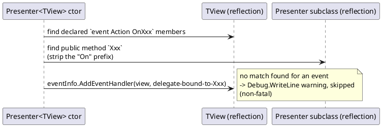

So `IClientDetailsView.OnSaveNewClientName` auto-binds to
`ClientDetailsPresenter.SaveNewClientName()` purely because the names match — this is what
`PresenterTest.cs` verifies.

## Components

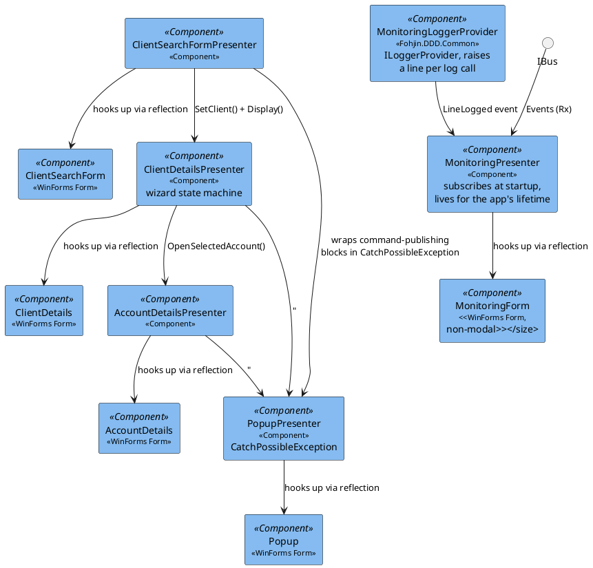

`IAccountDetailsPresenter` has no bank-card methods — `AssignNewBankCardCommand` /
`CancelBankCardCommand` / `ReportStolenBankCardCommand` (see `02-bank-cards.md`) are not
wired to any button or menu anywhere in this UI.

## Screens

**Client Search** — the main window. A hidden single-tab `TabControl` hosts a `ListBox`
bound to `ClientReport`s; a menu item starts the "add new client" flow.

```plantuml
@startsalt
{
  { "Client" | "Help" }
  ==
  Existing clients
  {
    "Doe, John"
    "Smith, Jane"
    "Nijhof, Mark"
  }
}
@endsalt
```

**Client Details — create-new wizard.** Three steps, shown one panel at a time. Steps 1
and 2 only mutate an in-memory DTO (`_clientDetailsReport = ... with { ... }`) — nothing is
published to the bus until step 3.

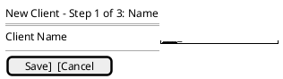

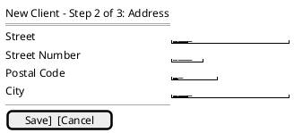

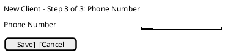

**Client Details — editing an existing client.** Every field is visible at once; each
"initiate change" action opens the relevant panel and publishes its command immediately on
save (no batching, unlike create).

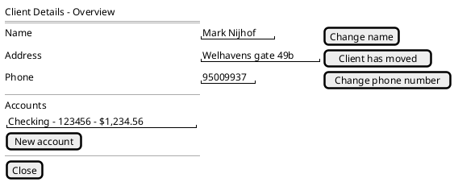

**Account Details.**

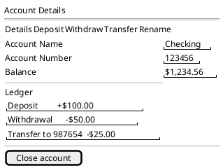

**Popup** — the shared error dialog every presenter routes exceptions through.

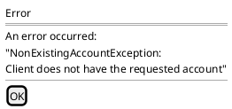

**Monitoring** — a non-modal companion window, opened alongside the main window at
startup (`MonitoringPresenter.Display()` calls `Show()`, not `ShowDialog()`, so it never
blocks the rest of the UI). Two bounded, auto-scrolling lists: every `ILogger` call in the
app on the left, every domain event that crosses `IBus.Events` on the right. Capped at a
fixed entry count (oldest trimmed) so a long-running session doesn't grow memory or the
control unboundedly.

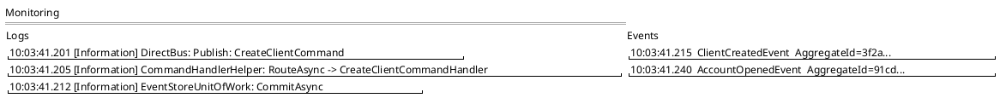

Design notes (see the components diagram above for how the pieces connect):

- `MonitoringLoggerProvider` (`Fohjin.DDD.Common`) is a custom `ILoggerProvider` registered
  alongside the existing console/debug providers in `Program.cs` — it doesn't replace them,
  it's a third listener. It raises a plain `event Action<string>? LineLogged` per log call
  (not an `IObservable`, since this project only needs simple fan-out here and the
  `Microsoft.Extensions.Logging` provider model is already the "many listeners" mechanism).
- `MonitoringPresenter` subscribes to `LineLogged` **and** `IBus.Events` once, in its
  constructor, so capture starts at app boot (before the main window is even shown) rather
  than only after the user opens the pane.
- Both subscriptions can fire from any thread — log calls happen everywhere, and
  `IBus.Events` deliveries run on whatever thread `DirectBus`'s consumer loop happens to be
  on (see `07-messaging-bus.md`), never guaranteed to be the UI thread. `MonitoringForm`'s
  `AppendLogLine`/`AppendEventLine` marshal to the UI thread themselves
  (`InvokeRequired`/`BeginInvoke`) before touching a control — the same fix already applied
  to `SystemTimer` for the same reason.

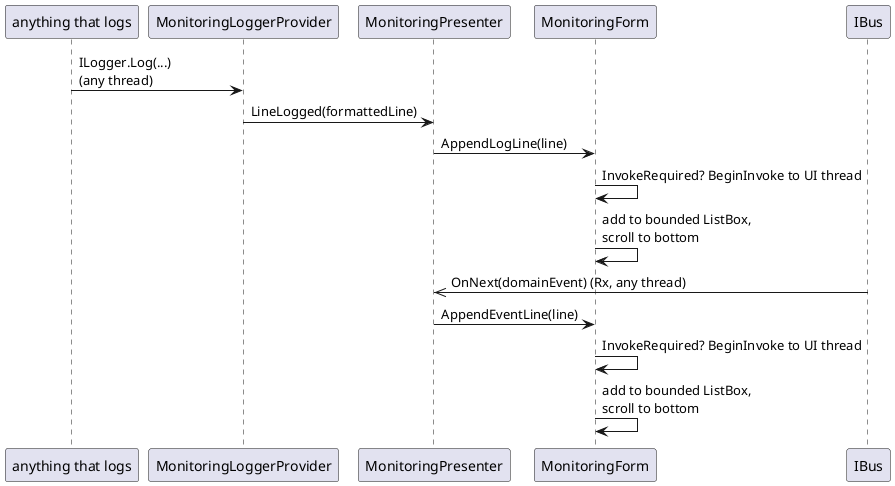

## Sequence: create new client, full UI-to-refresh flow

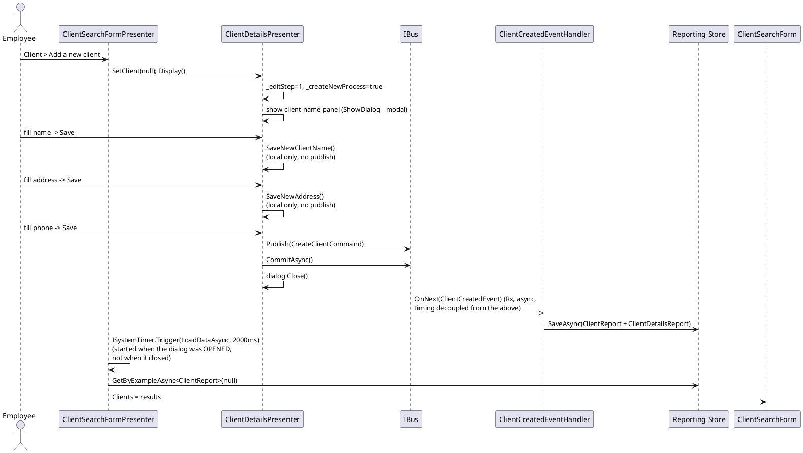

The 2-second timer is a blind fixed-delay poll, not correlated with when the command/event
pipeline actually finishes — on a slow event handler the new client may not appear yet, and
there's no retry. Historically this refresh also silently failed outright: `ISystemTimer`'s
production implementation ran the delayed callback via `Task.Run`, off the UI thread, and
setting a WinForms control's `DataSource` from a non-UI thread throws — invisibly, because
nothing observed the fire-and-forget task's exception. `SystemTimer.Trigger` now captures
the UI `SynchronizationContext` when scheduled and marshals the callback back onto it, so
the poll itself works again; the timing/correlation issue described above is unchanged.
