# Client UIs: WinForms and Vue

Two client applications drive the same `Fohjin.DDD.WebApi`: `Fohjin.DDD.BankApplication`
(WinForms desktop, retargeted from an in-process app to an HTTP client) and
`Fohjin.DDD.WebUI` (Vue 3 + Vite, the newer of the two). Neither ever touches the domain,
the bus, or either database directly anymore — both go through a generated API client and
sign in against `Fohjin.DDD.Sts` before making any call (see `00-architecture-overview.md`).
This doc covers WinForms first (the original UI, and the one with more architectural
machinery worth explaining — the Presenter/View reflection wiring), then Vue as a sibling
client covering the same screens.

## WinForms

> The Model-View-Presenter pattern this implements, and why Vue isn't "MVP again," explained
> from first principles: `patterns/mvp.md`.

### Presenter/View wiring

`Presenter<TView>`'s constructor wires up every view event to a matching presenter method
purely by reflection and naming convention — no manual `+=` anywhere in a concrete
presenter. This is unchanged by the HTTP retargeting below; it's purely a UI-layer
mechanism.

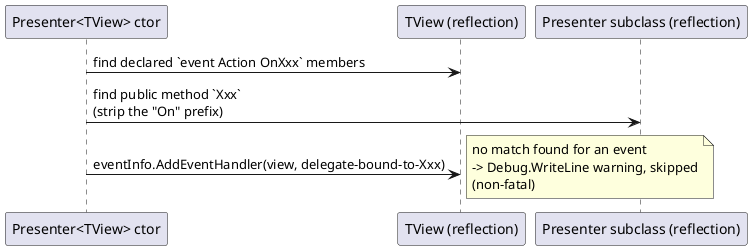

So `IClientDetailsView.OnSaveNewClientName` auto-binds to
`ClientDetailsPresenter.SaveNewClientName()` purely because the names match — this is what
`PresenterTest.cs` verifies.

### Sign-in, before any window opens

There's no WinForms login screen. `Fohjin.DDD.BankApplication/Program.cs` calls
`DesktopAuthService.LoginAsync()` once, synchronously, before building any presenter or
showing any window — every presenter's `FohjinApiClient` calls assume a token is already
sitting in `AuthorizationHandler.AccessToken` by the time they run. `LoginAsync()` opens
the STS's real login page in the user's actual default browser
(`Process.Start(..., UseShellExecute: true)`) and catches the authorization-code redirect
on a local `HttpListener` bound to a loopback address — the same authorization-code + PKCE
flow Vue drives via `oidc-client-ts` (below), against the same seeded `dev-client`, just
without a browser tab of its own. No refresh token is requested; the access token
(OpenIddict's default 1-hour lifetime) is held in memory for the process's lifetime, so a
session outlasting that needs signing in again — an accepted limitation for this dev
sample, not something this codebase builds silent-renewal machinery for.

### Components

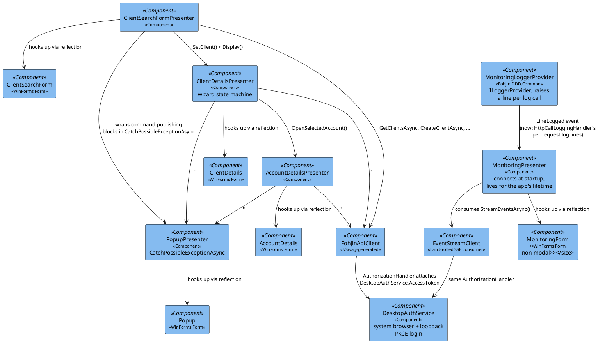

`IAccountDetailsPresenter` has no bank-card methods — `AssignNewBankCardCommand` /
`CancelBankCardCommand` / `ReportStolenBankCardCommand` (see `02-bank-cards.md`) are not
wired to any button or menu anywhere in this UI (or in Vue's).

### Screens

**Client Search** — the main window. A hidden single-tab `TabControl` hosts a `ListBox`
bound to `ClientReport`s (fetched via `FohjinApiClient.GetClientsAsync()`); a menu item
starts the "add new client" flow.

```plantuml
@startsalt
{
  { "Client" | "Help" }
  ==
  Existing clients
  {
    "Doe, John"
    "Smith, Jane"
    "Nijhof, Mark"
  }
}
@endsalt
```

**Client Details — create-new wizard.** Three steps, shown one panel at a time. Steps 1
and 2 only mutate an in-memory DTO (`_clientDetailsReport = ... with { ... }`) — nothing is
sent to the API until step 3.

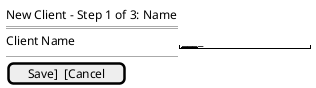

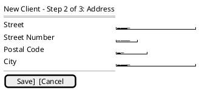

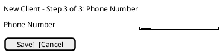

**Client Details — editing an existing client.** Every field is visible at once; each
"initiate change" action opens the relevant panel and calls the API immediately on save
(no batching, unlike create).

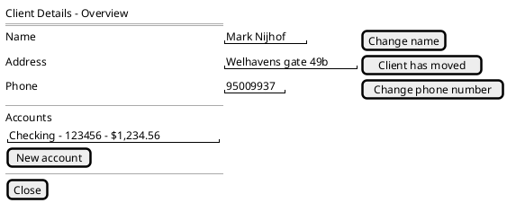

**Account Details.**

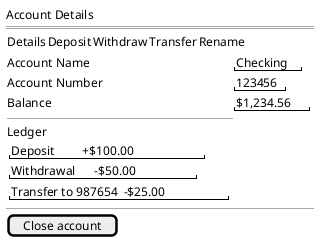

**Popup** — the shared error dialog every presenter routes exceptions through, now via
`PopupPresenter.CatchPossibleExceptionAsync(Func<Task>)` (an async overload was added
alongside the original sync `CatchPossibleException(Action)` in Phase 7, since every
presenter method wrapping an API call needed to `await` it).

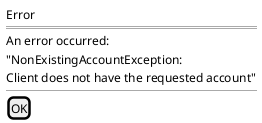

**Monitoring** — a non-modal companion window, opened alongside the main window at
startup (`MonitoringPresenter.Display()` calls `Show()`, not `ShowDialog()`, so it never
blocks the rest of the UI). Two bounded, auto-scrolling lists: every HTTP call the app
makes on the left, every domain event on the right. Capped at a fixed entry count (oldest
trimmed) so a long-running session doesn't grow memory or the control unboundedly.

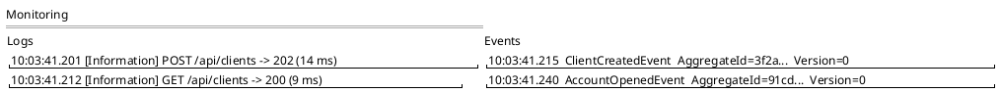

Design notes (see the components diagram above for how the pieces connect):

- `MonitoringLoggerProvider` (`Fohjin.DDD.Common`) is a custom `ILoggerProvider` registered
  alongside the existing console/debug providers in `Program.cs` — it doesn't replace them,
  it's a third listener. It raises a plain `event Action<string>? LineLogged` per log call.
  Since Phase 7, what it captures changed: there's no more in-process bus/command-handler
  logging to listen to (that all runs inside `Fohjin.DDD.WebApi`'s process now), so the log
  half is fed by a new `HttpCallLoggingHandler` — a `DelegatingHandler` in
  `FohjinApiClient`'s pipeline that logs `"{Method} {Path} -> {StatusCode} ({ElapsedMs} ms)"`
  per outgoing request.
- The event half used to be a direct `IBus.Events` subscription (`Subject<IDomainEvent>`,
  in-process). Since WinForms doesn't host the CQRS core anymore, `MonitoringPresenter`
  instead consumes `GET /api/events` through `EventStreamClient` — a hand-rolled
  `System.Net.ServerSentEvents.SseParser<T>`-based consumer, because the NSwag-generated
  `FohjinApiClient.StreamEventsAsync()` does a one-shot `SendAsync` and discards the
  response body without ever reading it (NSwag has no real streaming-response support).
  `ConsumeEventStreamAsync` runs an infinite retry loop with a 5-second backoff on
  disconnect, since the SSE connection can drop independently of the rest of the app.
- Both subscriptions can fire from any thread. `MonitoringForm`'s
  `AppendLogLine`/`AppendEventLine` marshal to the UI thread themselves
  (`InvokeRequired`/`BeginInvoke`) before touching a control — the same fix already applied
  to `SystemTimer` for the same reason.

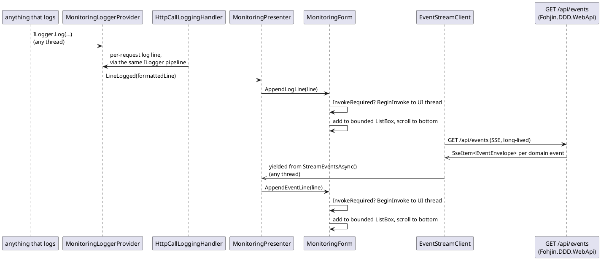

### Sequence: create new client, full UI-to-refresh flow

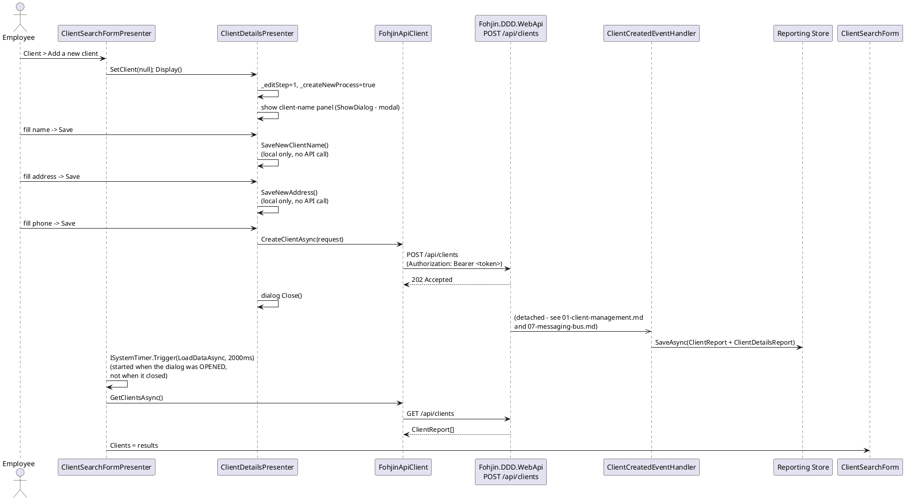

The 2-second timer is a blind fixed-delay poll, not correlated with when the command/event
pipeline actually finishes — on a slow event handler the new client may not appear yet, and
there's no retry. `ISystemTimer.Trigger` captures the UI `SynchronizationContext` when
scheduled and marshals the callback back onto it, so setting a WinForms control's
`DataSource` from the timer's background thread doesn't throw invisibly.

## Vue (`Fohjin.DDD.WebUI`)

A single-page app (Vue 3 + Vite + Vue Router) covering the same screens as WinForms, built
against the same `Fohjin.DDD.WebApi` and the same generated client story — NSwag generates
a `fetch`-based TypeScript client (`src/api/generated-client.ts`) instead of the C#
`FohjinApiClient` WinForms uses, from the same `openapi.json`.

| Route | Component | Covers |
|---|---|---|
| `/login` | `Login.vue` | Redirects into the STS's real login page |
| `/callback` | `LoginCallback.vue` | OIDC authorization-code redirect target |
| `/` | `ClientSearch.vue` | Client list (equivalent of WinForms' Client Search) |
| `/clients/new` | `ClientCreate.vue` | Single form for all three fields — no wizard, one `POST /api/clients` on submit |
| `/clients/:id` | `ClientDetails.vue` | Equivalent of WinForms' Client Details (edit + accounts list), **plus a bank-cards section WinForms doesn't have** (`02-bank-cards.md`) |
| `/accounts/:id` | `AccountDetails.vue` | Equivalent of WinForms' Account Details |
| `/monitoring` | `Monitoring.vue` | Live event stream, connect/disconnect/filter controls |

`router/index.ts`'s `beforeEach` guard redirects any non-public route to `/login` unless
`getUser()` (from `oidc-client-ts`'s `UserManager`) returns a non-expired user — this is
Vue's equivalent of WinForms blocking on `DesktopAuthService.LoginAsync()` before showing
any window, just enforced per-navigation instead of once at startup.

### Sign-in: browser redirect, not a loopback listener

`src/auth/authService.ts` wraps `oidc-client-ts`'s `UserManager` — `login()` calls
`signinRedirect()` (full-page redirect to the STS, PKCE handled automatically for
`response_type: "code"`), and `LoginCallback.vue` calls `completeLogin()` (`signinRedirectCallback()`)
to exchange the code for tokens once the STS redirects back to `/callback`. This is the
same authorization-code + PKCE flow WinForms drives through `DesktopAuthService` and the
same seeded `dev-client`, against the same `Fohjin.DDD.Sts` — the difference is purely
mechanical: a real browser tab doing a page redirect vs. a desktop process opening a
system browser and listening on a loopback port for the same redirect.

### Live refresh: a shared client-side event bus, not a poll

`src/events/eventBus.ts` is one shared `GET /api/events` (SSE) connection for the whole
Vue session — opened once at app boot (`main.ts`) and kept open, rather than each screen
polling on its own fixed-delay timer. It's the client-side mirror of `DirectBus`'s own
shape server-side (`07-messaging-bus.md`): one shared event stream, N independent
subscribers, each filtering for what it cares about. It can't use the NSwag-generated
client's `streamEvents()` (NSwag has no real SSE support) or the browser's native
`EventSource` (can't attach an `Authorization` header) — so, same as `EventStreamClient` on
the WinForms side, it reads `GET /api/events` by hand: `fetch()` with a bearer token, then
a hand-parsed reader over `Results.ServerSentEvents`'s wire format (`event:`/`data:` lines,
blank line between records), filtering out the synthetic `"StreamConnected"` marker event.

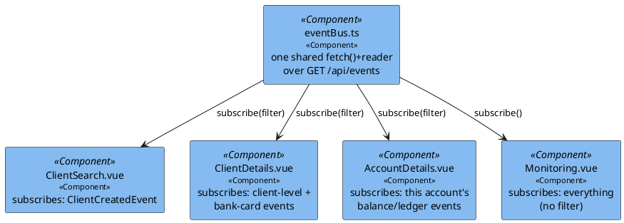

Filtering happens client-side, per subscriber, over the one unfiltered stream — not via a
separate server-side `$filter` connection per screen, since there's only one shared
connection. Filters key off `eventType` and `aggregateId` exactly as documented in each
domain doc: `ClientDetails.vue` needs the note in `02-bank-cards.md`/`06-event-sourcing-infrastructure.md`
about `BankCardWasCanceledByClientEvent`/`BankCardWasReportedStolenEvent` carrying the bank
card's own id as `aggregateId`, not the client's, so it also checks the event's aggregate id
against every bank card id already loaded for that client.

**No queue or replay on this stream** — an event that fires while nobody's connected (the
brief window right after login while the OIDC token exchange finishes, a dropped network
connection, a laptop waking from sleep) is gone for good, not delivered late. Two things
mitigate this without reintroducing a poll: the retry loop reconnects almost immediately
(not on a flat backoff) specifically when the reason was "not authenticated yet" rather than
a real connection failure, since every extra second there is a bigger miss window; and
`onReconnect()` lets a screen do one reconciliation reload every time the connection
(re)establishes, catching anything that happened in the gap. `Monitoring.vue` is the
simplest subscriber — no filter, no reconciliation reload (it has nothing to "reload," just
a live list) — and its "Pause"/"Resume" buttons only stop appending to its own list; they
don't touch the shared connection other screens are also using.

### What's genuinely different between the two UIs

- **Create-client UX**: WinForms uses a three-step modal wizard; Vue uses one form. Same
  single `CreateClientCommand`/`POST /api/clients` either way (`01-client-management.md`).
- **Refresh strategy**: WinForms polls on a fixed-delay timer after every mutating action.
  Vue subscribes to the relevant domain events on the shared event bus above and reloads
  when one arrives — no timer, no fixed delay, refresh happens as soon as the read model
  actually catches up rather than after a guessed interval.
- **Auth flow shape**: loopback `HttpListener` + system browser (desktop) vs. full-page
  redirect (web) — same authorization-code + PKCE grant underneath either way.
- **Bank cards**: Vue-only (`ClientDetails.vue`'s "Bank cards" section). WinForms has no
  bank-card screen at all — `IAccountDetailsPresenter` never got assign/cancel/report-stolen
  methods, and no menu item calls them (`02-bank-cards.md`).
- **Everything else** — the domain, the commands, the events, the read models, and the
  API surface itself — is identical regardless of which client is calling it.
