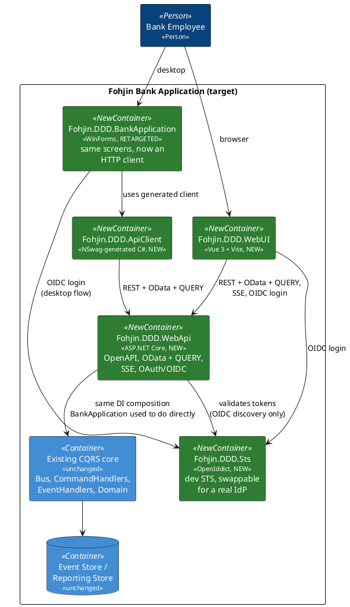

# Migration Plan: WebAPI + OData/QUERY + OAuth/OIDC + SSE/AsyncAPI + Vue

This is the plan for `feature/webapi-vue-modernization`: how to get from the current
single-process WinForms application (docs `00`–`10`) to a web-first system with an
ASP.NET Core backend, a Vue frontend, a retargeted WinForms client, and generated API
clients — without a big-bang rewrite. See `docs/supporting/` for the research backing
each technology choice (RFC 10008, OpenIddict vs. Duende, Saunter/AsyncAPI, Aspire/Docker
Compose, NSwag).

## Guiding principle: the CQRS/event-sourcing core does not move

Everything in `06-event-sourcing-infrastructure.md` and `07-messaging-bus.md` — aggregates,
command/event handlers, the event store, the reporting store, `IBus`/`DirectBus` — stays
exactly as it is. This migration adds a **new front door** (`Fohjin.DDD.WebApi`) that hosts
that same core over HTTP, the same way `Fohjin.DDD.BankApplication` hosts it today over
direct in-process calls. Nothing about *what* the system does changes; only *how it's
reached* changes, one surface at a time, with the old surface kept working until its
replacement is proven.

## Target architecture

## Phases

Each phase is independently shippable and leaves the system in a working state — the
existing WinForms app keeps working against the in-process core until the phase that
explicitly retargets it (Phase 7). Treat each phase as its own confirm-then-build cycle,
not a license to build all nine before showing anything.

### Phase 0 — Housekeeping (done)

Branch created (`feature/webapi-vue-modernization`), `Fohjin.DDD.MakeReusable` deadweight
removed, this plan and its supporting research written.

### Phase 1 — Bare WebAPI host (done)

Stood up `Fohjin.DDD.WebApi` (`Microsoft.NET.Sdk.Web`), referencing the same
`AddBusServices()`/`AddCommandHandlersServices()`/`AddCommonServices()`/
`AddConfigurationServices()`/`AddEventHandlersServices()`/`AddEventStoreServices()`/
`AddEventStoreSqliteServices()`/`AddReportingServices()`/`AddDddServices()` composition
`Program.cs` already uses (docs `07`) — same extension methods, registered into a
`WebApplicationBuilder` instead of a bare `ServiceCollection` — plus the same
`BootStrapApplicationAsync()`/`SubscribeEventHandlers()` startup calls
`Fohjin.DDD.BankApplication.Core`/`Fohjin.DDD.Configuration` already provide (referencing
`BankApplication.Core` directly turned out fine — it has no WinForms dependency itself,
only `BankApplication` does). `POST /api/clients` → `CreateClientCommand` via `IBus`, plus
`GET /api/clients` and `GET /api/clients/{id}` hitting `IReportingRepository` directly
(pre-OData). No auth, no OData, no SSE yet.

One wrinkle found while wiring the create endpoint: `CreateClientCommand.Id` isn't the
persisted client's id — `Client.CreateNew` (`Fohjin.DDD.Domain`) assigns the aggregate its
own `Guid.NewGuid()` rather than using the command's, a pre-existing quirk the WinForms UI
never surfaced because it just re-lists rather than round-tripping an id. The endpoint
returns `202 Accepted` with no id/`Location`, documented inline; combined with `DirectBus`
being fire-and-forget (docs `07`), the honest contract is "queued", not "done" or "here's
its id".

**Exit criteria — met**: verified live via `Fohjin.DDD.WebApi.http`/curl against real SQLite
databases — `POST /api/clients` returns 202, the client shows up in `GET /api/clients`,
and `GET /api/clients/{id}` with that id returns 200 (404 for an unknown id). OpenAPI
generation (`/openapi/v1.json`, native to .NET 10) already reflects both endpoints, ahead of
schedule for Phase 2. Full solution build + `dotnet test` unaffected: 410 passed, 4 skipped,
0 failed. WinForms is untouched and still works.

### Phase 2 — OpenAPI + NSwag client generation (done)

`Microsoft.AspNetCore.OpenApi` was already enabled in Phase 1 (native to .NET 10, no
Swashbuckle needed); this phase closed the loop by generating a real client from it. Added
`Fohjin.DDD.ApiClient` (`NSwag.ApiDescription.Client` + an `OpenApiReference` MSBuild item,
not a standalone `nswag.json` — the MSBuild-integrated form regenerates on every build rather
than needing a separate CLI invocation) pointed at a checked-in `openapi.json` snapshot
(curled from a running `Fohjin.DDD.WebApi` — see the comment above the `OpenApiReference`
item for how to refresh it; fully automating that fetch is left for a later phase). Configured
`/JsonLibrary:SystemTextJson` (NSwag defaults to Newtonsoft.Json, which doesn't match the rest
of this codebase) and added explicit `.Produces<T>(...)` metadata to the WebApi endpoints —
without it, minimal APIs returning bare `IResult` don't give the OpenAPI generator a schema to
work with, so `GetClientByIdAsync` came back untyped on the first pass.

**Exit criteria — met**: `Test.Fohjin.DDD.ApiClient` (new MSTest project) hosts
`Fohjin.DDD.WebApi` in-memory via `WebApplicationFactory<Program>` (which required marking
`Program` `partial` — top-level statements otherwise leave it inaccessible to other
assemblies) and drives the generated `FohjinApiClient` through a create-then-read round trip;
passes reliably. One wrinkle: `ApplicationBootStrapper` migrates the SQLite databases at
`Path.GetFullPath("domainDataBase.db3"/"reportingDataBase.db3")` — relative to the process's
current directory, ignoring `IConfiguration` entirely — while the runtime `DbContext`
factories resolve their connection string *through* configuration. Those two agree by
convention in normal (dev) usage, but it means a config-only override doesn't isolate a test
run: the bootstrapper would migrate one file while the app queries another. The test isolates
by switching the process's current directory to a fresh temp folder instead (both paths
resolve against that consistently), which is why the project doesn't parallelize tests. Full
solution build + `dotnet test`: 410 + 1 passed, 4 skipped, 0 failed.

### Phase 3 — OData + the QUERY verb (done)

Added `Microsoft.AspNetCore.OData` 9.5.0 and a `Clients` entity set (`Fohjin.DDD.WebApi/OData/ODataModel.cs`)
over `ClientReport`. `/odata/Clients` is one minimal-API delegate mapped to both `GET` and
`QUERY` (`Fohjin.DDD.WebApi/OData/EndpointRouteBuilderExtensions.cs`'s `MapQuery` — the missing
`HttpMethods.Query` convenience .NET 10 doesn't ship yet, per
`docs/supporting/rfc10008-http-query-method.md`) — the *same delegate*, not two independently
written ones, is what guarantees identical results for identical filters: for `QUERY`, the
filter arrives in a JSON body and gets copied into the request's query string before
`ODataQueryOptions<ClientReport>` parses it, so both verbs run through the exact same
parse-and-`ApplyTo` code either way. Bypasses `IReportingRepository.GetByExampleAsync` for this
endpoint on purpose — `[EnableQuery]`/`ODataQueryOptions.ApplyTo` need a live `IQueryable<T>`
to push `$filter`/`$orderby` into SQL, which the repository's reflection-driven "example
object" queries can't give them — using the existing `IDbContextFactory<ReportingDbContext>`
directly instead (not a second, plain `AddDbContext<ReportingDbContext>` registration: that
combination broke resolving the factory from the root DI scope, which the
`SubscribeEventHandlers` startup call needs).

Deliberately scoped down to `$filter` + `$orderby`: `ODataValidationSettings` restricts
`AllowedQueryOptions` to just those two, so `$select`/`$count`/`$expand` get a clear 400
instead of the wrong thing happening silently — this endpoint serializes results with plain
`System.Text.Json`, not OData's own content formatter, so `$select`'s projection-wrapper
result type and `$count`'s envelope don't have anywhere correct to go. No `$metadata`
endpoint either: that's wired through OData's controller/attribute-routing conventions,
which this phase deliberately didn't add (staying minimal-API-only, consistent with the rest
of the app) in favor of the shared-delegate design above.

**Exit criteria — met**: `Test.Fohjin.DDD.ApiClient/ODataClientsEndpointTest.cs` (3 new tests)
proves `GET ?$filter=...` and `QUERY` with the same filter in the body return identical
client sets; that a bodyless `QUERY` behaves like "no filter" rather than crashing (a real bug
hit and fixed during manual verification — the handler unconditionally tried to parse a JSON
body that might not exist); and that `$select` is rejected with 400 rather than the
`InvalidCastException` it threw before validation was added. Full solution build + test
suite: 410 + 4 passed, 4 skipped, 0 failed.

### Phase 4 — SSE event stream + AsyncAPI (done)

`GET /api/events` (`Fohjin.DDD.WebApi/Program.cs`) subscribes to `bus.Events`
(`IObservable<IDomainEvent>`, docs `07`), wraps each one in an `EventEnvelope`
(`Fohjin.DDD.WebApi/Sse/EventEnvelope.cs`) and streams matches over native
`System.Net.ServerSentEvents`/`Results.ServerSentEvents`. `IDomainEvent` itself has no
event-type or timestamp field (just `Id`/`AggregateId`/`Version`), so `EventEnvelope` adds
`EventType` (the concrete event's class name) and `OccurredAt` — the latter is genuinely
synthesized when the envelope is built, not read from anywhere, since no timestamp exists
anywhere in the event/aggregate/store/bus pipeline today; that's a real gap, not an oversight,
and it's called out in code rather than quietly implied. A pre-existing quirk this surfaced:
freshly-created aggregates' `AggregateId`/`Version` come through as `Guid.Empty`/`0` on their
creation event, because `BaseAggregateRoot.Apply` stamps them from the aggregate's own `Id`,
which isn't set until after the event is constructed — the same flavor of gap Phase 1 found
with `CreateClientCommand.Id`, left alone here for the same reason (out of this migration's
scope, not a regression this phase introduced).

**Decision resolved**: full `Microsoft.OData.UriParser` semantics, not a hand-rolled grammar —
reusing exactly the `ODataQueryOptions`/EDM-model machinery Phase 3 already built and proved
out for `/odata/Clients` (`Fohjin.DDD.WebApi/Sse/SseEdmModel.cs`), just `ApplyTo`'d against a
one-item `IQueryable<EventEnvelope>` per incoming event instead of a `DbSet` per HTTP request.
One filter engine for the whole API beat maintaining two. This needed its own keyed DI
registration (`AddKeyedSingleton<IEdmModel>("odata"/"sse", ...)` +
`[FromKeyedServices(...)]` on each handler) rather than two plain `AddSingleton<IEdmModel>`
calls — the latter silently broke `/odata/Clients` in the other direction, since two
unkeyed registrations of the same service type just means whichever handler resolves
`IEdmModel` by DI parameter gets whichever model was registered last, not necessarily its own.

Saunter documents the message catalog as AsyncAPI (`Fohjin.DDD.WebApi/AsyncApi/DomainEventsAsyncApi.cs`,
`docs/supporting/asyncapi-saunter.md`) as one channel/one subscribe operation, message type
`EventEnvelope` — not 17 operations, one per concrete domain event type, which is what was
tried first: Saunter only allows one subscribe operation per channel key, and 17 also would
have described a shape that's never really on the wire (clients always receive an
`EventEnvelope`, whose `Payload` is the polymorphic `IDomainEvent`, not a bare domain event).

**Exit criteria — met**: verified live end-to-end (server actually running, real HTTP, real
SQLite) with `curl --no-buffer` — connecting with `$filter=EventType eq 'ClientCreatedEvent'`
receives a `ClientCreatedEvent` the moment `POST /api/clients` is called elsewhere against the
same running instance; the identical setup with `$filter=EventType eq 'CashDepositedEvent'`
correctly receives nothing for that same `ClientCreatedEvent`. Not backed by an automated
test, unlike every other exit criterion in this plan: `WebApplicationFactory`'s in-memory
`TestServer` transport doesn't deliver a long-lived streaming response incrementally to the
test's `HttpClient` the way a real socket does (confirmed by trying both `TestServer` and a
`WithWebHostBuilder(b => b.UseKestrel(...))`-configured real Kestrel listener under the same
factory — both produced a `499` with no data ever received), so a test written the obvious
way just hangs to its own timeout. Automating this is left for later rather than shipping a
flaky or misleading test; the manual verification is real, reproducible, and documented here
in enough detail to redo. Full solution build + test suite otherwise unaffected: 410 + 4
passed, 4 skipped, 0 failed.

### Phase 5 — OAuth/OIDC via the OpenIddict dev STS

New `Fohjin.DDD.Sts` project (OpenIddict, authorization-code + PKCE — needed by both the
future Vue SPA and the WinForms desktop client). One seeded dev client, one seeded test
user. WebAPI adds `AddAuthentication().AddJwtBearer(o => o.Authority = <config>)` and
`[Authorize]` on command/query/SSE endpoints — the authority URL must come from
configuration, never a hardcoded OpenIddict-specific type, so a real IdP is a config
change later (`docs/supporting/oidc-sts-openiddict-vs-duende.md`).

**Decided**: preconfigured/seeded accounts (no interactive registration), still going
through a real (if minimal) login screen and a genuine authorization-code + PKCE exchange
— "simple for testing" means simple *credentials*, not a shortcut that skips the actual
OIDC flow, so what gets exercised in dev matches what a real IdP swap-in would do.

**Exit criteria**: unauthenticated requests are rejected; a token obtained from the dev STS
is accepted; swapping `Authority` to a different OIDC-compliant issuer requires no code
change.

### Phase 6 — Vue frontend

New `Fohjin.DDD.WebUI` (Vue 3 + Vite + TypeScript). NSwag-generated TypeScript client.
OIDC login (e.g. `oidc-client-ts`) against the same STS. Re-implement the existing screens
(`09-winforms-ui.md`: client search, the client-details wizard, account details) — this is
new frontend work, not a mechanical port of the WinForms Presenter/View code.

**Exit criteria**: everything the WinForms app does today is also possible from a browser,
through the new API.

### Phase 7 — Retarget WinForms

Swap WinForms' DI wiring (currently direct `AddBusServices()` etc. in
`Fohjin.DDD.BankApplication/Program.cs`) for `Fohjin.DDD.ApiClient`. Every Presenter that
currently takes `IBus`/`IDomainRepository`/`IReportingRepository` (every presenter in
`09-winforms-ui.md`'s component diagram) needs to go through the API client instead — this
touches every presenter, not just a config change. **Decided**: desktop OIDC login uses
the system browser + loopback redirect (not an embedded WebView2) — opens the STS login
page in the user's actual browser, catches the redirect on a local loopback listener.

**Exit criteria**: WinForms behaves identically to today, but every operation is an HTTP
call to `Fohjin.DDD.WebApi` instead of an in-process call. The monitoring pane
(`09-winforms-ui.md`) still shows logs, and can now also show the HTTP calls it's making.

### Phase 8 — Hosting: Aspire + Docker Compose

`Fohjin.DDD.AppHost` + `Fohjin.DDD.ServiceDefaults` (Aspire convention), modeling
STS → WebApi → WebUI startup order. Publish to `docker-compose.yml` via
`Aspire.Hosting.Docker` (`docs/supporting/hosting-aspire-docker-compose.md`).

**Decided**: move off SQLite entirely, to SQL Server running in a **Linux** container
(Aspire has a first-class `AddSqlServer(...)` resource for this). One database engine for
every environment — no SQLite-for-dev/SQL-Server-for-prod split to keep in sync. This
touches both `Fohjin.DDD.EventStore.SQLite` and `Fohjin.DDD.Reporting`'s EF Core
provider/migrations (`Microsoft.EntityFrameworkCore.Sqlite` → `Microsoft.EntityFrameworkCore.SqlServer`,
new migrations generated against SQL Server) — likely worth its own step at the start of
this phase, before wiring up the Aspire resource itself.

**Exit criteria**: `dotnet run` on the AppHost boots the whole system with one command;
publishing produces a working `docker-compose up`.

### Phase 9 — Decommission the direct in-process wiring

Once both WinForms (Phase 7) and Vue (Phase 6) are fully on the API, the old direct-wiring
code in `Fohjin.DDD.BankApplication` is dead — remove it, making `Fohjin.DDD.WebApi` the
only process that composes the CQRS core. Update docs `00`–`10` to reflect the new
container topology (they currently describe the pre-migration, single-process shape).

## What this plan still doesn't decide yet

All four originally-deferred decisions are now resolved: dev-STS login UX, desktop OIDC
flow, and database choice (Phases 5, 7, 8), and Phase 4's OData-vs-hand-rolled filter
grammar question (full `Microsoft.OData.UriParser` semantics, reusing Phase 3's machinery —
see Phase 4 above). Nothing left deferred.

## Modernization pass alongside this migration

Also requested, not phase-gated (doesn't block or depend on any phase above, so it's
happening now rather than waiting): push the existing codebase as far toward C# 12+ idioms
as it reasonably goes.

Done: file-scoped namespaces and primary constructors solution-wide (via `.editorconfig` +
`dotnet format style`, verified against the full test suite), collection expressions for
the remaining `new List<T>()` sites the analyzer didn't catch, and positional records for
`CommandBase` and all 15 commands (verified against `SerializationTests.cs`'s real
JSON-to-disk-and-back round trip for every one of them — collapsing each command's
`[JsonConstructor]`-marked parameterless ctor + value ctor pair into a single positional
ctor changes how `System.Text.Json` picks a constructor, so this needed the round-trip
proof, not just a green build).

**Deliberately not done**: domain events (`DomainEvent`-derived) and reporting DTOs stay as
regular records with explicit bodies, not positional. Both have properties that are
legitimately mutated *after* construction by framework machinery (`BaseAggregateRoot.Apply`
sets `AggregateId`/`Version` post-construction; `SqliteReportingRepository.UpdateAsync`
reflects a property setter onto an existing instance) — positional records model immutable
data, so forcing that shape here would fight the feature rather than use it. Commands never
have this problem (`init`-only, truly immutable end to end), which is exactly why they were
a clean fit and these two are not.

Also done: the nullable-annotation pass. `Test.Fohjin.DDD.csproj` now builds with
`<Nullable>enable</Nullable>` (it was `disable` while using `?` throughout, which is what
caused ~194 CS8632 warnings); the ~200 real CS8600/CS8602/CS8618/CS8620/CS8625 warnings that
enabling it surfaced were fixed file-by-file (`= null!`/`= default!` for fields assigned by
test-lifecycle methods rather than constructors, `as` casts over hard casts, trailing `!` for
null-conditional chains assigned into non-nullable contexts) and verified against the full
test suite (410 passed, 4 skipped, unchanged). Found one real production bug along the way:
`AccountDetails.GetSelectedTransferAccount()` didn't match its own interface's nullable
contract and would throw `InvalidCastException` instead of returning null.

## Suggested next step

Start Phase 5. Phases 1–4 proved the core architectural bet, the codegen loop, the OData
query surface, and live event streaming — every originally-deferred design decision is
resolved, and every phase since 4 (OIDC, both frontends, hosting, decommissioning) has its
approach already decided. Phase 5 is real auth: the OpenIddict dev STS, so the API stops
being wide open before either frontend gets built against it.
