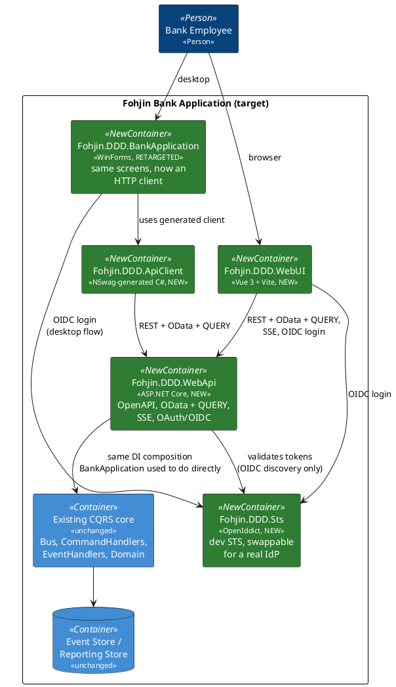

# Migration Plan: WebAPI + OData/QUERY + OAuth/OIDC + SSE/AsyncAPI + Vue

This is the plan for `feature/webapi-vue-modernization`: how to get from the current
single-process WinForms application (docs `00`–`10`) to a web-first system with an
ASP.NET Core backend, a Vue frontend, a retargeted WinForms client, and generated API
clients — without a big-bang rewrite. See `docs/supporting/` for the research backing
each technology choice (RFC 10008, OpenIddict vs. Duende, Saunter/AsyncAPI, Aspire/Docker
Compose, NSwag).

## Guiding principle: the CQRS/event-sourcing core does not move

Everything in `06-event-sourcing-infrastructure.md` and `07-messaging-bus.md` — aggregates,
command/event handlers, the event store, the reporting store, `IBus`/`DirectBus` — stays
exactly as it is. This migration adds a **new front door** (`Fohjin.DDD.WebApi`) that hosts
that same core over HTTP, the same way `Fohjin.DDD.BankApplication` hosts it today over
direct in-process calls. Nothing about *what* the system does changes; only *how it's
reached* changes, one surface at a time, with the old surface kept working until its
replacement is proven.

## Target architecture

## Phases

Each phase is independently shippable and leaves the system in a working state — the
existing WinForms app keeps working against the in-process core until the phase that
explicitly retargets it (Phase 7). Treat each phase as its own confirm-then-build cycle,
not a license to build all nine before showing anything.

### Phase 0 — Housekeeping (done)

Branch created (`feature/webapi-vue-modernization`), `Fohjin.DDD.MakeReusable` deadweight
removed, this plan and its supporting research written.

### Phase 1 — Bare WebAPI host (done)

Stood up `Fohjin.DDD.WebApi` (`Microsoft.NET.Sdk.Web`), referencing the same
`AddBusServices()`/`AddCommandHandlersServices()`/`AddCommonServices()`/
`AddConfigurationServices()`/`AddEventHandlersServices()`/`AddEventStoreServices()`/
`AddEventStoreSqliteServices()`/`AddReportingServices()`/`AddDddServices()` composition
`Program.cs` already uses (docs `07`) — same extension methods, registered into a
`WebApplicationBuilder` instead of a bare `ServiceCollection` — plus the same
`BootStrapApplicationAsync()`/`SubscribeEventHandlers()` startup calls
`Fohjin.DDD.BankApplication.Core`/`Fohjin.DDD.Configuration` already provide (referencing
`BankApplication.Core` directly turned out fine — it has no WinForms dependency itself,
only `BankApplication` does). `POST /api/clients` → `CreateClientCommand` via `IBus`, plus
`GET /api/clients` and `GET /api/clients/{id}` hitting `IReportingRepository` directly
(pre-OData). No auth, no OData, no SSE yet.

One wrinkle found while wiring the create endpoint: `CreateClientCommand.Id` isn't the
persisted client's id — `Client.CreateNew` (`Fohjin.DDD.Domain`) assigns the aggregate its
own `Guid.NewGuid()` rather than using the command's, a pre-existing quirk the WinForms UI
never surfaced because it just re-lists rather than round-tripping an id. The endpoint
returns `202 Accepted` with no id/`Location`, documented inline; combined with `DirectBus`
being fire-and-forget (docs `07`), the honest contract is "queued", not "done" or "here's
its id".

**Exit criteria — met**: verified live via `Fohjin.DDD.WebApi.http`/curl against real SQLite
databases — `POST /api/clients` returns 202, the client shows up in `GET /api/clients`,
and `GET /api/clients/{id}` with that id returns 200 (404 for an unknown id). OpenAPI
generation (`/openapi/v1.json`, native to .NET 10) already reflects both endpoints, ahead of
schedule for Phase 2. Full solution build + `dotnet test` unaffected: 410 passed, 4 skipped,
0 failed. WinForms is untouched and still works.

### Phase 2 — OpenAPI + NSwag client generation (done)

`Microsoft.AspNetCore.OpenApi` was already enabled in Phase 1 (native to .NET 10, no
Swashbuckle needed); this phase closed the loop by generating a real client from it. Added
`Fohjin.DDD.ApiClient` (`NSwag.ApiDescription.Client` + an `OpenApiReference` MSBuild item,
not a standalone `nswag.json` — the MSBuild-integrated form regenerates on every build rather
than needing a separate CLI invocation) pointed at a checked-in `openapi.json` snapshot
(curled from a running `Fohjin.DDD.WebApi` — see the comment above the `OpenApiReference`
item for how to refresh it; fully automating that fetch is left for a later phase). Configured
`/JsonLibrary:SystemTextJson` (NSwag defaults to Newtonsoft.Json, which doesn't match the rest
of this codebase) and added explicit `.Produces<T>(...)` metadata to the WebApi endpoints —
without it, minimal APIs returning bare `IResult` don't give the OpenAPI generator a schema to
work with, so `GetClientByIdAsync` came back untyped on the first pass.

**Exit criteria — met**: `Test.Fohjin.DDD.ApiClient` (new MSTest project) hosts
`Fohjin.DDD.WebApi` in-memory via `WebApplicationFactory<Program>` (which required marking
`Program` `partial` — top-level statements otherwise leave it inaccessible to other
assemblies) and drives the generated `FohjinApiClient` through a create-then-read round trip;
passes reliably. One wrinkle: `ApplicationBootStrapper` migrates the SQLite databases at
`Path.GetFullPath("domainDataBase.db3"/"reportingDataBase.db3")` — relative to the process's
current directory, ignoring `IConfiguration` entirely — while the runtime `DbContext`
factories resolve their connection string *through* configuration. Those two agree by
convention in normal (dev) usage, but it means a config-only override doesn't isolate a test
run: the bootstrapper would migrate one file while the app queries another. The test isolates
by switching the process's current directory to a fresh temp folder instead (both paths
resolve against that consistently), which is why the project doesn't parallelize tests. Full
solution build + `dotnet test`: 410 + 1 passed, 4 skipped, 0 failed.

### Phase 3 — OData + the QUERY verb (done)

Added `Microsoft.AspNetCore.OData` 9.5.0 and a `Clients` entity set (`Fohjin.DDD.WebApi/OData/ODataModel.cs`)
over `ClientReport`. `/odata/Clients` is one minimal-API delegate mapped to both `GET` and
`QUERY` (`Fohjin.DDD.WebApi/OData/EndpointRouteBuilderExtensions.cs`'s `MapQuery` — the missing
`HttpMethods.Query` convenience .NET 10 doesn't ship yet, per
`docs/supporting/rfc10008-http-query-method.md`) — the *same delegate*, not two independently
written ones, is what guarantees identical results for identical filters: for `QUERY`, the
filter arrives in a JSON body and gets copied into the request's query string before
`ODataQueryOptions<ClientReport>` parses it, so both verbs run through the exact same
parse-and-`ApplyTo` code either way. Bypasses `IReportingRepository.GetByExampleAsync` for this
endpoint on purpose — `[EnableQuery]`/`ODataQueryOptions.ApplyTo` need a live `IQueryable<T>`
to push `$filter`/`$orderby` into SQL, which the repository's reflection-driven "example
object" queries can't give them — using the existing `IDbContextFactory<ReportingDbContext>`
directly instead (not a second, plain `AddDbContext<ReportingDbContext>` registration: that
combination broke resolving the factory from the root DI scope, which the
`SubscribeEventHandlers` startup call needs).

Deliberately scoped down to `$filter` + `$orderby`: `ODataValidationSettings` restricts
`AllowedQueryOptions` to just those two, so `$select`/`$count`/`$expand` get a clear 400
instead of the wrong thing happening silently — this endpoint serializes results with plain
`System.Text.Json`, not OData's own content formatter, so `$select`'s projection-wrapper
result type and `$count`'s envelope don't have anywhere correct to go. No `$metadata`
endpoint either: that's wired through OData's controller/attribute-routing conventions,
which this phase deliberately didn't add (staying minimal-API-only, consistent with the rest
of the app) in favor of the shared-delegate design above.

**Exit criteria — met**: `Test.Fohjin.DDD.ApiClient/ODataClientsEndpointTest.cs` (3 tests,
later 4 — see the bug-fix pass below) proves `GET ?$filter=...` and `QUERY` with the same
filter in the body return identical client sets; that a bodyless `QUERY` behaves like "no
filter" rather than crashing (a real bug hit and fixed during manual verification — the
handler unconditionally tried to parse a JSON body that might not exist); and that `$select`
is rejected with 400 rather than the `InvalidCastException` it threw before validation was
added. Full solution build + test suite: 410 + 4 passed, 4 skipped, 0 failed.

### Phase 4 — SSE event stream + AsyncAPI (done)

`GET /api/events` (`Fohjin.DDD.WebApi/Program.cs`) subscribes to `bus.Events`
(`IObservable<IDomainEvent>`, docs `07`), wraps each one in an `EventEnvelope`
(`Fohjin.DDD.WebApi/Sse/EventEnvelope.cs`) and streams matches over native
`System.Net.ServerSentEvents`/`Results.ServerSentEvents`. `IDomainEvent` itself has no
event-type or timestamp field (just `Id`/`AggregateId`/`Version`), so `EventEnvelope` adds
`EventType` (the concrete event's class name) and `OccurredAt` — the latter is genuinely
synthesized when the envelope is built, not read from anywhere, since no timestamp exists
anywhere in the event/aggregate/store/bus pipeline today; that's a real gap, not an oversight,
and it's called out in code rather than quietly implied. A pre-existing quirk this surfaced:
freshly-created aggregates' `AggregateId`/`Version` come through as `Guid.Empty`/`0` on their
creation event, because `BaseAggregateRoot.Apply` stamps them from the aggregate's own `Id`,
which isn't set until after the event is constructed — the same flavor of gap Phase 1 found
with `CreateClientCommand.Id`, left alone here for the same reason (out of this migration's
scope, not a regression this phase introduced).

**Decision resolved**: full `Microsoft.OData.UriParser` semantics, not a hand-rolled grammar —
reusing exactly the `ODataQueryOptions`/EDM-model machinery Phase 3 already built and proved
out for `/odata/Clients` (`Fohjin.DDD.WebApi/Sse/SseEdmModel.cs`), just `ApplyTo`'d against a
one-item `IQueryable<EventEnvelope>` per incoming event instead of a `DbSet` per HTTP request.
One filter engine for the whole API beat maintaining two. This needed its own keyed DI
registration (`AddKeyedSingleton<IEdmModel>("odata"/"sse", ...)` +
`[FromKeyedServices(...)]` on each handler) rather than two plain `AddSingleton<IEdmModel>`
calls — the latter silently broke `/odata/Clients` in the other direction, since two
unkeyed registrations of the same service type just means whichever handler resolves
`IEdmModel` by DI parameter gets whichever model was registered last, not necessarily its own.

Saunter documents the message catalog as AsyncAPI (`Fohjin.DDD.WebApi/AsyncApi/DomainEventsAsyncApi.cs`,
`docs/supporting/asyncapi-saunter.md`) as one channel/one subscribe operation, message type
`EventEnvelope` — not 17 operations, one per concrete domain event type, which is what was
tried first: Saunter only allows one subscribe operation per channel key, and 17 also would
have described a shape that's never really on the wire (clients always receive an
`EventEnvelope`, whose `Payload` is the polymorphic `IDomainEvent`, not a bare domain event).

**Exit criteria — met**: verified live end-to-end (server actually running, real HTTP, real
SQLite) with `curl --no-buffer` — connecting with `$filter=EventType eq 'ClientCreatedEvent'`
receives a `ClientCreatedEvent` the moment `POST /api/clients` is called elsewhere against the
same running instance; the identical setup with `$filter=EventType eq 'CashDepositedEvent'`
correctly receives nothing for that same `ClientCreatedEvent`. Not backed by an automated
test, unlike every other exit criterion in this plan: `WebApplicationFactory`'s in-memory
`TestServer` transport doesn't deliver a long-lived streaming response incrementally to the
test's `HttpClient` the way a real socket does (confirmed by trying both `TestServer` and a
`WithWebHostBuilder(b => b.UseKestrel(...))`-configured real Kestrel listener under the same
factory — both produced a `499` with no data ever received), so a test written the obvious
way just hangs to its own timeout. Automating this is left for later rather than shipping a
flaky or misleading test; the manual verification is real, reproducible, and documented here
in enough detail to redo. Full solution build + test suite otherwise unaffected: 410 + 4
passed, 4 skipped, 0 failed.

### Phase 5 — OAuth/OIDC via the OpenIddict dev STS (done)

New `Fohjin.DDD.Sts` project: OpenIddict (`OpenIddict.AspNetCore`/`OpenIddict.EntityFrameworkCore`
7.x) as an MVC app, adapted from the OpenIddict team's own Velusia sample
(github.com/openiddict/openiddict-samples) rather than written from scratch against
OpenIddict's low-level API — `AuthorizationController` handles `~/connect/authorize` and
`~/connect/token`, ASP.NET Core Identity (EF Core + SQLite, same per-DbContext-SQLite-file
convention as the rest of this solution) provides the user store and the actual login
screen via `AddDefaultUI()`. One seeded client (`dev-client`, `ClientTypes.Public`,
`ConsentTypes.Implicit` so a caller only ever sees the login screen, PKCE required via
`Requirements.Features.ProofKeyForCodeExchange`) and one seeded user
(`dev@fohjin.local`), created idempotently at startup. `Fohjin.DDD.WebApi` adds
`AddAuthentication().AddJwtBearer(o => o.Authority = config["Sts:Authority"])` and
`.RequireAuthorization()` on `/api/clients` (all three routes), `/odata/Clients`, and
`/api/events` — confirmed via `grep -r OpenIddict` across every project except
`Fohjin.DDD.Sts` itself that the only hit is a comment, not a type/package reference,
matching `docs/supporting/oidc-sts-openiddict-vs-duende.md`'s "real IdP swap-in is a config
change" requirement.

Two adjustments the OIDC spec/OpenIddict defaults forced, both dev-appropriate rather than
compromises: `DisableAccessTokenEncryption()` on the STS (OpenIddict encrypts access tokens
by default — a JWE a plain `AddJwtBearer` can't decrypt without also referencing OpenIddict's
own validation packages, which is exactly the coupling this phase avoids) and
`DisableTransportSecurityRequirement()` (OpenIddict requires HTTPS by default; nothing in
this solution has a TLS cert configured, matching the plain-HTTP dev convention everywhere
else). Audience validation is off on the API side (`TokenValidationParameters.ValidateAudience
= false`) — the dev STS doesn't stamp a matching `aud` without extra per-scope resource
configuration, and issuer + signature validation via discovery is enough to reject anything
not issued by the configured `Authority`.

**Decided** (already reflected above): preconfigured/seeded accounts, still going through a
real login screen and a genuine authorization-code + PKCE exchange - confirmed by actually
driving that exact flow with curl (cookie jar across requests, real antiforgery token
extracted from the rendered login HTML, real password POST), not a shortcut.

**Exit criteria — met**, verified live end-to-end: `GET /api/clients`/`/odata/Clients`/`GET
/api/events` all return 401 with no token. A full authorization-code + PKCE round trip
against the real running STS - unauthenticated `GET /connect/authorize` → redirect to
`/Identity/Account/Login` → POST real credentials → redirect back through `/connect/authorize`
→ redirect to the client's `redirect_uri` with `?code=...` → `POST /connect/token` exchanges
it for a real signed JWT - and that token is accepted by all three endpoints (200/202)
against the separately-running `Fohjin.DDD.WebApi` process. `Authority` swap-with-no-code-
-change holds structurally (config-driven, zero OpenIddict types outside `Fohjin.DDD.Sts`).
Not backed by an automated test that exercises a live STS, for the same category of reason
as Phase 4's SSE gap: driving the real login-form/redirect chain end-to-end needs two
real-network-bound hosts (STS + API) rather than one in-memory `TestServer`, which is a
bigger lift than this phase's verification needed given the flow was already proven live.
What *is* automated: `AuthenticationRequiredTest` (4 tests, real `AddJwtBearer` wiring,
confirms all four routes reject an absent token) and a `TestAuthHandler` always-succeeds
scheme swapped into every other WebApi integration test's `WebApiIntegrationTestFixture` (via
`ConfigureTestServices`) - those tests exercise endpoint *behavior* (OData filtering, the
generated client, ...), not authentication, and adding `.RequireAuthorization()` had broken
all of them by returning 401 instead of their expected responses until this was in place.
Full solution build + test suite: 410 + 9 passed, 4 skipped, 0 failed.

### Bug-fix pass across Phases 1–5 (done)

Not a phase — a deliberate sweep after Phase 4 landed, to check behavior *outside* the exact
scenarios each phase's own verification already covered: malformed JSON bodies (both
`QUERY /odata/Clients` and `POST /api/clients`), invalid `$filter` syntax on both
`/odata/Clients` and `/api/events`, a nonexistent client id, and a malformed guid in a route.
One real gap found: `QUERY /odata/Clients` parses its filter from the request body by hand
(`ReadFromJsonAsync` inside the handler, not a bound parameter), which bypassed the automatic
bad-JSON-to-400 conversion `POST /api/clients` gets for free via normal minimal-API model
binding — a malformed body threw an unhandled `JsonException` straight through to a 500.
Fixed with a targeted try/catch, plus a regression test
(`QUERY_with_malformed_json_body_is_rejected_rather_than_a_500`, the 4th test in
`ODataClientsEndpointTest.cs`). Everything else in the sweep was already correct. Full
solution build + test suite: 410 + 5 passed, 4 skipped, 0 failed (before Phase 5 added its
own tests on top).

### Phase 6 — Vue frontend (done)

New `Fohjin.DDD.WebUI` (Vue 3 + Vite + TypeScript, scaffolded via `npm create vite@latest`),
`vue-router` with a `beforeEach` auth guard, and `oidc-client-ts` (authorization code + PKCE,
automatic for `response_type: "code"`) against the same dev STS from Phase 5. A second
`OpenApiReference` (`CodeGenerator="NSwagTypeScript"`) added to `Fohjin.DDD.ApiClient.csproj`
generates a TypeScript client straight into `Fohjin.DDD.WebUI/src/api/` from the same
`openapi.json` snapshot the C# client already used, keeping both clients generated from one
source instead of hand-writing `fetch` calls.

Before writing any frontend code, an audit of `Fohjin.DDD.BankApplication.Core`'s Presenters
against the WebApi surface built so far found the API only covered client creation and two of
five query shapes the WinForms screens actually use — asked the user how to sequence the
remaining work; chosen approach was **interleave**: for each WinForms screen, add its missing
endpoint(s) to `Fohjin.DDD.WebApi` and immediately build the matching Vue screen, committing
after each. That produced, on top of Phase 1–5's `POST /api/clients` / `GET /api/clients` /
`GET /api/clients/{id}`: `GET /api/clients/{id}/details`, `ChangeClientName`,
`ClientIsMoving` (address), `ChangeClientPhoneNumber`, `OpenNewAccountForClient`,
`GET /api/accounts`, `GET /api/accounts/{id}/details`, `ChangeAccountName`, `DepositCash`,
`WithdrawalCash`, `SendMoneyTransfer`, and `CloseAccount` — every command and query shape the
WinForms UI actually exercises (`BankCard`-related commands exist in `Fohjin.DDD.CommandHandlers`
but have no WinForms screen at all, confirmed by grep, so there's nothing to reach parity
with there). All of it backed by commands/handlers that already existed from the WinForms era
— this phase only added the missing HTTP endpoints, never new domain behavior. Five screens:
Login/callback, Client Search, Client Create, Client Details (name/address/phone/open-account,
plus the open/closed account list), Account Details (name/deposit/withdrawal/transfer/close,
plus the ledger history), and Monitoring (the live `/api/events` SSE stream from Phase 4).

No native Node.js/npm exists on this machine (the `node`/`npm` on `PATH` belong to an
unrelated project and fail outside an interactive terminal) — every `npm`/`vite`/`node`
command in this phase ran via `docker run node:22-alpine ...` instead, always through
PowerShell rather than Bash/git-bash (which silently mangles `/app`-style container paths via
MSYS path conversion). This validated, ahead of time, that Phase 8's Aspire/Docker-Compose
hosting for a Node-based frontend resource is workable on this machine.

NSwag's TypeScript generator always wraps its output in `namespace X { ... }` with no
supported way to suppress it (confirmed by reading NSwag/NJsonSchema source, not just
guessing at options) — incompatible with Vite's `erasableSyntaxOnly` tsconfig setting, which
can't compile a namespace containing runtime code. Fixed with a checked-in post-processing
script (`strip-ts-namespace.ps1`) wired via an MSBuild `AfterTargets="Build"` target, so
regenerating the client (rebuild `Fohjin.DDD.ApiClient` after refreshing `openapi.json`) always
produces a flat ES module.

End-to-end verification for every screen used a real headless browser (Playwright,
`mcr.microsoft.com/playwright` image) driving the real dev STS and `Fohjin.DDD.WebApi` as
separate live processes — not mocks — since that's the only way to prove a real OIDC
login/redirect/PKCE round trip and real CORS/cross-origin behavior work from an actual
browser. That surfaced three environment-specific issues worth recording because they'll
recur for anyone else driving this same setup: (1) the STS's issuer claim is
request-relative, so a browser reaching it via `host.docker.internal` (needed for a
containerized Playwright browser to reach STS/WebApi on the host) gets a token whose `iss`
doesn't match WebApi's own `Sts:Authority` config unless that's overridden to match for the
test run — a test-environment artifact, not a code bug; (2) the Vite dev server's file
watcher didn't reliably pick up regenerated files on this Windows-bind-mount setup, so a
`docker restart` of the dev-server container was needed after every regeneration of
`generated-client.ts` (hit three separate times before the pattern was recognized); (3) while
verifying the Monitoring screen, found and fixed a real bug: `Results.ServerSentEvents` holds
the response — headers included — open with zero bytes sent until its wrapped
`IAsyncEnumerable` yields a first item, so both `curl` and `fetch()` hung indefinitely against
a fresh WebApi instance with no domain events yet. Fixed by having the SSE `Stream` local
function (`Fohjin.DDD.WebApi/Program.cs`) yield a synthetic `EventEnvelope.Connected` marker
the instant a subscriber attaches, forcing an immediate flush; the Vue client recognizes and
discards it by `EventType` rather than showing it as a real event.

**Known issue found, not fixed (out of scope for this phase)**: live-testing the Monitoring
screen showed `ClientCreatedEvent`'s `AggregateId` as `Guid.Empty`. Root cause is in
`BaseAggregateRoot<T>.Apply()` (`Fohjin.DDD.EventStore`): `domainEvent.AggregateId = Id;` runs
*before* the event's own registered handler (which is what actually sets `Id` for a
newly-created aggregate, e.g. `Client`'s handler does `Id = clientCreatedEvent.ClientId;`). Every
aggregate's *creation* event is affected, not just `Client`'s — this predates Phase 6 and was
invisible until this phase put raw event metadata in front of a real user for the first time.
Left alone here since fixing it means changing shared event-sourcing plumbing used by every
aggregate, which is a bigger, separately-reviewable change than a frontend phase should fold in
unprompted.

**Exit criteria — met**: every command and query shape the WinForms UI uses is reachable from
the new Vue frontend through the WebApi, verified live end-to-end per screen (not just unit/
integration tests against an in-memory `TestServer`): login through the real STS; create a
client and see it in search; open, rename, move, and re-phone a client, and open a new account
for them; deposit, withdraw, rename, and close an account, and see a transfer debit the source
account's ledger and balance; and watch a `ClientCreatedEvent` created on a second, independent
tab appear live on the Monitoring screen within the same second. Two new integration test
classes (`ClientDetailsAndEditCommandsTest`, `AccountDetailsAndTransactionCommandsTest`) cover
the new endpoints' happy/404 paths through the generated C# client, the same way Phase 2's
test already covered client create/read — the money-transfer test only asserts the immediate,
deterministic half of the flow (the source account's debit), since crediting the target account
is intentionally non-deterministic in this codebase (`MoneyTransferService` randomly simulates
internal/external/failed bank routing with a 5-second delay) and asserting on it would make the
test flaky by design. Full solution build + test suite: 410 + 14 passed, 4 skipped, 0 failed.

### Phase 7 — Retarget WinForms (done)

Every presenter (`ClientSearchFormPresenter`, `ClientDetailsPresenter`, `AccountDetailsPresenter`)
now calls the generated `FohjinApiClient` instead of `IBus`/`IReportingRepository` directly.
`Fohjin.DDD.BankApplication/Program.cs` no longer hosts the CQRS core in-process at all — every
`AddBusServices()`-style registration and the `BootStrapApplicationAsync()`/
`SubscribeEventHandlers()` local-SQLite bootstrap are gone. `Fohjin.DDD.BankApplication.Core`
keeps its CQRS-core project references, though: `ApplicationBootStrapper`/
`DomainDatabaseBootStrapper`/`ReportingDatabaseBootStrapper` living in that same project are
still used by `Fohjin.DDD.WebApi`'s own startup and by `Test.Fohjin.DDD`'s infrastructure
tests, unrelated to WinForms — only the presenters stopped needing them, so no reference
cleanup was possible without touching those other consumers.

**Decided** (already reflected above): desktop OIDC login uses the system browser + loopback
redirect, not an embedded WebView2 — `DesktopAuthService` opens the STS's real login page via
`Process.Start`/`UseShellExecute` and catches the redirect on a local `HttpListener`, the same
authorization-code + PKCE flow the Vue app drives via `oidc-client-ts`, against the same seeded
`dev-client` (the STS's seed logic was changed from create-once to upsert, so a pre-existing
seeded application picks up the new loopback redirect URI on next startup). No refresh token —
the access token (OpenIddict's default 1-hour lifetime) is held in memory for the process's
lifetime, an accepted limitation for this dev sample. `MonitoringPresenter`'s event feed is
retargeted to `GET /api/events` via a hand-rolled SSE consumer (`EventStreamClient`, using
`System.Net.ServerSentEvents.SseParser<T>` — the generated client's `StreamEventsAsync()`
discards the response body without reading it, confirmed by reading the generated method). Its
log pane needed no changes: a new `HttpCallLoggingHandler` feeds it per-request log lines
through the same `MonitoringLoggerProvider` pipeline that used to carry in-process
bus/command-handler logging.

`Fohjin.DDD.ApiClient/DisplayExtensions.cs` adds `ToString()` overrides via partial classes
(NSwag generates every DTO as `partial` for exactly this) so the WinForms `ListBox`/`ComboBox`
controls — which bind these DTOs directly without `DisplayMember` — keep showing the same text
they did before switching from `Fohjin.DDD.Reporting.Dtos` types. This also fixed a pre-existing
display bug: `LedgerReport.ToString()` was a plain string literal, not interpolated, so every
ledger row showed the literal text `"{Action} - {Amount:C}"` instead of real values.

**Bugs found via UI automation, not just retargeting the code** — all four would have broken
the app for a real user, not just the test suite, and none were visible from a build or from
the (all-mocked) presenter unit tests:
- `DesktopAuthService`'s `HttpListener.Stop()` ran immediately after `GetContextAsync()`
  returned, before the redirect-confirmation page was written to the response — tearing down
  resources the in-flight `HttpListenerContext`'s response stream still needed, throwing
  `ObjectDisposedException` on every real sign-in. Fixed by letting the `using var listener`
  handle disposal after the response is actually sent.
- `AddHttpMessageHandler<T>()` (used to wire `AuthorizationHandler`/`HttpCallLoggingHandler`
  into `FohjinApiClient`'s pipeline) does not register `T` itself — it only resolves it via
  `GetRequiredService<T>()` — so both handlers needed an explicit `AddTransient<T>()`, or every
  `FohjinApiClient`/`EventStreamClient` resolution threw "No service for type ... has been
  registered."
- `DesktopAuthService` was registered via `services.AddHttpClient<DesktopAuthService>()`,
  which makes it a *typed client* — a fresh instance every resolution, only the underlying
  `HttpMessageHandler` is pooled. `AuthorizationHandler` was reading a different instance's
  `AccessToken` than the one `Main()` actually logged in, which was always `null` — every
  request silently went out with no `Authorization` header. Fixed by registering it as an
  explicit singleton instead.
- Nothing ever called `Application.Run()`. Real HTTP calls never complete synchronously the
  way the old in-process calls sometimes did, so `ClientSearchFormPresenter.Display()`'s
  `await LoadDataAsync()` always genuinely suspends — with no message loop pumping, `Main()`
  returned and the whole process exited before that continuation, or `ShowDialog()`, ever ran.
  This is the most severe of the four: the retargeted app would never have actually shown its
  main window for a real user, only for whatever timing let a *synchronously-completed* await
  slip through undetected in casual manual testing. Fixed by adding `Application.Run()` after
  the initial `Display()` calls, with `ClientSearchForm`'s `FormClosed` handler calling
  `Application.Exit()` to end it — matching the original exit-on-close-of-the-main-window
  behavior from before `Application.Run()` existed.

All 47 presenter scenario tests (`Test.Fohjin.DDD/Scenarios`) were rewritten to mock
`FohjinApiClient`'s virtual methods instead of `IBus`/`IReportingRepository` (two parallel
subagents handled the ~43 `AccountDetailsPresenter`/`ClientDetailsPresenter` files; the
`ClientSearchFormPresenter`/`PopupPresenter` ones were small enough to do directly), plus a new
test for `PopupPresenter`'s async `CatchPossibleExceptionAsync`.

**New**: `Test.Fohjin.DDD.BankApplication.UI`, a FlaUI + Playwright UI automation suite that
drives the real compiled `Fohjin.DDD.BankApplication.exe` against real, separately-launched
`Fohjin.DDD.Sts`/`Fohjin.DDD.WebApi` processes — the desktop equivalent of the Playwright
scripts used to verify `Fohjin.DDD.WebUI` in Phase 6. FlaUI (Windows UI Automation) drives the
WinForms controls directly; Playwright is used only to attach, via `connectOverCDP`, to the
real Edge window `DesktopAuthService` opens for the STS login step (`FOHJIN_TEST_BROWSER_EXECUTABLE`,
a test-only seam in `DesktopAuthService.LaunchBrowser` — production always takes the
`UseShellExecute` path). Automating an arbitrary already-running WinForms app surfaced several
FlaUI/UIA quirks worth recording since they'll bite anyone else automating this app: (1)
`Application.GetAllTopLevelWindows(automation)` reliably misses at least one real, visible,
correctly-titled window — a raw Win32 `EnumWindows` call sees it the whole time; finding the
HWND via Win32 first and wrapping only that handle through `AutomationBase.FromHandle` sidesteps
it; (2) `ToolStripMenuItem`s don't support UIA's `AutomationId` property at all (throws
`PropertyNotSupportedException` — they're owner-drawn by the strip, not real HWND-backed
controls), so menu items have to be found by `Name` (display text); (3) a `MenuStrip`'s submenu
items aren't realized in the UI Automation tree until the parent dropdown is actually opened,
exactly like a real user would have to click it open first to see them; (4) UIA's
`InvokePattern.Invoke()` is a synchronous, blocking round-trip call — invoking anything whose
click handler opens a *modal* dialog (every menu item and save button in this app) deadlocks,
since `Invoke()` won't return until the nested modal loop finishes closing, which can't happen
until the test interacts with a dialog `Invoke()` is still blocked waiting to return from;
fixed by always using a real (async) mouse `Click()` instead; (5) querying a window's
`.Title`/`.IsOffscreen` mid-teardown can throw a transient `COMException` from the native UIA
client, unrelated to any real failure — swallowed and retried; (6) list items scrolled outside
the visible viewport (the dev databases persist across every run and every manual debugging
session, so lists accumulate far more entries than fit on screen) throw
`NoClickablePointException` on click — fixed via `ScrollItemPattern.ScrollIntoView()` first.
Also fixed a real resource leak found along the way: `Browser.CloseAsync()` only disconnects
the CDP session when attached via `ConnectOverCDPAsync` rather than launched by Playwright
itself, and Chromium's browser process deliberately detaches from its launching parent's job
object — neither `CloseAsync()` nor killing the WinForms app's process tree actually took the
Edge instance down, leaking `msedge.exe` processes across every run. Fixed by giving every test
run a uniquely-named browser profile directory and killing only the specific instance this run
launched (matched by that profile path via WMI), never a broad "any msedge.exe."

**Exit criteria — met**: WinForms behaves identically to before, but every operation is an
HTTP call to `Fohjin.DDD.WebApi` instead of an in-process call, verified live end-to-end (not
just mocked unit tests) via the new UI automation suite: sign in through the real STS login
page, create a client through the full 3-step wizard, open it, open a new account for it,
deposit cash, and confirm the balance updates in the real UI. The monitoring pane still shows
logs (now HTTP call logs instead of in-process bus/command-handler logs) and events (now via
SSE instead of the in-process `IObservable<IDomainEvent>`). Full solution build + test suite:
413 + 14 passed (unit/integration), 4 skipped, 0 failed, plus 1/1 passed in the new UI
automation suite.

### Phase 8 — Hosting: Aspire + Docker Compose

`Fohjin.DDD.AppHost` + `Fohjin.DDD.ServiceDefaults` (Aspire convention), modeling
STS → WebApi → WebUI startup order. Publish to `docker-compose.yml` via
`Aspire.Hosting.Docker` (`docs/supporting/hosting-aspire-docker-compose.md`).

**Decided**: move off SQLite entirely, to SQL Server running in a **Linux** container
(Aspire has a first-class `AddSqlServer(...)` resource for this). One database engine for
every environment — no SQLite-for-dev/SQL-Server-for-prod split to keep in sync. This
touches both `Fohjin.DDD.EventStore.SQLite` and `Fohjin.DDD.Reporting`'s EF Core
provider/migrations (`Microsoft.EntityFrameworkCore.Sqlite` → `Microsoft.EntityFrameworkCore.SqlServer`,
new migrations generated against SQL Server) — likely worth its own step at the start of
this phase, before wiring up the Aspire resource itself.

**Exit criteria**: `dotnet run` on the AppHost boots the whole system with one command;
publishing produces a working `docker-compose up`.

### Phase 9 — Decommission the direct in-process wiring

Now that both WinForms (Phase 7) and Vue (Phase 6) are fully on the API, most of what this
phase originally described is already done: `Fohjin.DDD.BankApplication/Program.cs` no longer
does any direct in-process wiring at all (Phase 7 removed every `AddBusServices()`-style
registration and the local-SQLite bootstrap). What's left is narrower: confirm
`Fohjin.DDD.BankApplication.Core`'s remaining CQRS-core project references
(`Fohjin.DDD.Bus`, `Fohjin.DDD.CommandHandlers`, `Fohjin.DDD.Configuration`,
`Fohjin.DDD.EventHandlers`, `Fohjin.DDD.EventStore(.SQLite)`, `Fohjin.DDD.Reporting`,
`Fohjin.DDD.Services`) are there *only* to support `ApplicationBootStrapper`/
`DomainDatabaseBootStrapper`/`ReportingDatabaseBootStrapper`, which `Fohjin.DDD.WebApi`'s own
startup and `Test.Fohjin.DDD`'s infrastructure tests still legitimately need — and decide
whether those bootstrapper classes belong in a project named `Fohjin.DDD.BankApplication.Core`
at all anymore, or should move to a more accurately-named shared project now that WinForms
itself doesn't use them. That's a real (if small) architectural cleanup, not just a rename —
worth its own scoped change rather than folding it into whichever phase happens to touch that
project next.

### Phase 10 — Documentation pass: bring docs `00`–`10` in line with the final architecture

Docs `00`–`10` (and `docs/supporting/*`) still describe the pre-migration, single-process
WinForms-only shape — accurate when written, increasingly stale after every phase above
(WebApi, OData/QUERY, SSE, OIDC, Vue, retargeted WinForms, and whatever Phase 8's Aspire/Docker
Compose hosting adds on top). Do this pass **after** Phase 8 and Phase 9, once the system's
shape is actually settling, not mid-migration where it would just need redoing — read every one
of `00`–`10` fresh against the code as it exists at that point (not against what the earlier
phase write-ups above *say* happened, since even those are summaries, not the source of truth)
and update or rewrite each:
- `00-architecture-overview.md` — container topology (`Fohjin.DDD.Sts`, `Fohjin.DDD.WebApi`,
  `Fohjin.DDD.WebUI`, retargeted `Fohjin.DDD.BankApplication`, Aspire `AppHost`), not the
  original single-process diagram.
- `01`–`05` (client management, bank cards, account management, cash operations, money
  transfers) — confirm these still describe the domain/command layer accurately (they mostly
  should, since the guiding principle was the CQRS core never moved) but check for any
  WinForms-specific UI references that now need a WebApi/Vue equivalent mentioned too.
  `02-bank-cards.md` specifically should note the bank-card commands have no UI anywhere
  (confirmed during Phase 6/7 planning) rather than implying a screen exists.
- `06-event-sourcing-infrastructure.md`, `07-messaging-bus.md`, `08-reporting-read-models.md` —
  confirm these still hold (core untouched) but add a note on where each is now *reached from*
  (WebApi's minimal API endpoints, not WinForms presenters directly).
- `09-winforms-ui.md` — rewrite the "how it talks to the backend" section entirely (HTTP via
  `FohjinApiClient` + desktop OIDC, not direct DI-injected `IBus`/`IReportingRepository`); add
  the Vue frontend as a sibling UI, not a WinForms-only document anymore, or split into
  separate WinForms/Vue UI docs if that reads better once both exist in detail.
  `10-patterns-and-practices.md` — check every pattern listed against what's actually still
  true (e.g. the reflection-based `IEventHandler`/`Presenter<TView>` wiring, if anything from
  Phases 1-7 changed how those get invoked).
- `docs/supporting/*` — these were written as decision records for specific phases
  (OData-vs-hand-rolled, OpenIddict-vs-Duende, Aspire-vs-Docker-Compose, NSwag) and can likely
  stay as-is (historical record of a decision already made), but link them from wherever `00`
  now describes the relevant piece, so a fresh reader can find the "why" without already
  knowing this plan doc exists.

**Exit criteria**: someone who has never seen this migration, reading only docs `00`–`10`
(not this plan), can accurately describe the running system's actual architecture, every
process/project's real responsibility, and how a request actually flows end to end for each
of WinForms, Vue, and the API itself — with nothing left describing the pre-migration shape.

## What this plan still doesn't decide yet

All four originally-deferred decisions are now resolved: dev-STS login UX, desktop OIDC
flow, and database choice (Phases 5, 7, 8), and Phase 4's OData-vs-hand-rolled filter
grammar question (full `Microsoft.OData.UriParser` semantics, reusing Phase 3's machinery —
see Phase 4 above). Nothing left deferred.

## Modernization pass alongside this migration

Also requested, not phase-gated (doesn't block or depend on any phase above, so it's
happening now rather than waiting): push the existing codebase as far toward C# 12+ idioms
as it reasonably goes.

Done: file-scoped namespaces and primary constructors solution-wide (via `.editorconfig` +
`dotnet format style`, verified against the full test suite), collection expressions for
the remaining `new List<T>()` sites the analyzer didn't catch, and positional records for
`CommandBase` and all 15 commands (verified against `SerializationTests.cs`'s real
JSON-to-disk-and-back round trip for every one of them — collapsing each command's
`[JsonConstructor]`-marked parameterless ctor + value ctor pair into a single positional
ctor changes how `System.Text.Json` picks a constructor, so this needed the round-trip
proof, not just a green build).

**Deliberately not done**: domain events (`DomainEvent`-derived) and reporting DTOs stay as
regular records with explicit bodies, not positional. Both have properties that are
legitimately mutated *after* construction by framework machinery (`BaseAggregateRoot.Apply`
sets `AggregateId`/`Version` post-construction; `SqliteReportingRepository.UpdateAsync`
reflects a property setter onto an existing instance) — positional records model immutable
data, so forcing that shape here would fight the feature rather than use it. Commands never
have this problem (`init`-only, truly immutable end to end), which is exactly why they were
a clean fit and these two are not.

Also done: the nullable-annotation pass. `Test.Fohjin.DDD.csproj` now builds with
`<Nullable>enable</Nullable>` (it was `disable` while using `?` throughout, which is what
caused ~194 CS8632 warnings); the ~200 real CS8600/CS8602/CS8618/CS8620/CS8625 warnings that
enabling it surfaced were fixed file-by-file (`= null!`/`= default!` for fields assigned by
test-lifecycle methods rather than constructors, `as` casts over hard casts, trailing `!` for
null-conditional chains assigned into non-nullable contexts) and verified against the full
test suite (410 passed, 4 skipped, unchanged). Found one real production bug along the way:
`AccountDetails.GetSelectedTransferAccount()` didn't match its own interface's nullable
contract and would throw `InvalidCastException` instead of returning null.

## Suggested next step

Start Phase 6. Phases 1–5 proved the core architectural bet, the codegen loop, the OData
query surface, live event streaming, and real OAuth/OIDC end-to-end against the dev STS —
the API is no longer wide open. Phase 6 is the first user-facing surface built against all
of that: the Vue frontend, using the NSwag TypeScript client and OIDC login against the same
STS this phase stood up.
