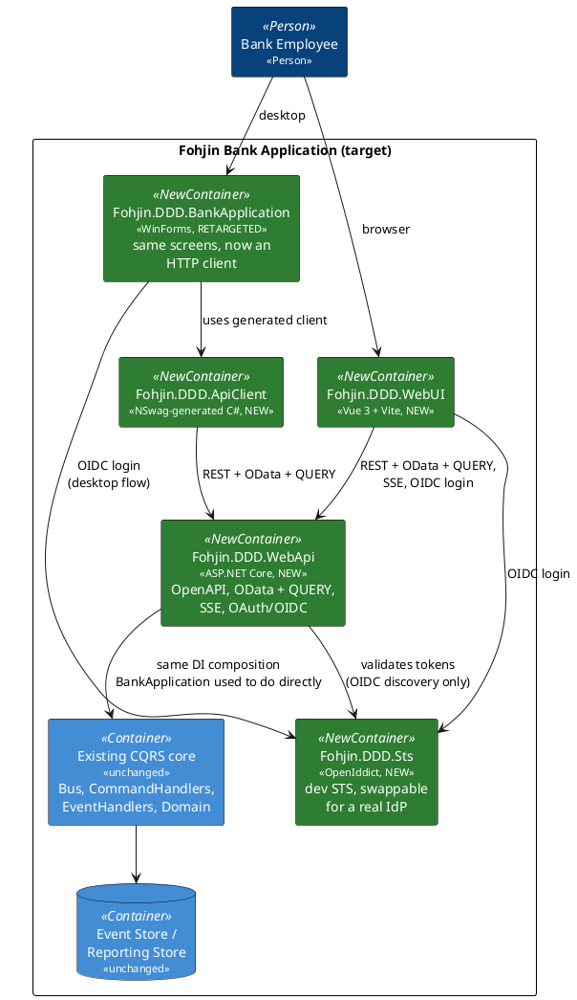

# Migration Plan: WebAPI + OData/QUERY + OAuth/OIDC + SSE/AsyncAPI + Vue

This is the plan for `feature/webapi-vue-modernization`: how to get from the current
single-process WinForms application (docs `00`–`10`) to a web-first system with an
ASP.NET Core backend, a Vue frontend, a retargeted WinForms client, and generated API
clients — without a big-bang rewrite. See `docs/supporting/` for the research backing
each technology choice (RFC 10008, OpenIddict vs. Duende, Saunter/AsyncAPI, Aspire/Docker
Compose, NSwag).

## Guiding principle: the CQRS/event-sourcing core does not move

Everything in `06-event-sourcing-infrastructure.md` and `07-messaging-bus.md` — aggregates,
command/event handlers, the event store, the reporting store, `IBus`/`DirectBus` — stays
exactly as it is. This migration adds a **new front door** (`Fohjin.DDD.WebApi`) that hosts
that same core over HTTP, the same way `Fohjin.DDD.BankApplication` hosts it today over
direct in-process calls. Nothing about *what* the system does changes; only *how it's
reached* changes, one surface at a time, with the old surface kept working until its
replacement is proven.

## Target architecture

## Phases

Each phase is independently shippable and leaves the system in a working state — the
existing WinForms app keeps working against the in-process core until the phase that
explicitly retargets it (Phase 7). Treat each phase as its own confirm-then-build cycle,
not a license to build all nine before showing anything.

### Phase 0 — Housekeeping (done)

Branch created (`feature/webapi-vue-modernization`), `Fohjin.DDD.MakeReusable` deadweight
removed, this plan and its supporting research written.

### Phase 1 — Bare WebAPI host

Stand up `Fohjin.DDD.WebApi` (`Microsoft.NET.Sdk.Web`) referencing the same
`AddBusServices()`/`AddCommandHandlersServices()`/`AddEventHandlersServices()`/
`AddEventStoreServices()`/`AddEventStoreSqliteServices()`/`AddReportingServices()`/
`AddDddServices()`/`AddConfigurationServices()` composition `Program.cs` already uses
(docs `07`) — same extension methods, registered into a `WebApplicationBuilder` instead of
a bare `ServiceCollection`. One thin command endpoint (`POST` → `CreateClientCommand`) and
one thin query endpoint (`GET` hitting `IReportingRepository` directly, pre-OData) to
prove the wiring. No auth, no OData, no SSE yet.

**Exit criteria**: create-client and get-client work end-to-end over HTTP against the same
SQLite databases, verified via a `.http` file/curl. WinForms is untouched and still works.

### Phase 2 — OpenAPI + NSwag client generation

Enable `Microsoft.AspNetCore.OpenApi` (native to .NET 10, no Swashbuckle needed). Add
`Fohjin.DDD.ApiClient` and an `nswag.json` generating a C# client from it. Validate the
codegen loop on this small surface before the API surface grows.

**Exit criteria**: a throwaway test/console app using the generated client can create and
read a client through the API.

### Phase 3 — OData + the QUERY verb

Add `Microsoft.AspNetCore.OData`, expose the reporting DTOs (`08-reporting-read-models.md`)
as OData entity sets. Add a `MapQuery` extension (see
`docs/supporting/rfc10008-http-query-method.md` — .NET 10 has the `HttpMethods.Query`
primitive but no built-in convenience method) for filters too large/complex for a GET query
string. Because ASP.NET Core 10's OpenAPI generator currently excludes QUERY endpoints
entirely, expose every QUERY route as an equivalent GET route too (same handler, two
routes) so NSwag/OpenAPI/codegen have something to generate against — QUERY becomes the
escape hatch for oversized filters, not the only way in.

**Exit criteria**: `GET /odata/Clients?$filter=...` and `QUERY /odata/Clients` (filter in
the body) return equivalent results for the same filter.

### Phase 4 — SSE event stream + AsyncAPI

New endpoint subscribing to `bus.Events` (already `IObservable<IDomainEvent>`, docs `07`)
and pushing matches over Server-Sent Events (native `System.Net.ServerSentEvents` in .NET
10), filterable by an OData-style expression so a client can track just the event
types/aggregates it cares about. Wire Saunter to document the channel/message catalog as
AsyncAPI (`docs/supporting/asyncapi-saunter.md`).

**Decision needed during this phase**: full `Microsoft.OData.UriParser` filter semantics
against event records, or a simpler hand-rolled filter grammar — full OData parsing may be
overkill for what's realistically a handful of fields (event type, aggregate id, version,
timestamp).

**Exit criteria**: a browser `EventSource` (or `curl --no-buffer`) connected to the stream
receives live events as commands are issued elsewhere in the running system, filtered
correctly.

### Phase 5 — OAuth/OIDC via the OpenIddict dev STS

New `Fohjin.DDD.Sts` project (OpenIddict, authorization-code + PKCE — needed by both the
future Vue SPA and the WinForms desktop client). One seeded dev client, one seeded test
user. WebAPI adds `AddAuthentication().AddJwtBearer(o => o.Authority = <config>)` and
`[Authorize]` on command/query/SSE endpoints — the authority URL must come from
configuration, never a hardcoded OpenIddict-specific type, so a real IdP is a config
change later (`docs/supporting/oidc-sts-openiddict-vs-duende.md`).

**Decided**: preconfigured/seeded accounts (no interactive registration), still going
through a real (if minimal) login screen and a genuine authorization-code + PKCE exchange
— "simple for testing" means simple *credentials*, not a shortcut that skips the actual
OIDC flow, so what gets exercised in dev matches what a real IdP swap-in would do.

**Exit criteria**: unauthenticated requests are rejected; a token obtained from the dev STS
is accepted; swapping `Authority` to a different OIDC-compliant issuer requires no code
change.

### Phase 6 — Vue frontend

New `Fohjin.DDD.WebUI` (Vue 3 + Vite + TypeScript). NSwag-generated TypeScript client.
OIDC login (e.g. `oidc-client-ts`) against the same STS. Re-implement the existing screens
(`09-winforms-ui.md`: client search, the client-details wizard, account details) — this is
new frontend work, not a mechanical port of the WinForms Presenter/View code.

**Exit criteria**: everything the WinForms app does today is also possible from a browser,
through the new API.

### Phase 7 — Retarget WinForms

Swap WinForms' DI wiring (currently direct `AddBusServices()` etc. in
`Fohjin.DDD.BankApplication/Program.cs`) for `Fohjin.DDD.ApiClient`. Every Presenter that
currently takes `IBus`/`IDomainRepository`/`IReportingRepository` (every presenter in
`09-winforms-ui.md`'s component diagram) needs to go through the API client instead — this
touches every presenter, not just a config change. **Decided**: desktop OIDC login uses
the system browser + loopback redirect (not an embedded WebView2) — opens the STS login
page in the user's actual browser, catches the redirect on a local loopback listener.

**Exit criteria**: WinForms behaves identically to today, but every operation is an HTTP
call to `Fohjin.DDD.WebApi` instead of an in-process call. The monitoring pane
(`09-winforms-ui.md`) still shows logs, and can now also show the HTTP calls it's making.

### Phase 8 — Hosting: Aspire + Docker Compose

`Fohjin.DDD.AppHost` + `Fohjin.DDD.ServiceDefaults` (Aspire convention), modeling
STS → WebApi → WebUI startup order. Publish to `docker-compose.yml` via
`Aspire.Hosting.Docker` (`docs/supporting/hosting-aspire-docker-compose.md`).

**Decided**: move off SQLite entirely, to SQL Server running in a **Linux** container
(Aspire has a first-class `AddSqlServer(...)` resource for this). One database engine for
every environment — no SQLite-for-dev/SQL-Server-for-prod split to keep in sync. This
touches both `Fohjin.DDD.EventStore.SQLite` and `Fohjin.DDD.Reporting`'s EF Core
provider/migrations (`Microsoft.EntityFrameworkCore.Sqlite` → `Microsoft.EntityFrameworkCore.SqlServer`,
new migrations generated against SQL Server) — likely worth its own step at the start of
this phase, before wiring up the Aspire resource itself.

**Exit criteria**: `dotnet run` on the AppHost boots the whole system with one command;
publishing produces a working `docker-compose up`.

### Phase 9 — Decommission the direct in-process wiring

Once both WinForms (Phase 7) and Vue (Phase 6) are fully on the API, the old direct-wiring
code in `Fohjin.DDD.BankApplication` is dead — remove it, making `Fohjin.DDD.WebApi` the
only process that composes the CQRS core. Update docs `00`–`10` to reflect the new
container topology (they currently describe the pre-migration, single-process shape).

## What this plan still doesn't decide yet

Three of the four originally-deferred decisions are now resolved (dev-STS login UX,
desktop OIDC flow, database choice — see Phases 5, 7, 8 above). One remains open:

- **Phase 4** — full `Microsoft.OData.UriParser` filter semantics against event records,
  or a simpler hand-rolled filter grammar. Still scoped to land during Phase 4 itself, once
  the SSE endpoint exists to make the decision against.

## Modernization pass alongside this migration

Also requested, not phase-gated (doesn't block or depend on any phase above, so it's
happening now rather than waiting): push the existing codebase as far toward C# 12+ idioms
as it reasonably goes.

Done: file-scoped namespaces and primary constructors solution-wide (via `.editorconfig` +
`dotnet format style`, verified against the full test suite), collection expressions for
the remaining `new List<T>()` sites the analyzer didn't catch, and positional records for
`CommandBase` and all 15 commands (verified against `SerializationTests.cs`'s real
JSON-to-disk-and-back round trip for every one of them — collapsing each command's
`[JsonConstructor]`-marked parameterless ctor + value ctor pair into a single positional
ctor changes how `System.Text.Json` picks a constructor, so this needed the round-trip
proof, not just a green build).

**Deliberately not done**: domain events (`DomainEvent`-derived) and reporting DTOs stay as
regular records with explicit bodies, not positional. Both have properties that are
legitimately mutated *after* construction by framework machinery (`BaseAggregateRoot.Apply`
sets `AggregateId`/`Version` post-construction; `SqliteReportingRepository.UpdateAsync`
reflects a property setter onto an existing instance) — positional records model immutable
data, so forcing that shape here would fight the feature rather than use it. Commands never
have this problem (`init`-only, truly immutable end to end), which is exactly why they were
a clean fit and these two are not.

Still open: the nullable-annotation pass (properties are still bare `string` despite
`<Nullable>enable</Nullable>` everywhere) — larger, more judgment-heavy, not done yet.

## Suggested next step

Start Phase 1. It's the smallest possible slice that proves the core architectural bet —
hosting the existing CQRS core over HTTP — before any of the more novel pieces (OData
QUERY, SSE+AsyncAPI, OIDC, Vue) get built on top of it.
