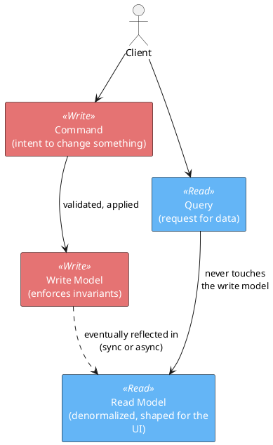
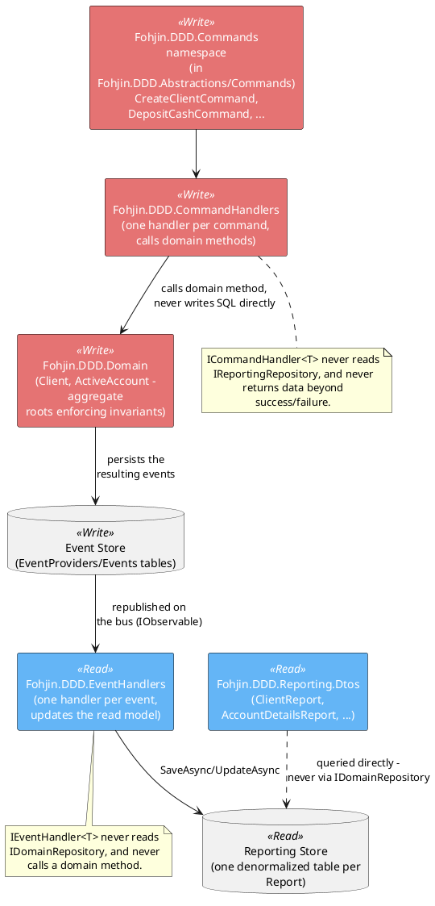

# CQRS — Command Query Responsibility Segregation

## The problem it solves

In a conventional layered architecture, one model serves both reads and writes: the same
`Client` class (or the same `Clients` table, accessed through the same repository) is used
to load a client for editing *and* to answer "give me every client whose name contains
'Smith'." As an application grows, that single model comes under pressure from two
directions at once:

- **Writes** want to be **narrow and rule-heavy**: a small, consistent surface
  (`Client.UpdateClientName(...)`) that enforces invariants and guard clauses, touching as
  little data as possible per operation.
- **Reads** want to be **wide and rule-free**: whatever shape the UI needs *right now* —
  denormalized, joined across what would otherwise be several aggregates, sorted, paged,
  filtered — with no business rules to get in the way of just fetching data.

Optimizing a single model for both pulls it in opposite directions. CQRS resolves the
tension by refusing to have one model at all: writes and reads are given their own model,
their own object shapes, and often their own storage, connected only by the fact that
writes eventually produce the data reads consume.

## The general shape

The essential rule, independent of any particular implementation: **a command never
returns data, and a query never changes state.** Once that split exists, two further
questions are implementation details, not part of the pattern itself:

- **Same database or two databases?** CQRS doesn't require physically separate storage —
  a single database with a "write" set of tables and a "read" set of (denormalized) tables
  is still CQRS. Separate storage (this codebase's choice) just makes the split harder to
  accidentally violate, and lets each side scale/be modeled independently.
- **How does the read side catch up?** Somewhere between "write" and "read" there has to
  be a synchronization step. This codebase uses Event Sourcing + a message bus for that (see
  `event-sourcing.md` and `messaging-mediator-observer.md`) — but plain CQRS doesn't
  *require* Event Sourcing; you could just as well update both a write table and a
  denormalized read table in the same transaction. This codebase does both together because
  the workshop it's derived from teaches them as a pair, not because one implies the other.

## This codebase's implementation

`Fohjin.DDD.Commands` is a namespace, not a project — the command record types physically
live in `Fohjin.DDD.Abstractions/Commands`, alongside `Fohjin.DDD.Abstractions`'s other
cross-cutting interfaces/DTOs, using the same `<RootNamespace>` trick
`Fohjin.DDD.BankApplication.Core` uses to keep its own types under the un-suffixed
`Fohjin.DDD.BankApplication` namespace (`patterns/winforms-architecture.md`). An earlier,
genuinely standalone `Fohjin.DDD.Commands` project predates that split, was never deleted
after `Abstractions` took over the same namespace, and had drifted out of `Fohjin.DDD.sln`
entirely — removed as dead, confusing weight during a naming-conventions pass.

The rule that makes this real rather than aspirational: **command handlers and event
handlers are two different type hierarchies that never reference each other's storage
interface.** `Fohjin.DDD.CommandHandlers/ChangeClientNameCommandHandler` depends on
`IDomainRepository<IDomainEvent>` and knows nothing about `IReportingRepository`;
`Fohjin.DDD.EventHandlers/ClientNameChangedEventHandler` depends on `IReportingRepository`
and knows nothing about `IDomainRepository`. There's no runtime check enforcing this — it's
enforced by which constructor parameters each handler class happens to declare — but the
consistent absence of a repository reference across all ~20 command handlers and ~18 event
handlers is the actual evidence the rule holds, not a comment claiming it does.

### Walking one request through both sides

1. A client (`Fohjin.DDD.WebApi`'s minimal API endpoint, called from either the WinForms or
   Vue UI) builds a **command** object and calls `IBus.Publish` + `CommitAsync()`.
2. `TransactionHandler<TCommand,THandler>` resolves the one `ICommandHandler<TCommand>` and
   calls it. The handler loads (or creates) an aggregate from `IDomainRepository<T>`, calls
   a domain method (`client.UpdateClientName(...)`), which raises a domain event
   (`ClientNameChangedEvent`) and mutates the aggregate's in-memory state.
3. The event store persists that event. The HTTP response has already returned
   `202 Accepted` by this point — command handling never returns query results, only an
   acknowledgement that the intent was accepted (or a rejection, if a guard clause threw).
4. The persisted event is republished on the bus's `IObservable<IDomainEvent>` stream. Every
   event handler subscribed to that event type gets its own independent invocation.
5. `ClientNameChangedEventHandler` updates `ClientReport`/`ClientDetailsReport` — plain
   denormalized rows, no aggregate, no invariants, just "make the read model match what
   happened."
6. A **query** — the next `GET /api/clients/{id}/details` — reads straight from
   `IReportingRepository`, never touching `IDomainRepository`, `Client`, or the event store
   at all.

The full sequence diagrams for command dispatch and event fan-out are in
`../07-messaging-bus.md`; the read side's DTOs and their event-driven updates are in
`../08-reporting-read-models.md`.

### What this buys, concretely, in this codebase

- `Client.UpdateClientName` can enforce "the client must exist" (`Id != Guid.Empty`) without
  that guard clause ever running on a pure read — because reads never call it.
- `IReportingRepository.Query<TDto>()` can compose an arbitrary `$filter`/`$orderby` across
  any reporting DTO (see `08-reporting-read-models.md`) without that query logic having any way
  to accidentally mutate a `Client` aggregate — because it has no reference to
  `IDomainRepository` at all.
- The read side can be denormalized however the UI actually wants it —
  `ClientDetailsReport` embeds a client's accounts *and* bank cards inline, something that
  would require joining three aggregates on the write side — without that shape ever
  leaking back into how `Client`'s invariants are enforced.

## See also

- `../00-architecture-overview.md` — the container-level diagram this pattern produces.
- `../10-patterns-and-practices.md#cqrs--command-query-responsibility-segregation` — the
  one-paragraph catalog entry.
- `event-sourcing.md` — how the write side actually persists state (a choice independent of
  CQRS itself, but paired with it here).
- `messaging-mediator-observer.md` — the mechanism that gets a change from the write side to
  the read side.
- Greg Young, *CQRS Documents*: https://cqrs.wordpress.com/documents/cqrs-documents/
