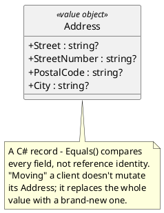
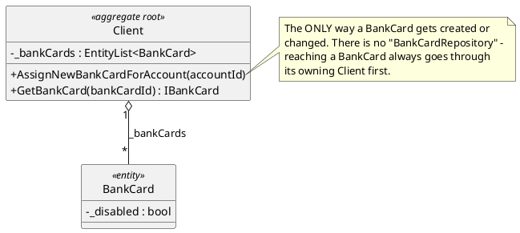
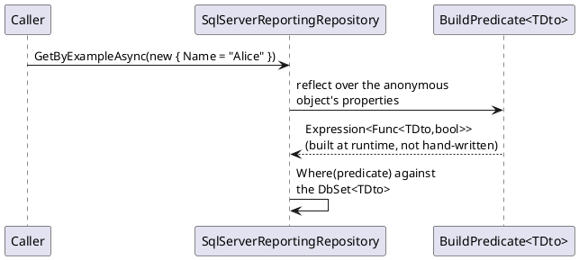

# Domain-Driven Design building blocks

Eric Evans' *Domain-Driven Design* (Addison-Wesley, 2003) gives a small vocabulary for
talking about the shape of a domain model. This codebase uses four of those terms
precisely, not loosely — knowing which one applies to a given class tells you a specific
set of rules that class follows.

## Value Object

**Defined entirely by its data, immutable, no identity.** Two value objects with the same
data *are* the same value — there's no sense in which one is "the same object, changed"
versus "a different object that happens to match."

**In this repo**: `ClientName`, `Address`, `PhoneNumber`, `Amount`, `Balance`,
`AccountNumber` — every one a C# `record`, replaced wholesale (`_address = newAddress`)
rather than mutated field-by-field. See `../01-client-management.md` and
`../03-account-management.md` for the class diagrams these appear in.

## Entity

**Has identity that persists across state changes.** Unlike a value object, two entities
with identical data right now are still different entities if their `Id`s differ — and the
*same* entity can look completely different at two points in time and still be "the same
one."

**In this repo**: `BankCard` — identity is its `Id`, but its `_disabled` flag and status
change over its lifetime (`../02-bank-cards.md`). It's an entity, not an aggregate root,
because of the next distinction:

## Aggregate Root

**A cluster of objects treated as a single unit for data changes, with exactly one member —
the root — as the only entry point from outside.** Nothing outside the aggregate is allowed
to reach into it and mutate an inner object directly; every change goes through the root,
which is what lets the root enforce invariants across the whole cluster.

**In this repo**: `Client` and `ActiveAccount` are aggregate roots — each has its own
`IDomainRepository<T>.GetByIdAsync`/`Add` entry point. `BankCard` is an entity *inside* the
`Client` aggregate; there is no `IDomainRepository<BankCard>` at all, matching the rule that
an aggregate's internals are only reachable through its root
(`client.AssignNewBankCardForAccount(...)`, `client.GetBankCard(...)`) — see
`../02-bank-cards.md`.

### Why the boundary matters here specifically

`Client.AssignNewBankCardForAccount` guards that the account being linked actually belongs
to *this* client (`accountId` must be in `_accounts`) before creating the card. If `BankCard`
could be created directly — bypassing `Client` — that guard would be trivially skippable.
The aggregate boundary is what makes "a bank card can't be linked to an account that isn't
this client's" an invariant the type system and the code path help enforce, rather than a
rule every caller has to remember to check by hand.

## Specification (a narrower, practical variant)

**Represent a business rule or query as a composable object, rather than scattering the
same condition as inline code wherever it's needed.** The classic formulation (Evans &
Fowler's *Specification* paper) builds full boolean-composable predicate objects
(`AndSpecification`, `OrSpecification`, ...); this codebase uses a much smaller, practical
slice of the same idea.

Rather than a hand-written LINQ query per DTO/filter combination,
`SqlServerReportingRepository.BuildPredicate<TDto>` builds an `Expression<Func<TDto,bool>>`
at runtime from an anonymous object's properties — one generic query mechanism instead of N
hand-written ones, at the cost of only supporting equality predicates (no `Or`, no ranges) —
see `../08-reporting-read-models.md` for the full mechanism.

## See also

- `../01-client-management.md`, `../02-bank-cards.md`, `../03-account-management.md` — the
  class diagrams for every aggregate/entity/value-object mentioned above.
- `../08-reporting-read-models.md` — `BuildPredicate<TDto>` in full.
- `../10-patterns-and-practices.md#domain-driven-design-building-blocks` and
  `#specification--dynamic-query-object` — the catalog entries.
- Eric Evans, *Domain-Driven Design: Tackling Complexity in the Heart of Software*
  (Addison-Wesley, 2003).
- Eric Evans & Martin Fowler, *Specification*: https://martinfowler.com/apsupp/spec.pdf
