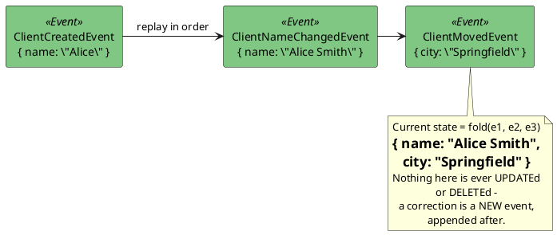
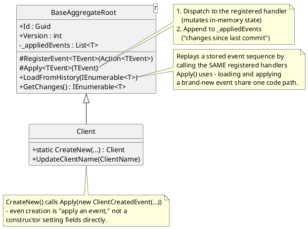
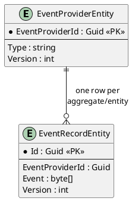
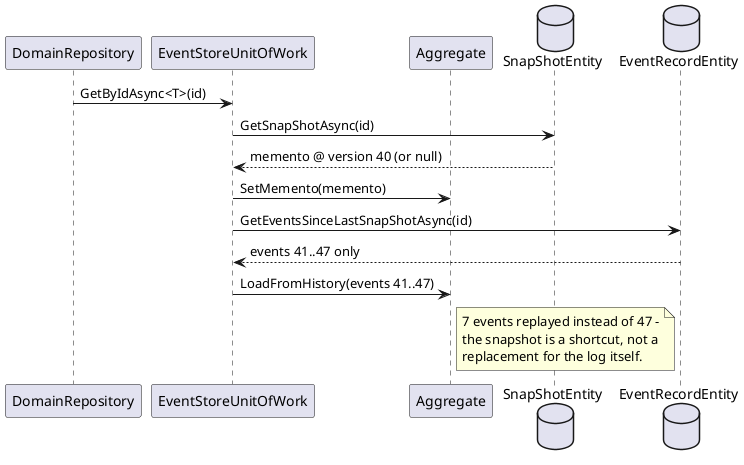

# Event Sourcing (and the Snapshot pattern)

## The problem it solves

Conventional persistence stores *current state*: a `Clients` row holds today's name,
today's address. Whatever the name was six months ago is gone the moment `UPDATE` runs —
unless a separate audit log was bolted on, usually as an afterthought, usually incomplete.

Event Sourcing inverts the default: instead of storing current state, store *every state
change* as an immutable fact, forever, in the order it happened. Current state is never
stored directly — it's derived by replaying those facts from the beginning. The event log
isn't a log *of* the system; it *is* the system's data.

## The general shape

Three ideas fall out of "replay the log" almost for free, and all three show up in this
codebase:

1. **Perfect audit trail** — every past state is reconstructable by replaying up to that
   point, because nothing was ever overwritten.
2. **New read models for free** — a brand-new denormalized view can be built at any time by
   replaying the *entire* event history from scratch, even for state changes that predate
   the new view's existence. (This codebase's reporting store is one such view — see
   `../08-reporting-read-models.md` — but the pattern generalizes to "add a whole new report
   type next year without a migration of historical data.")
3. **Replay gets expensive over time** — an aggregate with 100,000 events takes 100,000
   replays to load. This is what the **Snapshot pattern** exists to fix (below).

## This codebase's implementation

The key mechanical detail: **`Apply` and `LoadFromHistory` share the same event-handler
dispatch.** `Client.UpdateClientName` doesn't set `_clientName = newName` directly — it
calls `Apply(new ClientNameChangedEvent(newName))`, which looks up the handler registered
for that event type (`RegisterEvent<ClientNameChangedEvent>(OnClientNameChanged)`) and
invokes it. Loading an existing client from storage calls the exact same handler, once per
historical event, via `LoadFromHistory`. There is no second, parallel "how do I mutate
state" code path for replay versus live application — if there were, they could drift apart
silently, and replaying history could produce a different result than the events actually
produced when they first happened. See `BaseAggregateRoot<TDomainEvent>` in
`../06-event-sourcing-infrastructure.md` for the full class, including the documented bug
this project found and fixed in exactly this mechanism (`AggregateId` being stamped before
vs. after the handler runs — the kind of subtle-but-critical detail Event Sourcing code
needs to get right, since a mistake here is baked into the permanent log).

### Storage shape

One `EventProviderEntity` row per aggregate instance (its identity + a version counter for
optimistic concurrency — see `repository-and-unit-of-work.md`); one `EventRecordEntity` row
*per event*, serialized, ordered by `Version`. Loading a `Client` means: find its
`EventProviderEntity`, pull every `EventRecordEntity` for it in version order, deserialize
each back into a concrete event type, and `LoadFromHistory` them one at a time.

## The Snapshot pattern (and why it's a Memento in disguise)

Replaying from event zero every single time doesn't scale forever. The **Snapshot pattern**
periodically captures a serialized point-in-time copy of an aggregate's state — a
*memento*, in the GoF sense — so loading can start from the snapshot's version and replay
only the events *since* it, instead of from the beginning.

This is a textbook instance of the **Memento pattern** (GoF): the aggregate is the
*originator* (`IOriginator.CreateMemento`/`SetMemento`), the snapshot storage is the
*caretaker* that holds mementos without inspecting their contents, and the memento itself is
an opaque serialized blob the aggregate alone knows how to interpret. Event Sourcing supplies
the *history*; Memento supplies the *shortcut* through it — two named patterns, working
together, doing two different jobs.

> **Documented gap in this codebase**: the read path (`GetSnapShotAsync`,
> `GetEventsSinceLastSnapShotAsync`) fully exists and works, but the *write* path
> (`SaveShapShotAsync`) is never called from the production commit path
> (`EventStoreUnitOfWork.CommitAsync`) — only from repository tests. So this codebase
> demonstrates the mechanism completely, but doesn't currently benefit from it in practice;
> see `../06-event-sourcing-infrastructure.md` for exactly where that wiring is missing, if
> you want an exercise in completing a documented-but-unfinished pattern.

## See also

- `../06-event-sourcing-infrastructure.md` — the full class diagrams, sequence diagrams, and
  the AggregateId bug this pattern's replay/apply symmetry made a real bug (not just
  theoretical) to get right.
- `../10-patterns-and-practices.md#event-sourcing` and
  `../10-patterns-and-practices.md#snapshot-pattern` — the catalog entries.
- `repository-and-unit-of-work.md` — how a snapshot-or-full-replay load gets wrapped in a
  transaction alongside optimistic concurrency.
- Martin Fowler, *Event Sourcing*: https://martinfowler.com/eaaDev/EventSourcing.html
- GoF, *Design Patterns* (Gamma/Helm/Johnson/Vlissides, 1994) — the original Memento pattern.
