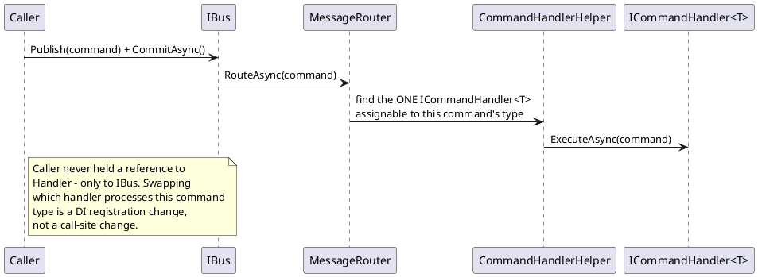
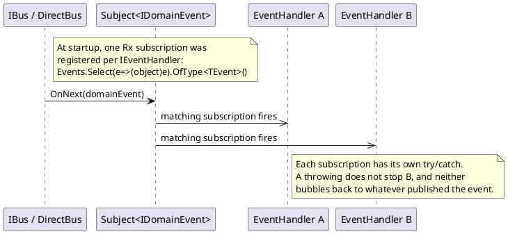

# Mediator / Message Bus, and Observer (via Rx.NET)

Commands and events both travel through the same `IBus`, but they use two different
patterns to get where they're going — because "exactly one handler processes this" and
"every interested party is notified" are genuinely different problems with genuinely
different named solutions.

## Mediator / Message Bus (commands)

**A caller publishes a message without knowing which handler will process it; something in
the middle looks that up at runtime.** The caller is decoupled from the handler — it
doesn't hold a reference to `ChangeClientNameCommandHandler`, only to `IBus`. Exactly one
handler runs per command; if a command has zero or several matching handlers, that's
treated as a configuration error, not a fan-out.

**In this repo**: `IBus`/`DirectBus`, `MessageRouter`, `CommandHandlerHelper` — full dispatch
chain (including the queue/commit mechanics) in `../07-messaging-bus.md`. Whether to call
this "Mediator" or "Bus" is genuinely disputed terminology: Udi Dahan's writing on the
distinction (linked below) argues a *bus* additionally carries events/notifications, while a
pure *mediator* only does request/handler dispatch. This codebase's `IBus` does both jobs
(commands via Mediator-style dispatch, events via Observer below), so "bus" is the more
accurate name for the whole thing even though the command half, in isolation, is textbook
Mediator.

## Observer (via Rx.NET) (events)

**Subscribers register interest in a stream of things happening, without the publisher
knowing or caring who's listening or how many there are.** Unlike the command side, *every*
matching subscriber runs per event — zero, one, or many, none of them aware of each other.

**In this repo**: `IBus.Events : IObservable<IDomainEvent>` is a hot Rx.NET
`Subject<IDomainEvent>`; `EventSubscriptionBootstrapper` subscribes each registered
`IEventHandler` once at startup via `.OfType<TEvent>().Subscribe(...)`. `Fohjin.DDD.Reactive`
(Rx.NET) is the specific library used, but the underlying pattern — `IObservable<T>` /
`IObserver<T>` — is a direct, near-literal implementation of GoF's Observer pattern, with
LINQ-style composability (`.OfType<TEvent>()` being the operator used here) layered on top.
Full mechanics in `../07-messaging-bus.md`.

### Why this codebase needs both, not just one

If events used Mediator-style single-handler dispatch, adding a second read model that
cares about `ClientNameChangedEvent` (say, a new `ClientAuditReport`) would mean either
registering a second competing "handler" (which command-style dispatch explicitly forbids —
one handler per message) or cramming multiple responsibilities into one handler class. Event
fan-out has to allow N independent listeners by design, because read-model projections and
audit trails and notifications are all legitimately independent concerns that all care about
the same fact. Observer is the pattern that allows that; Mediator deliberately doesn't.

## Observer, again, on the client side

The same shape — one shared stream, N independent filtered subscribers, instead of each
consumer opening its own connection or polling — reappears verbatim on the Vue frontend,
just without Rx.NET:
`Fohjin.DDD.WebUI/src/events/eventBus.ts` is one shared `GET /api/events` (Server-Sent
Events) connection for the whole browser session; every screen that wants live refresh
calls `subscribe(handler)` independently, exactly the way `EventSubscriptionBootstrapper`
gives each `IEventHandler` its own subscription server-side. The *filter* each subscriber
applies (which events matter to *this* screen) is `Fohjin.DDD.WebUI/src/events/refreshRules.ts`
— unit tested in isolation from the transport plumbing, in `refreshRules.test.ts`. Full
details in `../07-messaging-bus.md`'s "client-side mirror" section.

## See also

- `../07-messaging-bus.md` — every sequence diagram: command dispatch, event fan-out, and
  the client-side SSE mirror.
- `../10-patterns-and-practices.md#mediator--message-bus` and `#observer-via-rxnet` — the
  catalog entries.
- GoF, *Design Patterns* (1994) — the original Mediator and Observer patterns.
- ReactiveX documentation: https://reactivex.io/documentation/observable.html
- Udi Dahan, *Mediating in CQRS*: https://udidahan.com/2011/06/06/mediating-in-cqrs/
