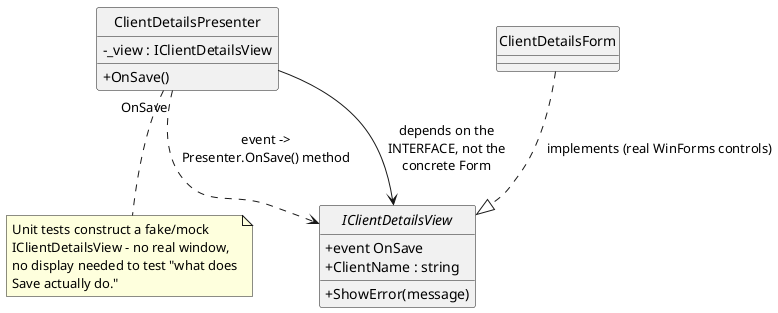
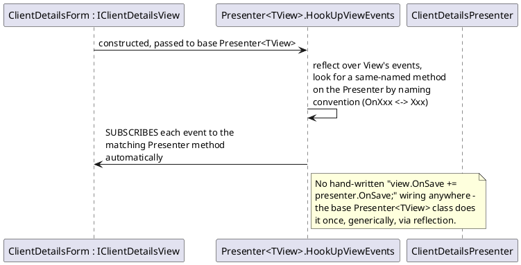

# Model-View-Presenter (MVP)

## The problem it solves

A WinForms `Form` subclass is hard to unit test: it's tied to a real window handle, real UI
controls, and the framework's own event loop. If business logic (what happens when the user
clicks Save, what the Save button should be enabled/disabled based on) lives directly in the
`Form` subclass's code-behind, testing that logic means either spinning up real UI (slow,
flaky, needs a display) or not testing it at all.

MVP separates "what does this screen look like and how does the user interact with it" from
"what happens when they do" — the View becomes a thin, passive interface with almost no
logic of its own, and the Presenter (a plain class, no UI framework dependency) holds every
decision, fully unit-testable by constructing a fake View.

## The general shape

The View exposes **events** (things the user did: "Save was clicked") and **settable
properties** (things to display: `ClientName`, `ErrorMessage`), and nothing else — no
business logic lives in the `Form` subclass itself. The Presenter is the only thing that
decides what a button click *means*.

## This codebase's implementation, and its specific twist

**In this repo**: every `*Presenter`/`I*View` pair under `Fohjin.DDD.BankApplication.Core`
follows textbook MVP — but the specific wiring mechanism
(`Presenter<TView>.HookUpViewEvents`) is this codebase's own twist on it: rather than each
Presenter's constructor manually subscribing to each of its View's events one at a time, a
shared base class reflects over the View's events once and subscribes any Presenter method
whose name matches the `OnXxx` ↔ `Xxx` convention automatically. The pattern itself (View/
Presenter separation, unit-testable Presenter) is standard MVP; the reflection-based
auto-wiring is this codebase's variation on *how* the two get connected, not a different
pattern.

### Why Vue and WPF aren't "MVP again"

`Fohjin.DDD.WebUI` and `Fohjin.DDD.BankApplication.Wpf` are sibling clients to the WinForms
app (all three talk to the same `Fohjin.DDD.WebApi` — see `../00-architecture-overview.md`),
but neither is a second/third implementation of MVP. Vue's Composition API and WPF's native
data/command binding each already solve the "keep logic out of the View, stay unit
testable" problem MVP was invented for, via their own framework's tools rather than a
hand-rolled reflection mechanism — see `vue-architecture.md` and `wpf-architecture.md` for
how each actually does it (composables/stores for Vue; `[ObservableProperty]`/
`[RelayCommand]` ViewModels for WPF). WinForms needed `Presenter<TView>.HookUpViewEvents`
specifically because plain WinForms has no built-in data-binding/command-binding
infrastructure comparable to either of those — MVP is the pattern that fills that gap for
a framework that doesn't have one natively, not a universal requirement every UI framework
needs reinventing.

## See also

- `../09-client-uis.md` — every `*Presenter`/`I*View` pair, and Vue/WPF as sibling clients
  (not second/third MVP implementations).
- `winforms-architecture.md` — this pattern formalized as WinForms' full layered
  architecture standard (data/actions/structure/presentation/styling), not just the
  View/Presenter wiring mechanism itself.
- `vue-architecture.md` and `wpf-architecture.md` — how the other two clients solve the
  same "keep logic out of the View" problem with their own frameworks' native tools.
- `../10-patterns-and-practices.md#model-view-presenter-mvp` — the catalog entry.
- Martin Fowler, *GUI Architectures*: https://martinfowler.com/eaaDev/uiArchs.html — MVP
  alongside MVC and Presentation Model, with the tradeoffs between them.
