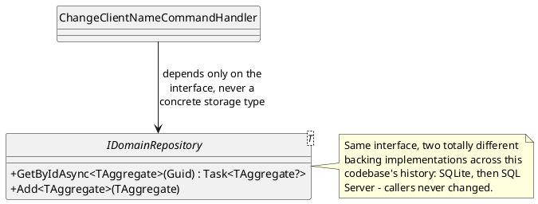
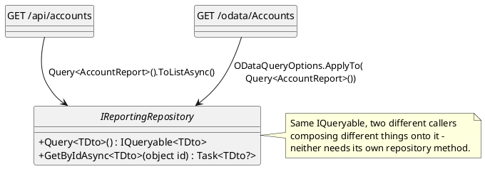
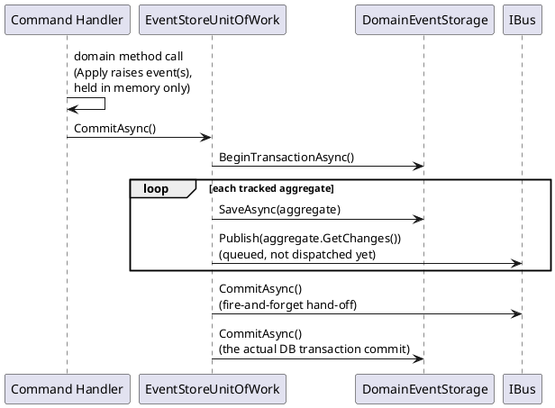
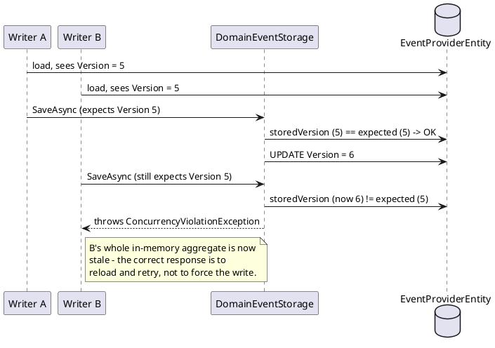

# Repository, Unit of Work, and Optimistic Concurrency

These three patterns are grouped here because in this codebase they're literally nested
inside one another: a `DomainRepository<T>` call is answered by an
`EventStoreUnitOfWork<T>`, whose `CommitAsync()` is where the optimistic-concurrency check
actually happens. Understanding one in isolation is possible; understanding why they're
shaped the way they are is easier seeing all three together.

## Repository

**Hide the storage mechanism behind a collection-like interface.** A caller asks for "the
client with this id" or "add this client" — it never sees SQL, EF Core, byte
serialization, or the event store's table layout.

**In this repo**: `IDomainRepository<T>` (write side — `DomainRepository<T>` implements it,
backed by the event store) and `IReportingRepository` (read side — backed by plain EF Core
over denormalized tables). Neither depends on the other's storage type, which is exactly
the write/read separation `cqrs.md` describes — Repository is *how* each side hides its own
storage, independently.

### The read side's Repository returns a composable query, not a fixed result

`IDomainRepository<T>.GetByIdAsync` above returns a materialized aggregate — there's exactly
one shape a caller could want (the whole thing). `IReportingRepository` is different: any
given DTO might need filtering, sorting, or paging in ways no fixed set of methods can
anticipate. Its `Query<TDto>()` hides the storage mechanism the same way `GetByIdAsync` does
above, but what it returns is an `IQueryable<TDto>` — a *composable* query object, not a result —
so a caller adds `.Where()`/`.OrderBy()`/etc itself, and the OData endpoints
(`08-reporting-read-models.md`) apply `$filter`/`$orderby` to that exact same object. One
mechanism serves every DTO and every filter shape, rather than a hand-written method (or an
ad hoc "example object", which is what this codebase used before) per case.

This is sometimes called a "leaky abstraction": exposing `IQueryable<T>` means a caller *can*
write a query the backing store can't translate, or one that behaves differently against a
real database than against an in-memory test double. That's a real, narrow constraint — this
codebase hit it directly (`MoneyTransferService`/`MoneyReceiveService` use a synchronous
`.First()` rather than EF Core's async `.FirstAsync()`, because `.FirstAsync()` requires an
`IAsyncQueryProvider`, which a Moq'd `List<T>.AsQueryable()` in a unit test doesn't implement —
a testing-strategy constraint, not a broken abstraction, and one a custom `IAsyncQueryProvider`
or expression-tree visitor could resolve if it mattered enough here). It is a different
criticism from Ayende Rahien's *Repository is the new Singleton*
(https://ayende.com/blog/3955/repository-is-the-new-singleton), which is sometimes cited
against `IQueryable` repositories but is actually about something else: a Singleton/Service
Locator hides *what a class depends on* and shares mutable state across every unrelated
caller, which is what makes it hard to reason about and hard to test. An `IQueryable<T>`
returned from a constructor-injected interface hides neither — the dependency is declared and
injected like any other, and every caller gets its own query to compose independently, with no
shared state between them. Composability is the opposite of the Singleton failure mode, not a
variant of it.

**In this repo**: `IReportingRepository.Query<TDto>()`/`GetByIdAsync<TDto>()`
(`Fohjin.DDD.Reporting/Infrastructure/SqlServerReportingRepository.cs`), consumed by both plain
REST endpoints and every OData endpoint (top-level entity sets and nested/contained routes
alike) in `Fohjin.DDD.WebApi/Program.cs`. Full mechanism, including why `Query`/`GetByIdAsync`
each open a fresh `DbContext` per call rather than reusing or eagerly disposing one, in
`../08-reporting-read-models.md`.

## Unit of Work

**Track a batch of changes and commit or roll them back as one transaction.** A single
business operation might touch several things; Unit of Work is what makes "all of it
succeeds, or none of it does" a property of the infrastructure rather than something every
handler has to manually coordinate.

**In this repo**: `EventStoreUnitOfWork<T>.CommitAsync`/`RollbackAsync` wraps the event
store transaction; `TransactionHandler<TCommand,THandler>` is what actually invokes a
command handler *inside* that wrapper, committing on success and rolling back on any
exception. Full sequence in `../07-messaging-bus.md`.

> **Naming trap worth knowing**: this codebase has *two* unrelated interfaces both named
> `IUnitOfWork`. `Fohjin.DDD.Bus.IUnitOfWork` (`CommitAsync` + sync `Rollback`) is what
> `IBus` itself extends — it's about flushing queued messages, nothing to do with a
> database transaction. `Fohjin.DDD.EventStore.IUnitOfWork` (`CommitAsync` + async
> `RollbackAsync`) is the one described above. Reading a handler's constructor parameters
> without checking the namespace can lead to assuming "the bus" when it's actually "the
> event-store session," or vice versa — see `../07-messaging-bus.md`'s callout.

## Optimistic Concurrency

**Instead of locking an aggregate while it's held in memory, check the expected version
number at save time and reject the write if someone else got there first.** Locking rows
for the duration of a user's think-time (load → edit → save, possibly minutes) doesn't scale
and creates its own class of bugs (a crashed client holding a lock forever). Optimistic
concurrency instead assumes conflicts are rare, does no locking at all, and simply detects a
conflict at the one moment it actually matters: the write.

**In this repo**: `DomainEventStorage.SaveAsync` does exactly this check
(`storedVersion != aggregate.Version && aggregate.Version > 0`) before inserting the new
event rows, throwing `ConcurrencyViolationException` on a mismatch. See
`../06-event-sourcing-infrastructure.md`'s commit sequence diagram for where this sits
inside the Unit of Work's transaction.

### Why these three are naturally nested here

`DomainRepository<T>.GetByIdAsync` (Repository) checks an in-memory identity map first,
then falls through to `EventStoreUnitOfWork` (Unit of Work) to actually load from storage —
replaying from a snapshot-or-full-history as described in `event-sourcing.md`. When a
command handler later calls `CommitAsync()`, that same Unit of Work is what runs the
optimistic-concurrency check per aggregate before persisting anything, and only *then*
queues the resulting events onto the bus. Three patterns, three separate concerns
(storage abstraction, transactional batching, conflict detection) — composed, not
duplicated.

## See also

- `../06-event-sourcing-infrastructure.md` — the full repository/unit-of-work class diagram
  and both sequence diagrams (load-with-snapshot, commit).
- `../07-messaging-bus.md` — `TransactionHandler`, and the `IUnitOfWork` naming collision.
- `../10-patterns-and-practices.md#repository`, `#unit-of-work`, `#optimistic-concurrency`,
  and `#iqueryable-repository--odata` — the catalog entries.
- Martin Fowler, *Patterns of Enterprise Application Architecture* (Addison-Wesley, 2002) —
  Unit of Work, and Optimistic Offline Lock (the general form of optimistic concurrency).
