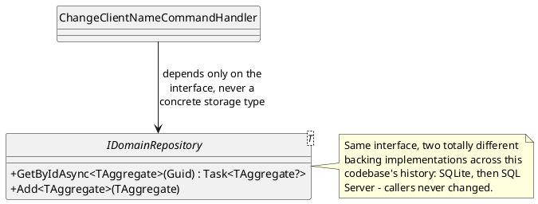
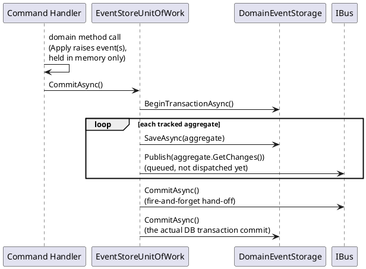
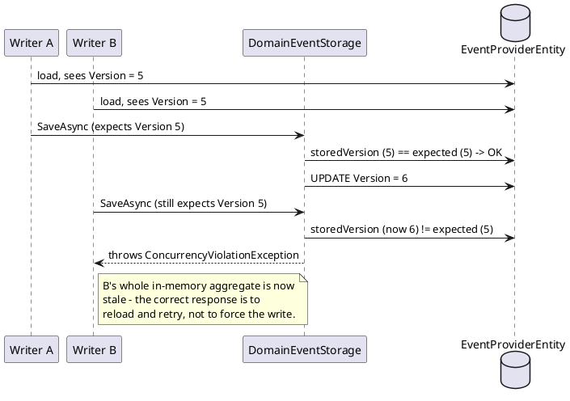

# Repository, Unit of Work, and Optimistic Concurrency

These three patterns are grouped here because in this codebase they're literally nested
inside one another: a `DomainRepository<T>` call is answered by an
`EventStoreUnitOfWork<T>`, whose `CommitAsync()` is where the optimistic-concurrency check
actually happens. Understanding one in isolation is possible; understanding why they're
shaped the way they are is easier seeing all three together.

## Repository

**Hide the storage mechanism behind a collection-like interface.** A caller asks for "the
client with this id" or "add this client" — it never sees SQL, EF Core, byte
serialization, or the event store's table layout.

**In this repo**: `IDomainRepository<T>` (write side — `DomainRepository<T>` implements it,
backed by the event store) and `IReportingRepository` (read side — backed by plain EF Core
over denormalized tables). Neither depends on the other's storage type, which is exactly
the write/read separation `cqrs.md` describes — Repository is *how* each side hides its own
storage, independently.

## Unit of Work

**Track a batch of changes and commit or roll them back as one transaction.** A single
business operation might touch several things; Unit of Work is what makes "all of it
succeeds, or none of it does" a property of the infrastructure rather than something every
handler has to manually coordinate.

**In this repo**: `EventStoreUnitOfWork<T>.CommitAsync`/`RollbackAsync` wraps the event
store transaction; `TransactionHandler<TCommand,THandler>` is what actually invokes a
command handler *inside* that wrapper, committing on success and rolling back on any
exception. Full sequence in `../07-messaging-bus.md`.

> **Naming trap worth knowing**: this codebase has *two* unrelated interfaces both named
> `IUnitOfWork`. `Fohjin.DDD.Bus.IUnitOfWork` (`CommitAsync` + sync `Rollback`) is what
> `IBus` itself extends — it's about flushing queued messages, nothing to do with a
> database transaction. `Fohjin.DDD.EventStore.IUnitOfWork` (`CommitAsync` + async
> `RollbackAsync`) is the one described above. Reading a handler's constructor parameters
> without checking the namespace can lead to assuming "the bus" when it's actually "the
> event-store session," or vice versa — see `../07-messaging-bus.md`'s callout.

## Optimistic Concurrency

**Instead of locking an aggregate while it's held in memory, check the expected version
number at save time and reject the write if someone else got there first.** Locking rows
for the duration of a user's think-time (load → edit → save, possibly minutes) doesn't scale
and creates its own class of bugs (a crashed client holding a lock forever). Optimistic
concurrency instead assumes conflicts are rare, does no locking at all, and simply detects a
conflict at the one moment it actually matters: the write.

**In this repo**: `DomainEventStorage.SaveAsync` does exactly this check
(`storedVersion != aggregate.Version && aggregate.Version > 0`) before inserting the new
event rows, throwing `ConcurrencyViolationException` on a mismatch. See
`../06-event-sourcing-infrastructure.md`'s commit sequence diagram for where this sits
inside the Unit of Work's transaction.

### Why these three are naturally nested here

`DomainRepository<T>.GetByIdAsync` (Repository) checks an in-memory identity map first,
then falls through to `EventStoreUnitOfWork` (Unit of Work) to actually load from storage —
replaying from a snapshot-or-full-history as described in `event-sourcing.md`. When a
command handler later calls `CommitAsync()`, that same Unit of Work is what runs the
optimistic-concurrency check per aggregate before persisting anything, and only *then*
queues the resulting events onto the bus. Three patterns, three separate concerns
(storage abstraction, transactional batching, conflict detection) — composed, not
duplicated.

## See also

- `../06-event-sourcing-infrastructure.md` — the full repository/unit-of-work class diagram
  and both sequence diagrams (load-with-snapshot, commit).
- `../07-messaging-bus.md` — `TransactionHandler`, and the `IUnitOfWork` naming collision.
- `../10-patterns-and-practices.md#repository`, `#unit-of-work`, and
  `#optimistic-concurrency` — the catalog entries.
- Martin Fowler, *Patterns of Enterprise Application Architecture* (Addison-Wesley, 2002) —
  Unit of Work, and Optimistic Offline Lock (the general form of optimistic concurrency).
