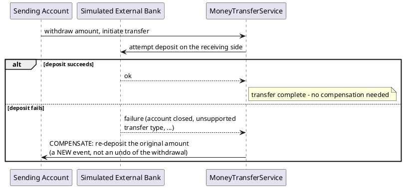
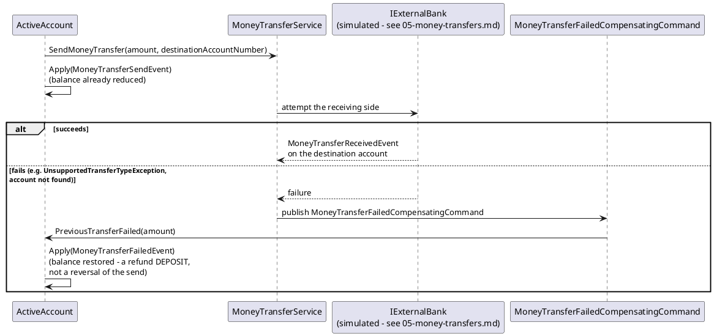

# Compensating Transaction

## The problem it solves

A money transfer between two accounts touches two aggregates. In a single database with
ACID transactions, that's not a special problem — wrap both writes in one transaction and
either both happen or neither does. But the moment "the other side" is a separate system (a
different bank, a different service, a different bounded context — even if, as here, it's
simulated within the same process), a single atomic transaction across both sides usually
isn't available or isn't desirable (distributed two-phase commit has its own well-known
costs: blocking, coordinator failure modes, and every participant needing transaction-
manager support). The practical alternative: let the first step complete on its own, and if
the second step fails, undo the first step with *another*, separate, forward-moving
operation — a **compensating transaction** — rather than a rollback.

## The general shape

The critical distinction from a database rollback: **the withdrawal genuinely happened.**
It is a real event in the permanent history (see `event-sourcing.md`) — it is never erased,
because it's not erasable. The compensation is a *second*, equally real event that happens
to move money back. Anyone reading the full history sees two facts: "$50 was withdrawn,
then $50 was refunded" — not "a withdrawal was attempted and undone." This matters for
audit trails, and it's the reason Event Sourcing and Compensating Transactions pair
naturally: once you've committed to never deleting history, "undo" can only ever mean "a new
event that moves things back," which is precisely what a compensating transaction is.

This is a deliberately narrow, single-step form of the broader **Saga pattern** (a
multi-step, long-running business transaction coordinated across several services, usually
with its own state machine tracking which steps have completed and which compensations are
pending). This codebase implements one compensation for one failure case, not a saga
orchestrator or choreographer — see Chris Richardson's *Microservices Patterns* (linked
below) for the full pattern this is a simplified instance of.

## This codebase's implementation

**In this repo**: `MoneyTransferService`'s catch-all around the simulated external-bank call
publishes `MoneyTransferFailedCompensatingCommand`, handled by
`ActiveAccount.PreviousTransferFailed` — which raises `MoneyTransferFailedEvent`, a genuine
refund deposit, not an undo of `MoneyTransferSendEvent`. The full activity diagram, including
exactly which failure modes trigger compensation, is in `../05-money-transfers.md`.

## See also

- `../05-money-transfers.md` — the full activity diagram and every event involved
  (`MoneyTransferSendEvent`, `MoneyTransferReceivedEvent`, `MoneyTransferFailedEvent`).
- `event-sourcing.md` — why "undo" has to mean "a new event" once history is immutable.
- `../10-patterns-and-practices.md#compensating-transaction` — the catalog entry.
- Chris Richardson, *Microservices Patterns* (Manning, 2018), ch. 4 — the full Saga pattern
  this is a single-step simplification of.
- Pat Helland's writing on compensation in distributed systems (widely cited; search
  "Pat Helland compensating transactions" for the original essays).
