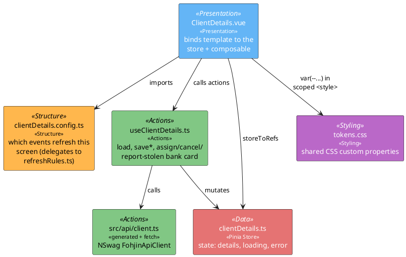
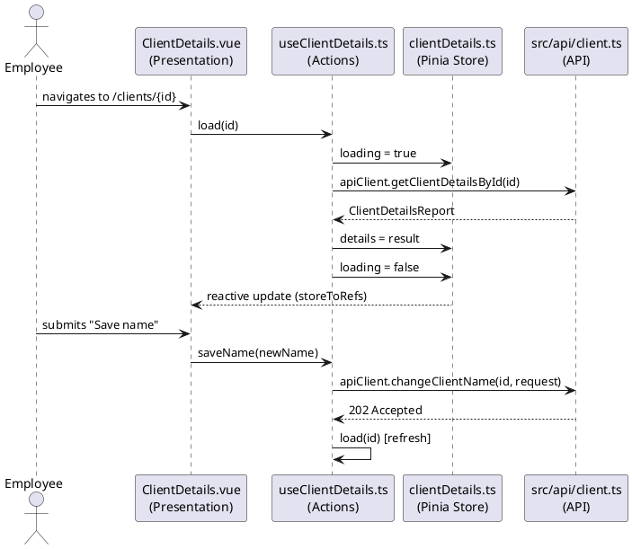

# Vue UI Architecture Pattern

## Purpose

This document defines the standard architecture for Vue 3 components in
`Fohjin.DDD.WebUI`. It exists to keep **data, actions, presentation structure, and
styling** cleanly separated, so components stay small, testable, and easy to maintain as
the application grows. Follow this pattern by default when creating or refactoring any Vue
component in this project, unless a specific task explicitly says otherwise.

This is an adaptation of a general-purpose pattern to this specific codebase's actual
stack — no component library (Naive UI, etc.) is introduced by this doc; "Styling" below
is shared CSS custom properties, not a themed component kit, and "Data" is genuinely new
here (Pinia wasn't previously a dependency of this project).

## 1. The Four Layers

| Layer | Responsibility | Lives in | Technology |
|---|---|---|---|
| **Data** | Application/domain state, single source of truth | `src/stores/*.ts` | Pinia |
| **Actions** | Business logic, side effects, API calls, mutations | `src/composables/use*.ts` | Vue Composition API composables |
| **Structure** | Static config that shapes presentation (form fields, which events refresh a screen, menu items) | `src/components/**/*.config.ts` | Plain TS objects |
| **Presentation** | Declarative template, binds to the layers above, no logic | `src/views/**/*.vue`, `src/components/**/*.vue` | `<script setup>` + `<template>` |
| **Styling** | Shared design tokens, applied globally | `src/theme/tokens.css` | CSS custom properties, imported once at the app root |

A `.vue` file should contain almost no logic. If a `<script setup>` block is doing more
than wiring — fetching, transforming, validating — that logic belongs in a store or
composable instead.

## 2. Component Diagram



`ClientDetails` is used here as the illustrative example for all four layers together;
`clientDetails.config.ts` in the diagram is the *general* shape of a Structure-layer file,
not a claim that this specific one exists — see §4's folder structure for which screens
currently have one.

## 3. Sequence: load and mutate



This is the same request lifecycle `00-architecture-overview.md`'s data-flow section
already describes end to end (command → `202 Accepted` → event → read model catches up) —
this doc is about where the *client-side* code for that lifecycle lives, not a different
protocol.

## 4. Folder structure

```
src/
├── stores/
│   ├── clientSearch.ts
│   ├── clientDetails.ts
│   └── accountDetails.ts          # DATA
├── composables/
│   ├── useClientSearch.ts
│   ├── useClientDetails.ts
│   └── useAccountDetails.ts       # ACTIONS
├── api/
│   ├── client.ts                  # generated FohjinApiClient + authenticatedFetch
│   └── generated-client.ts        # NSwag output, never hand-edited
├── events/
│   ├── eventBus.ts                # shared SSE connection (07-messaging-bus.md)
│   └── refreshRules.ts            # which event refreshes which screen, unit tested
├── views/
│   ├── ClientSearch.vue
│   ├── ClientSearch.config.ts     # STRUCTURE (search/refresh config)
│   ├── ClientDetails.vue          # no ClientDetails.config.ts yet - see note below
│   └── AccountDetails.vue         # no AccountDetails.config.ts yet - see note below
├── theme/
│   └── tokens.css                  # STYLING (shared, global)
└── main.ts
```

Conventions:

- One store + one composable per screen/domain concept (`clientDetails`, not a single
  monolithic store for everything) — mirrors the existing one-file-per-view layout, just
  splitting each view's logic out of the `.vue` file instead of inlining it.
- A view's structure config file, when one exists, sits next to its `.vue` file and shares
  its name (`ClientSearch.vue` + `ClientSearch.config.ts`). `ClientDetails.vue` and
  `AccountDetails.vue` currently skip this file and import `refreshRules.ts`'s predicate
  directly (`useClientDetails.ts`/`useAccountDetails.ts`) - there's no other static shape
  (form fields, menu items) for either screen that would justify the extra indirection yet,
  so the Structure layer is optional per screen rather than mandatory.
- Composables are named `use<Domain>.ts` and grouped by domain, not by component.
- `src/api/` is the *only* place that imports the generated NSwag client or calls
  `authenticatedFetch` directly — composables call `apiClient`, never `fetch`.
- `src/events/` stays a cross-cutting concern used by any composable, not owned by one
  screen's store (already true today: `eventBus.ts`/`refreshRules.ts` predate this doc and
  don't move).

## 5. Layer rules

### Data (Pinia store)

- Owns state and derived state (`getters`) only: `details`, `loading`, `error` — plain
  reactive data, nothing that decides *when* to fetch or *what* an action means.
- No API calls, no side effects beyond simple assignment.
- Views read via `storeToRefs`; only composables call store-mutating actions or assign to
  store refs directly.

### Actions (composables)

- All async logic, API orchestration, and multi-step business rules live here — `load()`,
  `saveName()`, `assignNewBankCard()`, the `subscribe(...)`/`onReconnect(...)` wiring to
  `eventBus.ts` using the screen's `*.config.ts` refresh rule.
- Must be usable without mounting a component (plain function calls), so they're unit
  testable in isolation — the same reasoning `eventBus.test.ts`/`refreshRules.test.ts`
  already establish for this codebase (`CLAUDE.md`'s Testing section).
- Composables mutate the store; components never mutate store state directly.

### Structure (config files)

- Which events refresh a screen, which form fields exist, menu/nav structure — anything
  describing *shape* rather than *behavior* — lives in a plain `.ts` file.
- `ClientSearch.config.ts` is a thin re-export/composition of `refreshRules.ts`'s predicate
  for that screen plus any other static shape — it doesn't duplicate logic that already has
  a home. `ClientDetails`/`AccountDetails` don't have one today (see the folder-structure
  note above) since neither has accumulated enough static shape to warrant it yet.

### Presentation (`.vue` files)

- `<script setup>` should only: call composables, destructure store refs, wire lifecycle
  hooks (`onMounted`, `onBeforeUnmount`), and pass data to the template.
- `<template>` binds to what's exposed — no inline business logic, no inline API calls, no
  ad-hoc computed chains duplicating a store getter.
- `<style scoped>` is reserved for layout-only concerns (spacing, flex/grid structure) —
  colors, typography, and any value that should be consistent across screens come from
  `theme/tokens.css` via `var(--token-name)`, never a locally hard-coded value.

### Styling (shared tokens)

- One `theme/tokens.css`, imported once in `main.ts`, defining CSS custom properties on
  `:root` (colors, spacing scale, border radius, font sizes).
- No component hard-codes its own color/spacing/radius values. If a value needs to change,
  it changes in `tokens.css` and propagates everywhere via the cascade — no component
  library or theme-provider component is required for this to work with plain CSS custom
  properties.

## 6. Example skeleton (reference implementation)

**`stores/clientDetails.ts`**
```ts
import { defineStore } from "pinia";
import type { ClientDetailsReport } from "../api/generated-client";

export const useClientDetailsStore = defineStore("clientDetails", {
  state: () => ({
    details: null as ClientDetailsReport | null,
    loading: true,
    error: null as string | null,
  }),
});
```

**`composables/useClientDetails.ts`**
```ts
import { storeToRefs } from "pinia";
import { apiClient } from "../api/client";
import { useClientDetailsStore } from "../stores/clientDetails";
import { onReconnect, subscribe } from "../events/eventBus";
import { shouldRefreshClientDetails } from "../events/refreshRules";

export function useClientDetails(clientId: () => string) {
  const store = useClientDetailsStore();
  const { details, loading, error } = storeToRefs(store);

  async function load() {
    store.loading = true;
    store.error = null;
    try {
      store.details = await apiClient.getClientDetailsById(clientId());
    } catch (e) {
      store.error = e instanceof Error ? e.message : String(e);
    } finally {
      store.loading = false;
    }
  }

  function watchLiveEvents() {
    const bankCardIds = () => store.details?.bankCards?.map((c) => c.id!) ?? [];
    const unsubscribe = subscribe((event) => {
      if (shouldRefreshClientDetails(event, clientId(), bankCardIds())) load();
    });
    const unsubscribeReconnect = onReconnect(load);
    return () => {
      unsubscribe();
      unsubscribeReconnect();
    };
  }

  return { details, loading, error, load, watchLiveEvents };
}
```

**`views/ClientDetails.vue`**
```vue
<script setup lang="ts">
import { onBeforeUnmount, watch } from "vue";
import { useClientDetails } from "../composables/useClientDetails";

const props = defineProps<{ id: string }>();
const { details, loading, error, load, watchLiveEvents } = useClientDetails(() => props.id);

watch(() => props.id, load, { immediate: true });
const stopWatching = watchLiveEvents();
onBeforeUnmount(stopWatching);
</script>

<template>
  <p v-if="loading">Loading...</p>
  <h1 v-else-if="details">{{ details.clientName }}</h1>
  <p v-else class="error">{{ error }}</p>
</template>

<style scoped>
.error { color: var(--color-danger); }
</style>
```

**`theme/tokens.css`**
```css
:root {
  --color-primary: #1976d2;
  --color-danger: #c0392b;
  --color-border: #eee;
  --spacing-sm: 0.5rem;
  --spacing-md: 1rem;
  --radius-sm: 4px;
}
```

## 7. Guardrails

When generating or modifying components in this project:

1. Don't put `fetch`/`apiClient` calls inside `.vue` files — put them in a composable,
   which is the only thing that talks to `src/api/`.
2. Don't put derived/computed business state directly in a component if it belongs in a
   store getter — reuse the getter instead of recomputing it.
3. Don't inline a screen's event-refresh rule inside the component — it belongs in
   `src/events/refreshRules.ts` (already established) or a `*.config.ts` file, and should
   be unit tested there, not only exercised implicitly through the component.
4. Don't add per-component color, spacing, or typography values — add or reuse a token in
   `theme/tokens.css` instead.
5. Keep composables framework-agnostic where possible (no direct DOM access) so they stay
   unit-testable without mounting a component — matches `eventBus.test.ts`'s approach.
6. New features follow the folder-per-concern convention above, mirroring
   `stores/<domain>.ts` and `composables/use<Domain>.ts`.

## See also

- `winforms-architecture.md` and `wpf-architecture.md` — the equivalent layered
  architecture for this codebase's other two clients.
- `../09-client-uis.md` — all three clients' actual screens and flows.
- `../07-messaging-bus.md` — `eventBus.ts`/`refreshRules.ts`, which this pattern builds on
  rather than replaces.
