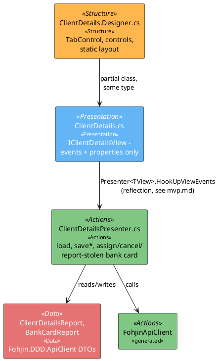
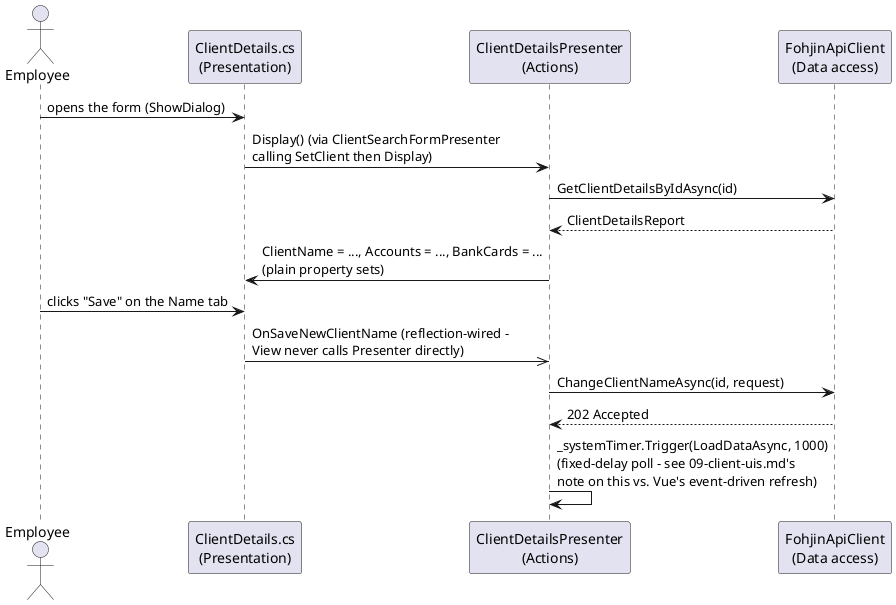

# WinForms UI Architecture Pattern

## Purpose

This document defines the standard architecture for WinForms screens in
`Fohjin.DDD.BankApplication`/`Fohjin.DDD.BankApplication.Core`. It's the WinForms
counterpart to `vue-architecture.md` and `wpf-architecture.md` — same goal (keep data,
actions, presentation structure, and styling cleanly separated), different mechanism,
because WinForms' natural separation mechanism is Model-View-Presenter, not composables and
a template. This isn't a new pattern being introduced: every screen in this codebase
already follows it (see `mvp.md` for the reflection-based View/Presenter wiring mechanism
itself) — this doc formalizes it as the standard to keep following, and maps it onto the
same four/five-layer framing as the other two clients so the three are easy to compare.

> **Why MVP here and not MVVM, given this codebase's general preference order (MVVM > MVP >
> MVC > code-behind)**: that preference is honored where a real choice exists — the WPF
> client (`wpf-architecture.md`) is MVVM, and Vue's own reactivity-plus-template model is
> itself MVVM-flavored (`vue-architecture.md`). Plain WinForms has no built-in
> command-binding infrastructure (`ICommand`, `{Binding}`) to build a real MVVM
> implementation on — WPF's binding engine is what makes MVVM natural there, and WinForms
> doesn't have an equivalent. MVP is the pattern that gets WinForms the same outcome MVVM
> gives WPF (a passive View, testable logic with no window required) using the tools
> WinForms actually has (reflection + plain C# events) — and it's already the deeply
> embedded, working pattern across every existing screen, so this doc formalizes MVP rather
> than proposing a full rewrite onto a binding model the framework doesn't natively support.

## 1. The layers

| Layer | Responsibility | Lives in | Technology |
|---|---|---|---|
| **Data** | The shape of what's fetched/submitted | `Fohjin.DDD.ApiClient` generated DTOs (`ClientDetailsReport`, `BankCardReport`, ...) | NSwag-generated C# classes, shared with WinForms and WPF |
| **Actions** | Business logic, API calls, form-state transitions | `*Presenter.cs` (`Fohjin.DDD.BankApplication.Core/Presenters/`) | Plain C# classes, unit-testable without any real window |
| **Structure** | Which controls exist, their static layout | `*.Designer.cs` (`Fohjin.DDD.BankApplication/Views/`) | WinForms Designer-generated partial class |
| **Presentation** | Passive View: exposes events + settable properties, no logic | `*.cs` non-Designer half of each View (`Fohjin.DDD.BankApplication/Views/`) | `partial class X : ViewFormBase, IXView` |
| **Styling** | Shared visual conventions | *(currently ad hoc — see the gap noted below)* | Per-control `Font`/`Color` properties in each `.Designer.cs` |

A View's non-Designer `.cs` file should contain almost no logic beyond wiring `Click`/
`TextChanged`/`SelectedIndexChanged` events to `OnXxx` event invocations and simple
getter/setter properties over its controls. If a View's code-behind is doing more than
that — validating, deciding what a button click *means*, calling `FohjinApiClient` — that
logic belongs in the Presenter instead.

## 2. Component diagram



## 3. Sequence: load and mutate



## 4. Folder structure

```
Fohjin.DDD.BankApplication.Core/
├── Presenters/
│   ├── IClientDetailsPresenter.cs
│   └── ClientDetailsPresenter.cs   # ACTIONS
├── View/
│   └── IClientDetailsView.cs       # PRESENTATION contract (events + properties)
└── Presenters/Presenter.cs         # base class: reflection-based event wiring (mvp.md)

Fohjin.DDD.BankApplication/
└── Views/
    ├── ClientDetails.cs            # PRESENTATION (implements IClientDetailsView)
    └── ClientDetails.Designer.cs   # STRUCTURE (controls + static layout)
```

Conventions already in force, kept as the standard going forward:

- One `I<Screen>View` + `<Screen>Presenter` pair per screen, in `.Core` (framework-agnostic,
  unit-testable) — never a WinForms type referenced from a Presenter.
- The View interface declares every event and every property the Presenter needs; adding a
  new interaction (like the bank-card actions) means adding to the interface first, then
  implementing it in both the View and the Presenter, matching the existing pattern rather
  than inventing a parallel wiring mechanism.
- `Fohjin.DDD.ApiClient` DTOs are shared as-is with WPF and (via generation) with Vue's
  TypeScript equivalent — there's no separate WinForms-only data-shape layer.

## 5. Layer rules

### Data (generated DTOs)

- Presenters hold DTOs (`ClientDetailsReport`, etc.) as their working state — there's no
  separate store class; the Presenter instance itself is the "current state" for its
  screen, matching the single-window, single-Presenter-instance lifetime this app uses.
- DTOs are never mutated by a View directly — only a Presenter reads from and assigns to
  them, then pushes values onto View properties.

### Actions (Presenters)

- All async logic, `FohjinApiClient` calls, and form-flow state (`_editStep`,
  `_addNewBankCardProcess`, etc.) live here — never in a View's code-behind.
- Every mutating action follows the same shape: `_popupPresenter.CatchPossibleExceptionAsync`
  wrapping the API call, then `_systemTimer.Trigger(LoadDataAsync, <delay>)` to refresh —
  a new action should reuse this shape rather than inventing a different one.
- Presenters are constructor-injected with everything they need (the View, sibling
  Presenters, `FohjinApiClient`, `ISystemTimer`) and are fully unit-testable by constructing
  a fake `IXView` — no real window required.

### Structure (`*.Designer.cs`)

- Control layout, static text, and initial enabled/visible state live here — this file is
  "generated" in spirit even where it's hand-edited (as the bank-cards tab was), and should
  stay free of anything beyond `InitializeComponent()`-style construction.
- A new screen feature (like a new tab/panel) means adding controls here, wiring their
  events in the View's code-behind, and adding the corresponding Presenter logic — the same
  three-file change bank cards' WinForms parity followed.

### Presentation (View code-behind)

- Only: raise an `OnXxx` event on a control's native event, and expose typed
  getters/setters over control values (`ClientName => _clientName.Text`).
- Never calls `FohjinApiClient` directly, never contains an `if`/business rule beyond what's
  needed to read a control's value (e.g. `GetSelectedBankCard() => _bankCards.SelectedItem as BankCardReport`).

### Styling

> **Documented gap, not a hidden inconsistency**: unlike Vue's `theme/tokens.css`, this
> codebase has no centralized WinForms style/theme layer today — colors, fonts, and sizes
> are set ad hoc per control in each `.Designer.cs`. If this is worth fixing, the natural
> shape would be a small static `AppTheme` class (shared font/color/spacing constants)
> referenced from each `InitializeComponent()`, mirroring what `tokens.css` does for Vue —
> not attempted here since no screen currently has visibly inconsistent styling to justify
> the churn, but flagged so it isn't silently assumed to already exist.

## See also

- `mvp.md` — the reflection-based View/Presenter event-wiring mechanism this architecture
  is built on.
- `vue-architecture.md` and `wpf-architecture.md` — the equivalent layered architecture for
  this codebase's other two clients.
- `../09-client-uis.md` — all three clients' actual screens and flows.
