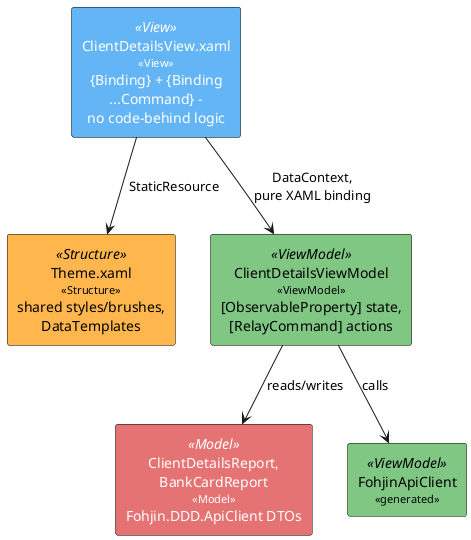
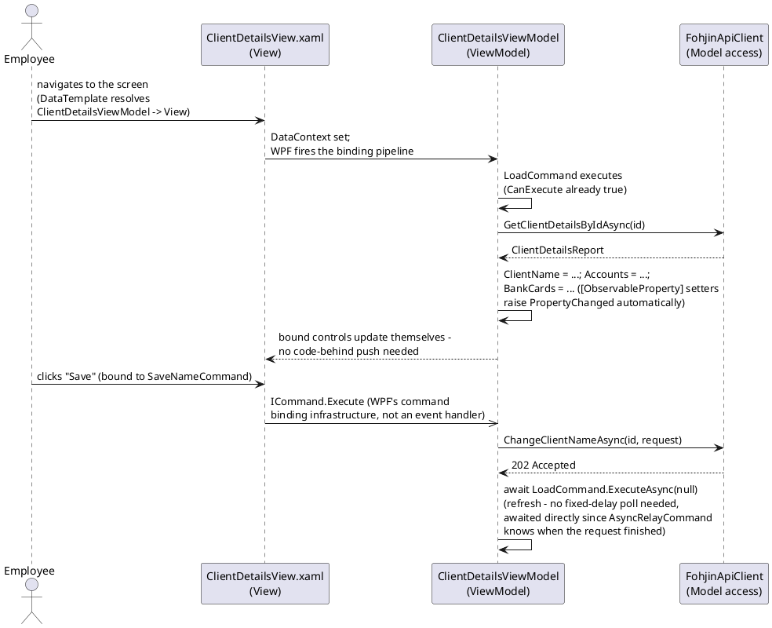

# WPF MVVM Architecture Pattern

## Purpose

This document defines the standard architecture for `Fohjin.DDD.BankApplication.Wpf`, the
third UI client. It's the WPF counterpart to `vue-architecture.md` and
`winforms-architecture.md` — same goal (data, actions, and presentation cleanly separated),
but implemented as close to textbook **Model-View-ViewModel (MVVM)** as WPF's own tooling
allows: XAML data binding and command binding do the wiring WinForms' reflection-based
`Presenter<TView>` does by hand, and Vue's Composition API does declaratively.

Unlike WinForms (retrofit onto an existing MVP codebase) and Vue (adapting a pattern onto
an existing app), this client is new — so it's built MVVM-first from the start rather than
having MVVM layered on afterward.

## 1. The layers

| Layer | Responsibility | Lives in | Technology |
|---|---|---|---|
| **Model** | The shape of what's fetched/submitted | `Fohjin.DDD.ApiClient` generated DTOs — the exact same types WinForms already uses | NSwag-generated C# classes |
| **ViewModel** | State + actions: observable properties, commands, API calls | `ViewModels/*ViewModel.cs` | `CommunityToolkit.Mvvm`'s `ObservableObject`, `[ObservableProperty]`, `[RelayCommand]` |
| **View** | Declarative XAML, binds to a ViewModel, no logic | `Views/*.xaml` (+ minimal `.xaml.cs`) | WPF XAML, `{Binding}`, `DataTemplate`-based view resolution |
| **Structure** | Static resources that shape presentation (styles, templates, converters) | `Resources/*.xaml` | WPF `ResourceDictionary` |
| **Styling** | Shared visual tokens | `Resources/Theme.xaml` | WPF `ResourceDictionary` (`SolidColorBrush`, `Style` resources) — same role as Vue's `tokens.css` |

A View's code-behind (`.xaml.cs`) should contain **nothing** beyond
`InitializeComponent()`. If a `.xaml.cs` file has an event handler with real logic in it,
that logic belongs on the ViewModel, reached via a `Command` binding instead.

## 2. Component diagram



Notably: **no line from View to ViewModel that isn't a binding.** WPF's `{Binding}` markup
resolves against `DataContext` at runtime, so a View never holds a compiled reference to
its ViewModel's concrete type the way a WinForms code-behind holds `this` — this is the
part of MVVM that "as MVVM as possible" specifically means: the View doesn't know the
ViewModel exists as code, only as a binding target.

## 3. Sequence: load and mutate



Same request lifecycle as every other client (`00-architecture-overview.md`'s data-flow
section: command → `202 Accepted` → event → read model catches up) — refreshing
immediately after `await`ing the command's own response only re-reads what's already
committed to the write side; if the read model hasn't caught up to the eventual event yet,
a field can still show stale data for a moment. `AsyncRelayCommand` makes the *request*
awaitable, not the read model's own eventual consistency — the same one instant of caveat
every other client's refresh has.

## 4. Folder structure

```
Fohjin.DDD.BankApplication.Wpf/
├── App.xaml / App.xaml.cs           # Generic Host + DI container bootstrap
├── ViewModels/
│   ├── ViewModelBase.cs             # ObservableObject + shared error-handling helper
│   ├── LoginViewModel.cs
│   ├── ClientSearchViewModel.cs
│   ├── ClientDetailsViewModel.cs
│   ├── AccountDetailsViewModel.cs
│   └── MonitoringViewModel.cs
├── Views/
│   ├── LoginView.xaml
│   ├── ClientSearchView.xaml
│   ├── ClientDetailsView.xaml
│   ├── AccountDetailsView.xaml
│   └── MonitoringView.xaml
├── Services/
│   ├── INavigationService.cs / NavigationService.cs   # ViewModel-first navigation
│   └── IDialogService.cs / DialogService.cs           # error popups (WinForms' IPopupPresenter equivalent)
├── Resources/
│   ├── Theme.xaml                    # STYLING (brushes, fonts, spacing)
│   └── ViewModelTemplates.xaml       # STRUCTURE (DataTemplate per ViewModel -> View)
└── MainWindow.xaml                   # Hosts a ContentControl bound to CurrentViewModel
```

Conventions:

- One ViewModel + one View (XAML) per screen, matching the same screen set WinForms and
  Vue already have (`09-client-uis.md`) — feature parity across all three clients is the
  point of this client existing at all.
- `Resources/ViewModelTemplates.xaml` maps `ClientDetailsViewModel` → `ClientDetailsView`
  via `DataTemplate DataType="{x:Type vm:ClientDetailsViewModel}"` — navigation is "set
  `CurrentViewModel`," never "construct a View and show it," keeping the View layer
  entirely out of navigation logic.
- `Fohjin.DDD.ApiClient` DTOs are shared as-is with WinForms — no separate WPF-only
  data-shape layer, same as WinForms shares them with Vue's generated TypeScript.

## 5. Layer rules

### Model (generated DTOs)

- ViewModels hold DTOs as their working state, same role as a WinForms Presenter's private
  fields — there's no separate store class.
- Never mutated by a View — Views only ever read through a binding or invoke a command.

### ViewModel

- Inherits `CommunityToolkit.Mvvm.ComponentModel.ObservableObject`; state is declared with
  `[ObservableProperty]` (source-generates the backing field, property, and
  `PropertyChanged` notification — no hand-written `INotifyPropertyChanged` boilerplate).
- Actions are declared with `[RelayCommand]` (source-generates an `IRelayCommand`/
  `IAsyncRelayCommand` property) — every mutating action (`SaveName`, `AssignNewBankCard`,
  `CancelSelectedBankCard`, ...) is a command, never a plain method a View calls directly.
- `[RelayCommand(CanExecute = ...)]` replaces WinForms' manual
  `EnableSaveButton()`/`DisableSaveButton()` calls — the button's `IsEnabled` is bound to
  the command's own `CanExecute`, which WPF re-evaluates automatically via
  `CommandManager.RequerySuggested` (bound property changes) rather than needing an
  explicit "enable the button" call after every state change.
- Constructor-injected with `FohjinApiClient`, `INavigationService`, `IDialogService` — same
  constructor-injection discipline as every other layer in this solution
  (`10-patterns-and-practices.md`'s Practices section).
- Fully unit-testable: construct a ViewModel directly, assign properties, invoke
  `SomeCommand.ExecuteAsync(null)`, assert on the resulting state — no WPF runtime, no
  window, no dispatcher needed for the ViewModel layer itself.

### View (XAML)

- Every value comes from `{Binding PropertyName}`; every action comes from
  `{Binding SomeCommand}` on a control's `Command` property (`Button.Command`,
  `MenuItem.Command`) — never a `Click="Handler"` event with logic in the code-behind.
- `.xaml.cs` contains only `InitializeComponent()` — if a View seems to need code-behind
  logic, that's a sign the ViewModel is missing a property or command, not a reason to add
  an event handler.
- Validation feedback (e.g. "client name required") binds to `INotifyDataErrorInfo` on the
  ViewModel or a simple bound `ErrorMessage` string — never a code-behind check.

### Structure (resource dictionaries)

- `DataTemplate`s mapping ViewModel types to Views live in one dictionary
  (`ViewModelTemplates.xaml`), merged into `App.xaml` — this is the WPF equivalent of a
  Vue `*.config.ts` file: it describes *shape* (which View renders which ViewModel), not
  behavior.

### Styling (shared resources)

- One `Theme.xaml` (brushes, `Style` resources for buttons/text boxes/labels), merged once
  into `App.xaml`'s `ResourceDictionary.MergedDictionaries` — the direct WPF equivalent of
  Vue's `theme/tokens.css` import, and the thing WinForms' architecture doc notes as a
  currently-missing layer for that client.
- No View sets an inline `Foreground`/`FontSize`/`Margin` that duplicates what a shared
  `Style` should provide — if a value needs to change, it changes in `Theme.xaml`.

## 6. Example skeleton (reference implementation)

**`ViewModels/ClientDetailsViewModel.cs`**
```csharp
using CommunityToolkit.Mvvm.ComponentModel;
using CommunityToolkit.Mvvm.Input;
using Fohjin.DDD.ApiClient;

namespace Fohjin.DDD.BankApplication.Wpf.ViewModels;

public partial class ClientDetailsViewModel : ObservableObject
{
    private readonly FohjinApiClient _apiClient;
    private Guid _clientId;

    [ObservableProperty]
    private ClientDetailsReport? details;

    [ObservableProperty]
    private bool isLoading;

    public ClientDetailsViewModel(FohjinApiClient apiClient) => _apiClient = apiClient;

    public void Initialize(Guid clientId) => _clientId = clientId;

    [RelayCommand]
    private async Task LoadAsync()
    {
        IsLoading = true;
        Details = await _apiClient.GetClientDetailsByIdAsync(_clientId);
        IsLoading = false;
    }

    [RelayCommand]
    private async Task AssignNewBankCardAsync(Guid accountId)
    {
        await _apiClient.AssignNewBankCardAsync(_clientId, new AssignNewBankCardRequest { AccountId = accountId });
        await LoadAsync();
    }
}
```

**`Views/ClientDetailsView.xaml`** (excerpt)
```xml
<UserControl x:Class="Fohjin.DDD.BankApplication.Wpf.Views.ClientDetailsView" ...>
    <StackPanel>
        <TextBlock Text="{Binding Details.ClientName}" Style="{StaticResource HeaderText}" />
        <ListBox ItemsSource="{Binding Details.BankCards}" />
        <Button Content="Assign" Command="{Binding AssignNewBankCardCommand}"
                CommandParameter="{Binding SelectedAccount.Id}" />
    </StackPanel>
</UserControl>
```

**`Resources/Theme.xaml`** (excerpt)
```xml
<ResourceDictionary xmlns="http://schemas.microsoft.com/winfx/2006/xaml/presentation" ...>
    <SolidColorBrush x:Key="DangerBrush" Color="#C0392B" />
    <Style x:Key="HeaderText" TargetType="TextBlock">
        <Setter Property="FontSize" Value="18" />
        <Setter Property="FontWeight" Value="Bold" />
    </Style>
</ResourceDictionary>
```

## 7. Guardrails

When generating or modifying ViewModels/Views in this project:

1. Never put a `Click`/event handler with logic in a View's code-behind — add a
   `[RelayCommand]` to the ViewModel and bind to it instead.
2. Never call `FohjinApiClient` from a View — only a ViewModel calls it.
3. Never hard-code a color/font/spacing value in a View — add or reuse a resource in
   `Theme.xaml`.
4. Keep ViewModels free of `System.Windows` types where possible (no direct control
   references) so they stay unit-testable without a WPF `Dispatcher`.
5. New screens follow the one-ViewModel-one-View-one-DataTemplate convention above,
   mirroring the equivalent WinForms Presenter/View pair and Vue store/composable/view for
   the same screen.

## See also

- `winforms-architecture.md` and `vue-architecture.md` — the equivalent layered
  architecture for this codebase's other two clients, useful for comparing how the same
  screen is implemented three different ways.
- `../09-client-uis.md` — all three clients' actual screens and flows.
- `mvp.md` — why WinForms needed a hand-rolled reflection mechanism to get View/Presenter
  separation, which WPF's native binding system provides for free.
